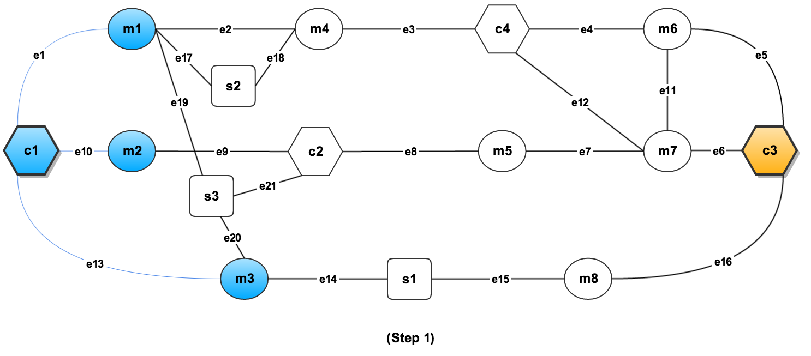
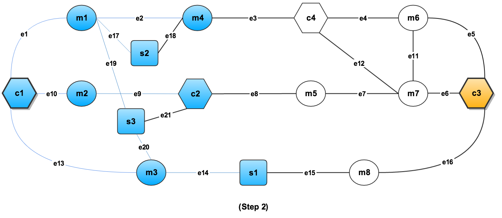
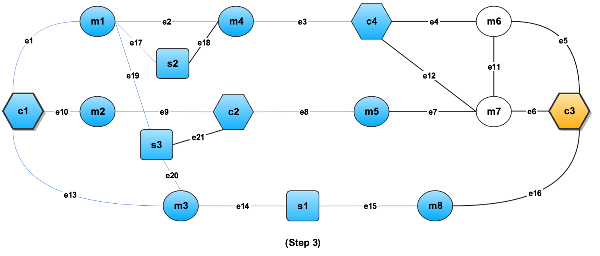
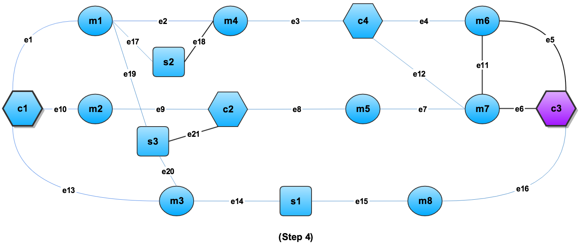
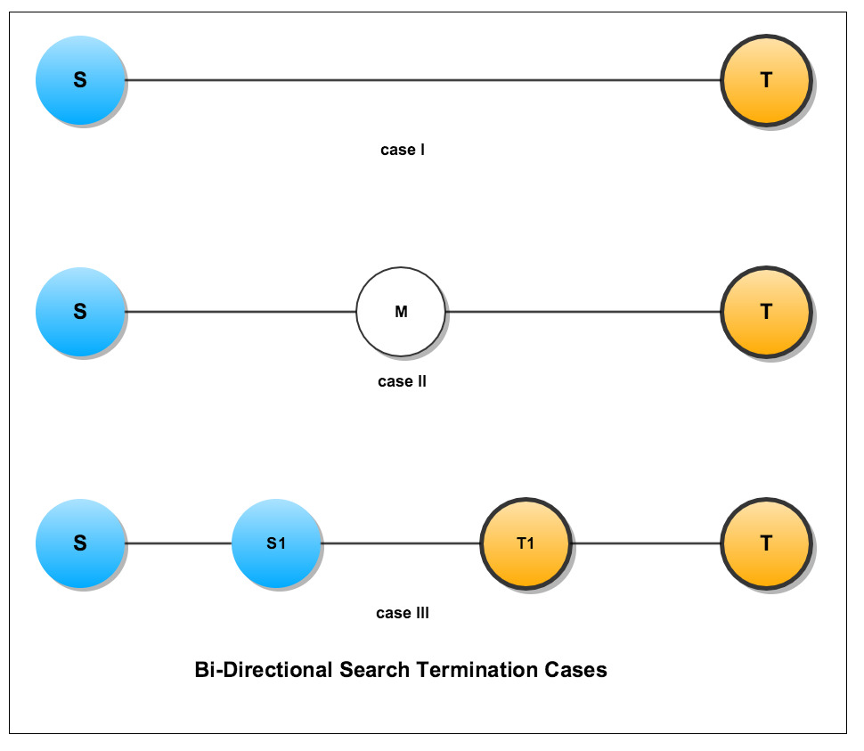
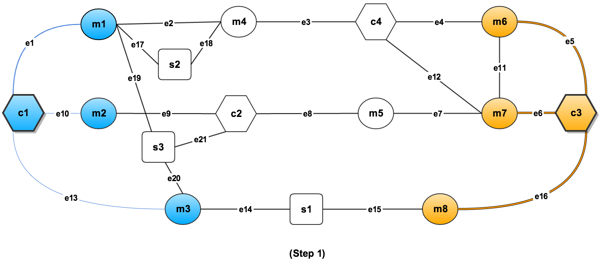
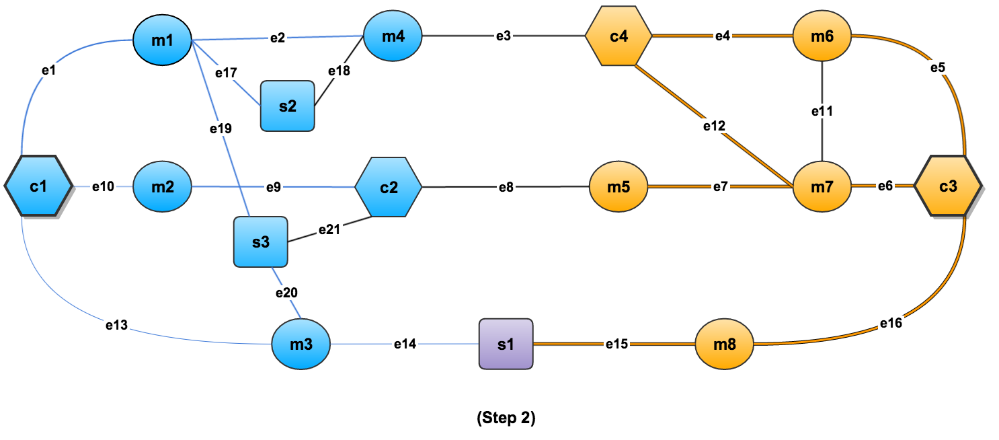
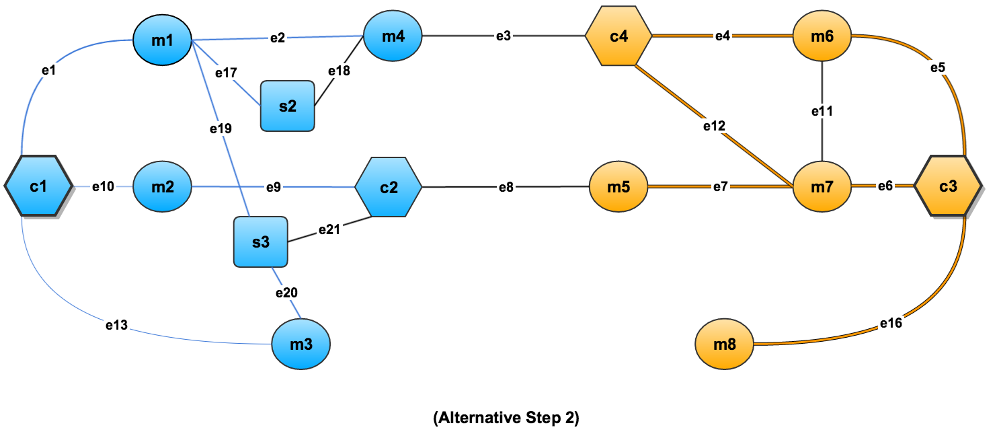
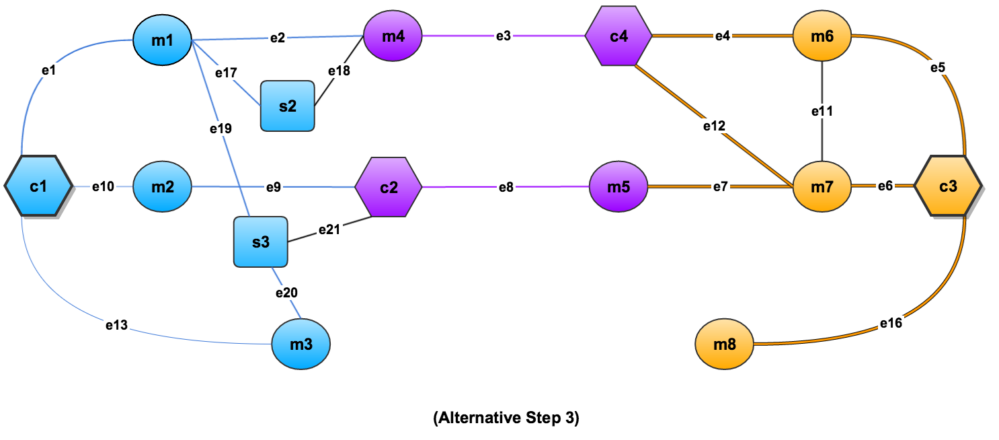

= Classic Graph Algorithms

== Example 8. Single Pair Shortest Path (unweighted)

The shortest path problem is to find the path(s) between two given vertices S and T in a graph such that the path's total edge weight is minimized. If the edge weights are all the same (e.g., weight=1), then the shortest paths are the ones with the fewest edges or steps from S to T. The classic solution to this graph problem is to start the search from one vertex S and walk one step at a time on the graph until it meets the other input vertex T (unidirectional Breadth-First Search). In addition, we present a more sophisticated way to solve this problem on the TigerGraph advanced graph computing platform. Instead of starting the search from one input vertex, our solution will launch the search agents from both input vertices, walking the graph concurrently until they meet. This greatly improves the algorithm performance. To simplify this problem, this article will assume the graph is undirected and unweighted.

=== 1. Graph Schema and Data

The following examples will use the graph that is presented below. Before we show the algorithms, their implementation and examples, we present the graph schema and data used to create the graph. All files in this document are available here:



image::../../.gitbook/assets/3.1%20%283%29%20%281%29.png[Figure 1: Example Graph used to demonstrate the Shortest Path algorithms.]

Graph Schema

First, we give the graph schema. This will create the graph with vertices of type _company_ , _persons_ and _skill_. It also creates undirected edges that go from _person_ to _company_, from _person_ to _person_, from any type to _skill_, and from any type to _company_.



[source,sql]
----
DROP ALL
CREATE VERTEX company (PRIMARY_ID companyId string, id string, company_name string default "unknown")
CREATE VERTEX persons (PRIMARY_ID pId string, id string, profileId string default "0", registrationDate uint default 0)
CREATE VERTEX skill (PRIMARY_ID skillId uint, id string)
CREATE UNDIRECTED EDGE person_work_company (FROM persons, TO company, positionId double, industryId float, startTime int)
CREATE UNDIRECTED EDGE person_person (FROM persons, TO persons, connect_time int)
CREATE UNDIRECTED EDGE all_to_skill (FROM *, TO skill)
CREATE UNDIRECTED EDGE all_to_company (FROM *, TO company)
CREATE GRAPH work_graph(*)
----



Data Set

Data source for _company_ vertices.



[source,sql]
----
c1,1,com1,us
c2,0,com2,jp
c3,1,com3,de
c4,0,com4,cn
----



Data source for _person_ vertices and _skill_ vertices. The first line,

`m1,i1,0,"s2|s3"`

means that person m1 has skills s2 and s3.



[source,sql]
----
m1,i1,0,"s2|s3"
m2,i1,1,""
m3,i1,2,"s1|s3"
m4,i1,3,"s2"
m5,i2,4,""
m6,i2,5,""
m7,i2,6,""
m8,i3,7,"s1"
----



Data source for _person_work_company_ edges.  The first line means that person m1 works for company c1.



[source,sql]
----
m1,c1,1,1,1
m2,c1,2,1,3
m2,c2,2,1,4
m3,c1,2,1,5
m4,c4,2,2,6
m5,c2,3,2,7
m6,c3,3,2,8
m6,c4,3,2,9
m7,c3,3,2,10
m7,c4,3,2,11
m8,c3,3,3,12
----



Data source for _person_person_ edges.



[source,sql]
----
m1,m4,1
m6,m7,3
m7,m5,4
----



Data source for _all_to_skill_ edges such as _all_to_skill_ (m1, s2) or _all_to_skill_ (c2, s3). While the schema supports _all_to_company_ edges, this particular data set does not use any..



[source,sql]
----
s,m,m1,s2,0
s,m,m4,s2,0
s,m,m1,s3,0
s,m,m3,s3,0
s,c,c2,s3,0
s,m,m3,s1,1
s,m,m8,s1,1
----



Loading the Data

To load all of this data into the graph, we can use the following GSQL command file (which also includes the graph schema creation commands).



[source,sql]
----
DROP ALL
CREATE VERTEX company (PRIMARY_ID companyId string, id string, company_name string default "unknown")
CREATE VERTEX persons (PRIMARY_ID pId string, id string, profileId string default "0", registrationDate uint default 0)
CREATE VERTEX skill (PRIMARY_ID skillId uint, id string)
CREATE UNDIRECTED EDGE person_work_company (FROM persons, TO company, positionId double, industryId real, startTime int)
CREATE UNDIRECTED EDGE person_person (FROM persons, TO persons, connect_time int)
CREATE UNDIRECTED EDGE all_to_skill (FROM *, TO skill)
CREATE UNDIRECTED EDGE all_to_company (FROM *, TO company)
CREATE GRAPH work_graph(*)

USE GRAPH work_graph
SET sys.data_root="./"
CREATE LOADING JOB load_data FOR GRAPH work_graph {
    LOAD "$sys.data_root/small_companies"
        TO VERTEX company VALUES ($0, $0, $2)
        USING HEADER="false", SEPARATOR=",", QUOTE="double";
    LOAD "$sys.data_root/small_persons"
        TO VERTEX persons VALUES ($0, $0, $1, $2)
            WHERE to_int($2) >= 0
        USING HEADER="false", SEPARATOR=",", QUOTE="double";
# Example of flattening a multi-valued field
    LOAD "$sys.data_root/small_persons"
        TO temp_table member_skill_table (memberID, skillID)
            VALUES ($0, flatten($3, "|", 1))
        USING HEADER="false", SEPARATOR=",", QUOTE="double";
    LOAD temp_table member_skill_table
        TO VERTEX skill VALUES ($"skillID", $"skillID");

    LOAD "$sys.data_root/small_person_company"
        TO EDGE person_work_company VALUES($0, $1, $2, $3, $4)
            WHERE to_int($4) >= 0
        USING HEADER="false", SEPARATOR=",",  QUOTE="double";
    LOAD "$sys.data_root/small_person_person"
        TO EDGE person_person VALUES($0, $1, $2)
            WHERE to_int($2) >= 0
        USING HEADER="false", SEPARATOR=",", QUOTE="double";

# Note how $0 and $1 indicate what type of data is in $3 and $2, respectively,
# so that the VALUES $2 and $3 can explicitly state the data type.
    LOAD "$sys.data_root/small_all_to_all"
        TO EDGE all_to_skill VALUES ($2 company, $3 skill)
            WHERE $0 == "s" AND $1 == "c",
        TO EDGE all_to_skill VALUES ($2 persons, $3 skill)
            WHERE $0 == "s" AND $1 == "m",
        TO EDGE all_to_skill VALUES ($2 skill, $3 skill)
            WHERE $0 == "s" AND $1 == "s",
        TO EDGE all_to_company VALUES ($2 company, $3 company)
            WHERE $0 == "c" AND $1 == "c",
        TO EDGE all_to_company VALUES ($2 persons, $3 company)
            WHERE $0 == "c" AND $1 == "m",
        TO EDGE all_to_company VALUES ($2 skill, $3 company)
            WHERE $0 == "c" AND $1 == "s"
        USING HEADER="false", SEPARATOR=",", QUOTE="double";
}
RUN LOADING JOB load_data
----



To run a command file, simply enter gsql _name_of_file_



[source,sql]
----
> gsql graph_create.gsql
----



=== 2. Unidirectional (BFS) Algorithm

If the edges are unweighted, then the shortest path can be found using the classic Breadth-First Search (BFS) algorithm. Below is an implementation in the GSQL Query Language:



[source,sql]
----
/**
 * This query assumes every edge in the graph is undirected.
 * It uses breadth-first-search to find the shortest path between s and t.
 */
// 1 May 2018: v2.0 - ListAccum "+" behavior changed.  Need to use FOREACH.

CREATE QUERY shortest_path_1D (VERTEX<company> S, VERTEX<company> T, INT maxDepth) FOR GRAPH work_graph{

  OrAccum @@found  = false;
  OrAccum @notSeen = true;
  ListAccum<STRING>  @pathResult;
  Start (ANY) = {S};
  Start = SELECT v
    FROM Start:v
    //assume each vertex has an id attribute
    ACCUM v.@notSeen = false, v.@pathResult = v.id;

  WHILE NOT @@found LIMIT maxDepth DO
    Start = SELECT v
      FROM Start - (:e) -> :v
      WHERE v.@notSeen
      ACCUM v.@notSeen = false,
            //add partial result paths to target v. v2.0 ListAccum requires FOREACH.
            FOREACH path IN Start.@pathResult DO
                v.@pathResult += (path + "-" + v.id)
            END,
            CASE WHEN v == T
              THEN @@found += true
            END;
  END;

  IF @@found THEN
    Result = {T};
    #PRINT Result.@pathResult;         #JSON output API version v1
    PRINT Result [Result.@pathResult]; #JSON output API version v2
  ELSE
    PRINT "Can't find shortest path within max steps";
  END;
}
INSTALL QUERY shortest_path_1D
----



The algorithm works by expanding the search path through all vertices that were seen in the previous step. Each step is taken by one iteration of the WHILE loop. In the first iteration of the WHILE loop, we start at vertex S and travel to all its neighbors. In each of the following iterations, we travel from previously reached vertices to their neighbors that have not already been seen by the path.

To install the query, run the following command:



[source,sql]
----
> gsql -g work_graph shortest_path_1D.gsql
----



Example of Unidirectional BFS Search

Let us show a running example of this algorithm. We will be trying to find the shortest path from c1 to c3. First, we have our initial graph, where we have not traveled along any edges yet.

image::../../.gitbook/assets/3.1%20%283%29%20%282%29.png[]

Figure 2: __**__The starting state for our graph. From here, we go on to the first step of the algorithm. We start at c1, and go along each of its edges.

Figure 3: __**__This is the graph after one step. We have traveled from c1 to all of its neighbors, labeling them as visited. For each one that we visit, we update its @pathResult accumulator value in order to keep track of our path as we traverse the graph.

Figure 4: This graph shows where we have traveled after two steps. We traveled to our new vertices s1, s2, s3, c2 and m4 by traveling one edge away from the nodes that we had visited in step 1. Note that the blue edges also tell us how we can get from c1 to a vertex.  For example, we notice that e21 is not labeled blue. This means that we did not travel along this edge. That is, we must have gotten to c2 using a different edge. Indeed, we can see that the path c1-m2-c2 is shorter than c1-m3-s3-c2. This explains why e9 is blue, but e21 is not.

Each time that the query travels from a starting vertex (m1, m2, or m3) to a target vertex (s1, s2, s3, c3, or m4), the target vertex's @pathResult ListAccum<string> is updated (Line 22 of the query). A new string is added to the list (the += operator), which means that there is a path string for each time that the target vertex is reached. The path string consists of the path string from the source vertex, followed by this target vertex.  That is equivalent to the path from the query's starting vertex (e.g., c1) to the current target vertex.

Figure 5: At the third step of our algorithm, we have reached the nodes m8, m5 and c4. We got here by moving one edge away from the vertices that we reached in step 2.

Figure 6: __**__Finally, we have reached the end of our algorithm. Note that when we travel one edge away from m8, we arrive at our target node of c3. Working backwards, we can reconstruct the shortest path. We reached c3 from m8, m8 from s1, s1 from m3 and m3 from c1. Thus, we get that the shortest path is indeed c1-m3-s1-m8-c3.

To run the query with starting vertex c1, ending vertex c3, and a maximum distance of 10:



[source,sql]
----
> gsql -g work_graph 'RUN QUERY shortest_path_1D("c1","c3",10)'
----



This will give the following result.



[source,sql]
----
{
  "error": false,
  "message": "",
  "version": {
    "schema": 0,
    "api": "v2"
  },
  "results": [{"Result": [{
    "v_id": "c3",
    "attributes": {"Result.@pathResult": ["c1-m3-s1-m8-c3"]},
    "v_type": "company"
  }]}]
}
----



As we can see, the algorithm tells us that the shortest path from c1 to c3 is going through m3, followed by s1, then m8, then finally arriving at c3. However, this result also tells us that this is the unique shortest path. Indeed, if we instead run:



[source,sql]
----
> gsql -g work_graph 'RUN QUERY shortest_path_1D("c3", "c4", 10)'
----



Our results are:



[source,sql]
----
{
  "error": false,
  "message": "",
  "version": {
    "schema": 0,
    "api": "v2"
  },
  "results": [{"Result": [{
    "v_id": "c4",
    "attributes": {"Result.@pathResult": [
      "c3-m6-c4",
      "c3-m7-c4"
    ]},
    "v_type": "company"
  }]}]
}
----



Note that here we have two paths. The first is from c3 to m6, and then to c4. The other path is from c3, to m7, to c4. We are presented with both paths because each of these consists of the least possible weight: exactly two edges. As explained earlier, this is because we arrive at a vertex at the same time through two different paths. When we started at c3, we traveled to m6, m7 and m8. At the second step, both m6 and m7 arrive at c4 at the exact same time. That means that two path strings will be written to c4.@queryResult, recording two shortest paths.

=== 3. Bi-Directional Shortest Path Search Algorithm

Bi-Directional search will launch two search agents, each from a given vertex. The two agents concurrently walk one step at a time, until they meet at an intermediate vertex. The shortest path length may be odd or even.  For example, in Figure 7 below, ****Case II ****is an even-length case, and Case III is an odd-length case. Case I is a special case of an odd-length path.

The core of this solution __**__is that in each step, a set of previously unvisited vertices will be discovered by the search frontiers of S and T.  The newly visited vertices will become the new frontier of  S or T. The algorithm will repeat this process until the frontiers of the two agents meet.

Because this algorithm is more complicated than one directional search, we first give pseudocode to help explain the algorithm.



[source,sql]
----
void find_shortest_path_bi_directional_search(Vertex S, Vertex T) {
	bool stop = false;
	vertex.pathFromS = "";

	vertex.pathFromT = "";
	vertex.visitedByS = false;
	vertex.visitedByT = false;
	final_path = "";

	Activate vertex S and T as the starting vertices;
	S.visitedByS = true;
	T.visitedByT = true;
	
	// VERTEX GROUP, if a vertex V is visited by a vertex originating from vertex T,
	// then V is part of vertex group T.  The vertices who have the longest path
	// from its origin vertex are called the FRONTIER of the vertex group.
	// Initially, S is the frontier and only member of vertex group S,
	// and T is the frontier and only member of vertex group T.
	while (!stop) {
		VS = (frontier of Vertex Group S) union (frontier of Vertex Group T)
		for each vertex v in VS {
			for each neighbor vertex b of v {
				if ((v.visitedByS && b.visitedByT) || (v.visitedByT && b.visitedByS)) {
					// If the frontiers of S and T are neighbors (Case III in Figure 7)
					if (v.visitedByS) {
						final_path = v.pathFromS + v.ID + b.ID + b.pathFromT;
					}
					if (v.visitedByT) {
						final_path = v.pathFromT + v.ID + b.ID + b.pathFromS;
					}
					stop = true;
					break;
				} else if ((v.visitedByS && not b.visitedByS) || (v.visitedByT && not b.visitedByT)) {
					// If b (the neighbor of v) is not yet part of v's vertex group,
					// then add b to the vertex group, and update b's path to the origin.
					if (v.visitedByS)  {
						b.visitedByS = true;
						b.pathFromS = v.pathFromS + v.ID;
					}
					if (v.visitedByT) {
						b.visitedByT = true;
						b.pathFromT = v.pathFromT + v.ID;
					}
				}
			}
			
			// if a vertex is visited by S & T in the same iteration (Case II, Figure 7)
			if (v.visitedByT && v.visitedByS) {
				final_path = v.pathFromS + v.ID + v.pathFromT;
				stop = true;
				break;
			}
		}
	}
	print out final_path;
}
----



This algorithm essentially works by running two versions of the algorithm from the first example at the same time, just with different starting vertices. The algorithm continues with these two paths until there is an intersection. Once the two paths cross, we know that the shortest path goes through this intersection, as explained in the previous section.

Below is an implementation in the GSQL Query Language.



[source,sql]
----
// 1 May 2018: v2.0 - ListAccum "+" behavior changed.  Need to use FOREACH.
CREATE QUERY shortest_path_2D (VERTEX<company> S, VERTEX<company> T , INT maxDepth) FOR GRAPH work_graph
{
  OrAccum @@stop = false;       // global variable controlling whether to continue the search
  OrAccum  @seenS = false;      // a vertex has been seen by S
  OrAccum  @seenT = false;      // a vertex has been seen by T
  OrAccum @meet = false;        // vertex flag indicating whether it is 'meeting' point
  SumAccum<int>   @sLength = 0;  // vertex runtime attribute: # steps from origin vertex S
  SumAccum<int>   @tLength = 0;  // vertex runtime attribute: # steps from origin vertex T
  SumAccum<int>   @resultLength = 0; // the final length of shortest path
  ListAccum<string>  @pathS;  //list of paths so far from S
  ListAccum<string>  @pathT;  //list of paths so far from T
  ListAccum<string>  @pathResults; //final set of shortest paths

  Start = {S,T};

  //initialize S, T vertices
  StartSet (ANY) = SELECT v         // _ means StartSet can contain any vertex type
             FROM Start:v
             ACCUM CASE WHEN v==S THEN v.@seenS=true, v.@pathS +=  ""
                        WHEN v==T THEN v.@seenT=true, v.@pathT +=  ""
                   END;
  WHILE @@stop == false LIMIT maxDepth DO
    StartSet  = SELECT v
        // Consider each edge from S or T's frontier (u) to outside (v),
        // i.e., each edge that moves "out" from the frontier.
        // Note how StartSet is updated to be v (pushing the frontier forward).
        FROM StartSet:u-(:e)->:v
        WHERE ((u.@seenS==true AND v.@seenS!=true) OR // from S frontier to outside
               (u.@seenT==true AND v.@seenT!=true))   // from T frontier to outside
        ACCUM
            // If u->v joins the S and T frontiers, an odd-length path is found (Case III)
            CASE WHEN ((u.@seenS == true AND v.@seenT == true) OR
                       (u.@seenT == true AND v.@seenS == true))
                THEN @@stop += true,
                    // we don't want to print the results twice
                    // v.@pathResults  stores all shortest paths
                    // between S and T where v is in the middle of
                    // every such path.
                    // only need to print out the result once, see above step 3 (b)
                    CASE WHEN (u.@seenS == true AND v.@seenT == true)
                        THEN
            				STRING joiner = u.id + "-" + v.id + "-",
            				FOREACH pathS IN u.@pathS DO
            			    	FOREACH pathT in v.@pathT DO
            			        	v.@pathResults += pathS + joiner + pathT
            			    	END
            				END,
                            v.@meet = true,
                            v.@resultLength =  u.@sLength + v.@tLength + 1
                    END
            // Else, since u->v does not complete a path, move the frontiers forward.
            // If u is in S's frontier, then extend S's frontier to v. Assign path info to v.
            WHEN u.@seenS == true
                THEN v.@seenS = true,
                    FOREACH uPath IN u.@pathS DO
                        v.@pathS += uPath + ( u.id + "-")
                    END,
                    v.@sLength = u.@sLength + 1
            // If u is in T's frontier, then extend T's frontier to v. Assign path info to v.
            WHEN  u.@seenT == true
                THEN v.@seenT =true,
                    FOREACH uPath IN u.@pathT DO
                        v.@pathT += (u.id + "-") + uPath
                    END,
                    v.@tLength = u.@tLength + 1
            END
        POST-ACCUM
            // If the two frontiers meet at v, an even-length path is found (Case II)
            CASE WHEN (v.@seenS == true AND v.@seenT == true AND @@stop == false)
                THEN @@stop += true,
                    // Insert v.id between the source paths and the target paths
                    FOREACH pathS in v.@pathS DO
                    	FOREACH pathT in v.@pathT DO
                    		v.@pathResults += pathS + v.id + "-" + pathT
                    	END
                    END,
                    v.@resultLength = v.@sLength + v.@tLength,
                    v.@meet = true
            END;
  END;

  // print out the final result stored at the vertex who marked
  // as meet vertex
  StartSet = SELECT v
             FROM StartSet:v
             WHERE v.@meet == true;

  #PRINT StartSet.@resultLength, StartSet.@pathResults;           # JSON Output v1
  PRINT StartSet [StartSet.@resultLength, StartSet.@pathResults]; # JSON Output v2
}
INSTALL QUERY shortest_path_2D
----



Example of Bidirectional BFS Search

The following is a running example to demonstrate the algorithm of finding the shortest path in a bi-directional way. The graph below (Figure 8) shows vertices c1 and c3, with several other vertices between them. The algorithm will demonstrate the two search directions by using two different colors and border thicknesses:

* Blue and thin border for c1's search frontier
* Orange and thick border for c3's search frontier

image::../../.gitbook/assets/3.1%20%283%29%20%283%29.png[]

Figure 8: ****Initialization - prepare to start the search process. The two given vertices (c1 and c3) are activated and colored as Blue ****and Orange __**__respectively. The rest of the graph remains untouched.

Figure 9: __**__The graph after the first step. The search process starts simultaneously from c1 and c3. If a vertex is seen by the agent starting from c1 (c3), we will say it is seen by c1 (c3).

* From the vertex c1, the algorithm goes to the neighbors of c1 that have not yet been seen. As a result, the unseen vertices m1, m2 and m3 are discovered and become the frontier of c1's vertex group.
* From the vertex c3, in a similar fashion, the vertices m5, m7 and m8 are discovered and become the frontier of c3's vertex group.

Figure 10: As the two groups have not been met yet, the search process continues.

* From c1's search agent, the vertices m4, s2, c2, s3 and s1 are all discovered.
* From c3's search agent, the vertices c4, m5 and s1 are all discovered.

Notice that both search agents have found the vertex s1. Thus, the algorithm should stop, and return the path going through s1. In this case, this path is c1-m3-s1-m8-c3.

In order to get this result in the TigerGraph Query Language (GSQL), first install the query, for which the code was given earlier.



[source,sql]
----
> gsql -g work_graph shortest_path_2D.gsql
----



Now, run the query using c1 as a starting node, c3 as the ending node, and a maximum distance of 10:



[source,sql]
----
> gsql -g work_graph 'RUN QUERY shortest_path_2D("c1","c3",10)'
----



This will return the following result:



[source,sql]
----
{
  "error": false,
  "message": "",
  "version": {
    "schema": 0,
    "api": "v2"
  },
  "results": [{"StartSet": [{
    "v_id": "s1",
    "attributes": {
      "StartSet.@pathResults": ["c1-m3-s1-m8-c3-"],
      "StartSet.@resultLength": 4
    },
    "v_type": "skill"
  }]}]
}
----



However, in order to demonstrate the odd-length case, assume that s1 does not exist.

Figure 11: __**__2nd Iteration in a modified graph in which s1 does not exist. We got here by traveling one edge away form the vertices that were visited in the previous step. However, as we do not yet have a crossing, we must complete one more iteration.

Figure 12: Here, the paths from c1 have finally found a vertex that was previously found by the paths from c3 (and vice versa). That is, the blue paths traveled from c2 to m5 and from m4 to c4. In Figure 11, m5 and c4 were both orange. In Figure 12, we change a vertex's color to purple when one frontier meets the other. This tells us that the shortest path from c1 to c3 either goes through e8 or e3. If we go through e8, we go along the path c1-m2-c2-m5-m7-c3. Note that if we go through e3, we are given two paths. This is almost identical to the multiple path example from the first algorithm. From c4, we can either take e4 or e12 to get to c3. Thus, when going from c1 to c3 through e3, we are actually given two paths. These paths are c1-m1-m4-c4-m6-c3 and c1-m1-m4-c4-m7-c3.

The * operator in Lines 41 and 63 handle the case of multiple paths from one direction merging with multiple paths from the other direction. For example, we know there are two shortest paths from c4 to c3. Pretend for a moment that there are 3 shortest paths from c1 to m4.  Then, when m4 and c4 meet, there would then be (3 * 2) = 6 shortest paths from c1 to c3.

Once again, we can implement this alternate graph in GSQL by using the DELETE keyword. First, we delete the vertex s1 from the graph by doing the following:



[source,sql]
----
> gsql -g work_graph 'DELETE FROM skill WHERE primary_id=="s1"'
----



Now, we can run our query once again:



[source,sql]
----
> gsql -g work_graph 'RUN QUERY shortest_path_2D("c1","c3",10)'
----



Notice that this time, we are given the three paths that we previously described.



[source,sql]
----
{
  "error": false,
  "message": "",
  "version": {
    "schema": 0,
    "api": "v2"
  },
  "results": [{"StartSet": [
    {
      "v_id": "m5",
      "attributes": {
        "StartSet.@pathResults": ["c1-m2-c2-m5-m7-c3-"],
        "StartSet.@resultLength": 5
      },
      "v_type": "persons"
    },
    {
      "v_id": "c4",
      "attributes": {
        "StartSet.@pathResults": [
          "c1-m1-m4-c4-m6-c3-",
          "c1-m1-m4-c4-m7-c3-"
        ],
        "StartSet.@resultLength": 5
      },
      "v_type": "company"
    }
  ]}]
}
----


