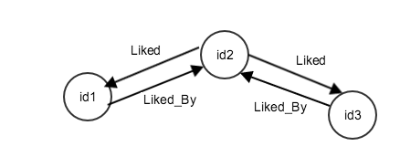
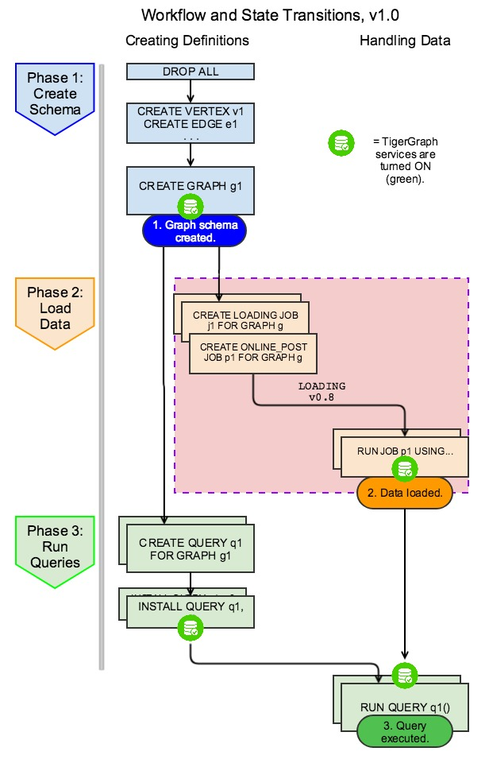
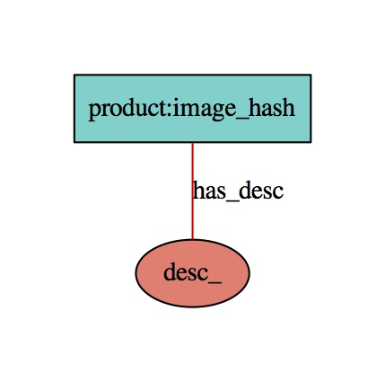
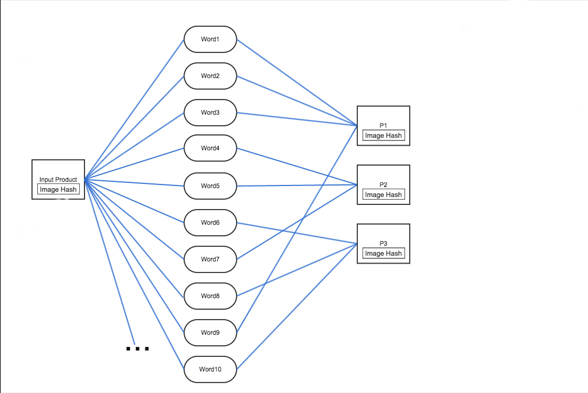
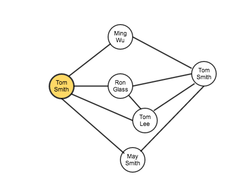

= Common Applications
:stem: latexmath



== Example 1. Collaborative Filtering

Here is an observation about social networks: If a set of persons likes me, and many of them also like another person Z, it is probably true that person Z and I have some things in common.  The same observation works for products and services: if a set of customers likes product X, and many of them also like product Z, then product X and Z probably have something in common.  We say X and Z are "co-liked". This observation can be turned around into a search for recommendations: Given a user X, find a set of of users Z which are highly co-liked.  For social networks, this can be used as friend recommendation: find a highly co-liked person Z to introduce to X.  For e-commerce, this can be used for purchase recommendation: someone who bought X may also be interested in buying Z. This technique of finding the top co-liked individuals is called collaborative filtering.

A graph analytics approach is a natural fit for collaborative filtering because the original problem is in a graph (social network), and the search criteria can easily be expressed as a path in the graph. We first find all people Y who like user X, then find other users Z who are liked by someone in group Y, and rank members of Z according to how many times they're liked by Y.

Figure 1 below shows a simple graph according to our model.  The circles represent three User vertices with id values id1, id2, and id3. There are two directed edges labeled "Liked" which show that User id2 likes id1, and id2 also likes id3.  (In this model, friendship is directional because in online social networks, one of the two persons initiates the friendship.) There are two more directed edges in the opposite directions labeled "Liked_By". Since id2 likes both id1 and id3, id1 and id3 are co-liked.

=== Quick Demo

To just see the basic operation of the TigerGraph system, follow the easy instructions below .  You can then continue to read for the explanation of the command files so you can learn to design your own examples.

==== *Quick Demo Instructions*

This example uses the graph below and asks the following query: "Who are the top co-liked persons of id1"?

image::../../.gitbook/assets/c2%20%281%29%20%282%29%20%283%29.png[]

*Step 1*: Obtain the data and command files. Create a graph model.

This example uses 4 small files: 3 command files ( cf_model.gsql , cf_load.gsql , cf_query.gsql) __**__and one data file ( cf_data.csv) . Their contents are shown below, so you can either copy from this document or download the files (look in the "cf" subfolder of Examples.zip)

[,bash]
----
> gsql 'DROP ALL'
> gsql cf_model.gsql
> gsql 'CREATE GRAPH gsql_demo(*)'
----

*Step 2*: Load data:

The command below loads our new data.

[,bash]
----
> gsql -g gsql_demo cf_load.gsql
----

*Step 3*: Install and execute the query:

The file cf_query.gsql creates a query called topCoLiked. Then we install the query. The creation step runs fast, but the installation (compiling) step may take about 1 minute. We then run the query, asking for the top 20 Users who are co-liked with User id1.

[,bash]
----
> gsql -g gsql_demo cf_query.gsql
> gsql -g gsql_demo 'INSTALL QUERY topCoLiked'
> gsql -g gsql_demo 'RUN QUERY topCoLiked("id1", 20)'
----

The query results should be the following. Interpretation: id4 has as score (@cnt) = 2, which means there are two persons who like both id1 and id4. Next, id2 and id3 each have 1 co-friend in common with id1.

[,coffeescript]
----
{
  "error": false,
  "message": "",
  "version": {
    "edition": "developer",
    "schema": 0,
    "api": "v2"
  },
  "results": [{"L2": [
    {
      "v_id": "id4",
      "attributes": {"@cnt": 2},
      "v_type": "User"
    },
    {
      "v_id": "id3",
      "attributes": {"@cnt": 1},
      "v_type": "User"
    },
    {
      "v_id": "id2",
      "attributes": {"@cnt": 1},
      "v_type": "User"
    }
  ]}]
}
----

We now begin a tutorial-style explanation of this TigerGraph example and the workflow in general.

The figure below outlines the steps to progress from an empty graph to a query solution.  Each of the blocks below corresponds to one of the steps in the Quick Demo above. The tutorial below will give you a deeper understanding of each step, so you can learn how it works and so you can design your own graph solutions.

=== *Step 1: Create a graph model.*

The first step is to create a model for your data which describes the types of vertices and edges you will have.


 This example is written to be compatible with older TigerGraph platforms which support only one graph model at a time (though the user can make the model simple or complex, to handle multiple needs).  To clear an existing model and old data, so you can install a new one, run the  **`DROP ALL`**command.


The statements below describe the vertex types and edge types in our Co-Liked model

[,coffeescript]
----
CREATE VERTEX User (PRIMARY_ID id string)
CREATE DIRECTED EDGE Liked (FROM User, TO User) WITH REVERSE_EDGE = "Liked_By"
----

The first CREATE statement creates one vertex type called User. The second statement creates one directed edge type called Liked.  The `WITH REVERSE_EDGE` clause means that for every two vertices (x,y) connected by a Liked type of edge, the system will automatically generate a corresponding edge of type Liked_By pointing from y to x, and both edges will have the same edge attributes.

After defining all your vertex and edge types, execute the following command to create a graph which binds the vertices and edges into one graph model:



[,coffeescript]
----
CREATE GRAPH gsql_demo(*)
----



The name of the graph is gsql_demo. Within the parentheses, you can either list the specific vertex and edge types (User, Liked), or you can use *, which means include everything.  We chose to use * so that the same command can be used for all of our examples.

The CREATE commands can be stored in one file and executed together.



[,coffeescript]
----
CREATE VERTEX User (PRIMARY_ID id string)
CREATE DIRECTED EDGE Liked (FROM User, TO User) WITH REVERSE_EDGE = "Liked_By"
#CREATE GRAPH gsql_demo(*)
----




The CREATE GRAPH command is commented out for the following reason:

Our examples have been designed to run either as individual graphs or merged together into one multi-application graph.  The CREATE GRAPH command may be run only once, after all the vertex and edge types  have been created. (Each of our demo examples uses unique vertex and edge names, to avoid conflicts.) In other words, we run **`CREATE GRAPH gsql_demo(*)`**as a separate command after creating all the vertex and edge types. If you decide you want to modify the schema after running CREATE GRAPH, you can create and run a SCHEMA_CHANGE JOB.

Newer TigerGraph platforms (i.e., version 1.1 or higher) can support multiple graphs, but this tutorial has been designed to be compatible with older single-graph platforms.


* To execute these statements (DROP ALL, CREATE VERTEX, etc.), you can type them individually at the GSQL shell prompt, or you can first save them to a file, such as `cf_model.gsql` , and then run the command file.  From within the shell, you would run  *`@cf_model.gsql`*  From outside the shell, you would run  `>` *`gsql cf_model.gsql`*


 Normally a user would put all their CREATE VERTEX, CREATE EDGE, and the final CREATE GRAPH statements in one file. In our example files, we have separated out the CREATE GRAPH statement because we want to merge all our example schemas together into one common graph.


* The vertex, edge, and graph types become part of the _catalog_ . To see what is currently in your catalog, type the *`ls`* command from within the GSQL shell to see a report as below:



[,text]
----
Vertex Types:
  - VERTEX User(PRIMARY_ID id STRING) WITH STATS="OUTDEGREE_BY_EDGETYPE"

Edge Types:
  - directed edge Liked(from User, to User) with reverse_edge="Liked_By"
  - directed edge Liked_By(from User, to User) with reverse_edge="Liked"

Graphs:

Jobs:
Queries:

Json API version: v2
----



* To remove a definition from the catalog, use some version of the **`DROP`**command.  Use the **`help`**command to see a summary of available GSQL commands.
* In our examples, we typically show keywords in ALL UPPERCASE to distinguish them from user-defined identifiers. Identifiers are case-sensitive but keywords are not.

In this example, the vertices and edges don't have attributes. In general, a TigerGraph graph can have attributes on both vertices and edges, and it can also have different types of edges connecting the same two vertices.  Please see link:../../dev/gsql-ref/ddl-and-loading/[GSQL Language Reference Part 1 - Defining Graphs and Loading Data] which provides a more complete description of the graph schema definition language with additional examples.

=== *Step 2: Load initial data.*

Figure 2 shows a larger graph with five vertices and several edges. To avoid crowding the figure, only the Liked edges are shown: For every Liked edge, there is a corresponding Liked_By edge in the reverse direction.

image::../../.gitbook/assets/c2%20%281%29%20%282%29.png[Figure 2 - Graph for Collaborative Filtering Calculation]

The data file below describes the five vertices and seven edges of Figure 2.



[,sql]
----
id2,id1
id2,id3
id3,id1
id3,id4
id5,id1
id5,id2
id5,id4
----



The loading job below will read from a data file and create vertex and edge instances to put into the graph.



[,coffeescript]
----
# define the loading job
USE GRAPH gsql_demo # added for v1.2
CREATE LOADING JOB load_cf FOR GRAPH gsql_demo {
  DEFINE FILENAME f;
  LOAD f
    TO VERTEX User VALUES ($0),
    TO VERTEX User VALUES ($1),
    TO EDGE Liked VALUES ($0, $1);
}

# load the data
RUN LOADING JOB load_cf USING f="../cf/data/cf_data.csv"
----




Now that we have defined a graph (in Step 1), GSQL commands or sessions should specify that you want to use a particular graph. Line 2 (new for v1.2) sets the working graph to be gsql_demo. Another way to set the working graph is to specify each time you invoke the gsql command, e.g.,


[,text]
----
gsql -g gsql_demo cf_load.gsql
----

The CREATE LOADING JOB statement (line 3) defines a job called load_cf. The job will read each line of the input file, creates one vertex based on the value in the first column (referenced with column name $0), another vertex based on the value in the second column ($1), and one Liked edge pointing from the first vertex to the second vertex. In addition, since the Liked edge type definition includes the WITH REVERSE_EDGE clause, a Liked_By edge pointing in the opposite direction is also created.

After the job has been created, we run the job (line 12).  the RUN LOADING JOB command line includes details about the data source: the name of the file is cf_data.csv, commas are used to separate columns, and \n is used to end each line. (Data files should not contain any extra spaces before or after the separator character.)

The TigerGraph loader automatically filters out duplicates. If either of the two column values has already been seen before, that vertex won't be created. Instead the existing vertex will be used. For example, if we read the first two data lines in data file cf_data.csv , the first line will generate two `User` vertices, one edge type of `Liked` , and one edge type of `Liked_By` . For the second row, however, only one new vertex will be created since `id2` has been seen already. Two edges will be created for the second row.



. It is okay to run an LOADING JOB again, or to run a different loading job, to add more data to a graph store which already has some data.  For example, you could do the following:

[,text]
----
RUN LOADING JOB load_cf USING f="../cf/cf_data1.csv"
RUN LOADING JOB load_cf USING f="../cf/cf_data2.tsv"
----

 2.After loading, you can use the GraphStudio UI to visually inspect your data.  Refer to the [TigerGraph GraphStudio UI Guide](../../ui/graphstudio/) . 


To clear all your data but to keep your graph model, run the "CLEAR GRAPH STORE -HARD" command. -HARD must be in all capital letters.



Be very careful using CLEAR GRAPH STORE; there is no UNDO command.


For the querying and updating examples in the remainder of this use case, we will assume that Figure 2 has been loaded.

This loading example is basic. The GSQL language can do complex data extraction and transformation, such as dealing with JSON input format and key-value list input, all in high-level syntax.  Please see link:../../dev/gsql-ref/ddl-and-loading/[GSQL Language Reference Part 1 - Defining Graphs and Loading Data] for more examples.

=== *Step 3: Write a graph-based query solution*

The GSQL language includes not only data definition and simple inspection of the data, but also advanced querying which traverses the graph and which supports aggregation and iteration.

==== Built-In Queries

First , we can run some simple queries to verify that the data were loaded correctly. Below are some examples of some built-in GSQL queries which can be run in GSQL shell:+++<table>++++++<thead>++++++<tr>++++++<th style="text-align:left">+++Simple Query for Validation+++</th>+++
      +++<th style="text-align:left">+++Meaning & Comments+++</th>++++++</tr>++++++</thead>+++
  +++<tbody>++++++<tr>++++++<td style="text-align:left">++++++<code>+++SELECT count(*) FROM User+++</code>++++++</td>+++
      +++<td style="text-align:left">+++Display the number of User vertices,+++</td>++++++</tr>+++
    +++<tr>++++++<td style="text-align:left">++++++<code>+++SELECT count(*) FROM User-(Liked)->User+++</code>++++++</td>+++
      +++<td style="text-align:left">+++Display the number of directed Liked edges from User type to User type+++</td>++++++</tr>+++
    +++<tr>++++++<td style="text-align:left">++++++<code>+++SELECT approx_count(*) FROM User+++</code>++++++</td>+++
      +++<td style="text-align:left">+++Display the number of User vertices according to cached statistics. Response
        time may be faster than count(*). See note below.+++</td>++++++</tr>+++
    +++<tr>++++++<td style="text-align:left">++++++<code>+++SELECT approx_count(*) FROM User-(Liked)->User+++</code>++++++</td>+++
      +++<td style="text-align:left">+++Display the number of directed Liked edges from User type to User Type,
        according to cached statistics. Response time may be faster than count(*).
        See note below.+++</td>++++++</tr>+++
    +++<tr>++++++<td style="text-align:left">++++++<code>+++SELECT * FROM User LIMIT 3+++</code>++++++</td>+++
      +++<td style="text-align:left">++++++
+++Display all id, type, and attribute information for up to 3 User vertices.+++
+++
        +++
+++A LIMIT or WHERE condition is required, to prevent the output from being
          too large.
          +++ ++++++ +++Note that there is also a system limit of 10240 vertices or edges returned
          by SELECT *.+++
++++++</td>++++++</tr>+++
    +++<tr>++++++<td style="text-align:left">++++++<code>+++SELECT * FROM User WHERE primary_id==&quot;id2&quot;+++</code>++++++</td>+++
      +++<td style="text-align:left">+++Display all id, type and attribute information for the User vertex whose
        primary_id is &quot;id2&quot;.
        +++ ++++++ +++The WHERE clause can also specify non-ID attributes.+++</td>++++++</tr>+++
    +++<tr>++++++<td style="text-align:left">++++++<code>+++SELECT * FROM User-(ANY)->ANY WHERE from_id==&quot;id1&quot;+++</code>++++++</td>+++
      +++<td style="text-align:left">++++++
+++Display all id,type, and attribute information about any type of edge
          which starts from vertex &quot;id1&quot;.+++
+++
        +++
+++To guard against queries which select too many edges, the WHERE clause
          is mandatory when selecting edges.+++
++++++</td>++++++</tr>++++++</tbody>++++++</table>+++

[,coffeescript]
----
GSQL > SELECT * FROM User LIMIT 5
[
  {
    "v_id": "id2",
    "attributes": {},
    "v_type": "User"
  },
  {
    "v_id": "id5",
    "attributes": {},
    "v_type": "User"
  },
  {
    "v_id": "id3",
    "attributes": {},
    "v_type": "User"
  },
  {
    "v_id": "id4",
    "attributes": {},
    "v_type": "User"
  },
  {
    "v_id": "id1",
    "attributes": {},
    "v_type": "User"
  }
]
----

==== Create a Query


Note on approx_count(*)

The approx_count(*)  function relies on statistics which may not account for recent insertions and deletions. If there has been no recent activity, they will give accurate results. In contrast, the count(*) function insures that recent data insertions and deletions are processed, so that it returns an accurate count.


`SELECT *`  displays information in JSON format.  Below is an example of query output.

Now let's solve our original problem: find users who are co-liked with a user X. The following query demonstrates a 2-step traversal with aggregation.

The query below performs the co-liked collaborative filtering search.  The concept behind this query is to describe a "graph path" which represents the relationship between a person (the starting point) and a person that is co-liked (the ending point).  Figure 1 illustrates this path: id3 is a co-liked user of id1, because id2 likes both of them.  The path from id1 to co-liked users is: (1) traverse a Liked_By edge to a User, and then (2) traverse a Liked edge to another User. This query also calculates the magnitude of the relationship between the starting point and each ending point. The more users there are such as id2 which connect id1 and id3, the stronger the co-like relationship between id1 and id3.  Counting the number of paths that end at id3 serves to calculate this magnitude.



[,coffeescript]
----
CREATE QUERY topCoLiked( vertex<User> input_user,  INT topk) FOR GRAPH gsql_demo
{
  SumAccum<int>  @cnt = 0;
  # @cnt is a runtime attribute to be associated with each User vertex
  # to record how many times a user is liked.
    L0 = {input_user};
    L1 = SELECT tgt
    	FROM L0-(Liked_By)->User:tgt;
    L2 =  SELECT tgt
          FROM L1-(Liked)->:tgt
          WHERE  tgt != input_user
          ACCUM tgt.@cnt += 1
          ORDER BY tgt.@cnt DESC
          LIMIT topk;
  PRINT L2;
}
----



This query is structured like a procedure with two input parameters: an input vertex and value of k for the top-K ranking. The query contains three SELECT statements executed in order. The L0 statement defines our initial list of vertices: a set containing a single user supplied by the `input_user` parameter. Suppose the input user is `id1` . Next, the L1 statement starts from every vertex in the set L0, traverses every connected edge of type Liked_By and returns every target vertex (that is, the other ends of the connected edges).  As a result, L1 is the set of all users who liked the input user. Referring to the graph in Figure 2, the query travels backwards along every Liked edge which points to `id1` , arriving at `id2` , `id3` , and `id5` . These three vertices form L1. Next, the L2 statement starts from each user in L1, travels to every user liked by that starting user (via the Liked type of edges), and increments the count for each User reached. That is, the algorithm counts how many times each vertex is visited by a query path. The WHERE condition makes sure the original input user will not be returned in the result.ORDER BY and LIMIT have the same meaning as in SQL. Below, we show how the L2 step tallies the counts for each vertex encountered:

. From id2, Liked edges lead to id1 and id3. id1 is excluded due to the WHERE clause.  The cnt count for id3 is incremented from 0 to 1.
. From id3, Liked edges lead to id1 and id4. id1 is excluded due to the WHERE clause.  The cnt count for id4 is incremented from 0 to 1.
. From id5, Liked edges lead to id1, id2, and id4. id1 is excluded to to the WHERE clause. The cnt count of id2 is incremented from 0 to 1. The cnt count of id4 is incremented from 1 to 2.

The three co-liked users and their cnt scores:  id3 (cnt score = 1), id4 (cnt = 2), and id2 (cnt = 1).  The ORDER BY clause indicates that the sorting should be in descending order, such that the LIMIT clause trims L2 to the 20 vertices with the highest (as opposed to lowest) cnt values.  For the test graph, there are only 3 vertices which are co-liked, less than the limit of 20. id4 has the strongest co-liked relationship.

==== Install and Run a Query

After the query is defined (in the CREATE QUERY block), it needs to be installed.  The INSTALL QUERY command compiles the query.

[,coffeescript]
----
INSTALL QUERY topCoLiked
----

If you have several queries, you can wait to install them in one command, which runs faster than installed each one separately. E.g.,

[,coffeescript]
----
INSTALL QUERY query1, query2
----

or

[,coffeescript]
----
INSTALL QUERY ALL
----

is faster than

[,coffeescript]
----
INSTALL QUERY query1
INSTALL QUERY query2
----

After a query has been installed, it can be run as many times has desired. The command RUN QUERY invokes the query, with the given input arguments.

Using "id1" as the starting point and allowing up to 5 vertices in the output, the RUN QUERY command and its output on our test graph is shown below:

[,coffeescript]
----
GSQL > RUN QUERY topCoLiked("id1", 5)
{
  "error": false,
  "message": "",
  "version": {
    "edition": "developer",
    "schema": 0,
    "api": "v2"
  },
  "results": [{"L2": [
    {
      "v_id": "id4",
      "attributes": {"@cnt": 2},
      "v_type": "User"
    },
    {
      "v_id": "id3",
      "attributes": {"@cnt": 1},
      "v_type": "User"
    },
    {
      "v_id": "id2",
      "attributes": {"@cnt": 1},
      "v_type": "User"
    }
  ]}]
}
----

Instead of using the RUN QUERY command within the GSQL shell, the query can be invoked from the operating system via a RESTful GET endpoint (which is automatically created by the `INSTALL QUERY` command):

[,bash]
----
curl -X GET "http://hostName:port/query/gsql_demo/topCoLiked?input_user=id1&topk=5"
----

If you followed the standard installation instructions for the TigerGraph system, _hostName ****_for the REST server is **`localhost`**and *`port`* _****_is **`9000`**.


As of TigerGraph 1.2, the URL for query REST endpoints includes the graph name after query/. Prior to 1.2, the URL for the example above was http://hostName:port /query/topCoLiked


=== *Step 4 (Optional): Update Your Data.*

You can update the stored graph at any time, to add new vertices and edges, to remove some, or to update existing values. The GSQL language includes ADD, DROP, ALTER, UPSERT, and DELETE operations which are similar to the SQL operations of the same name. The UPSERT operation is a combined UPDATE-INSERT operation: If _object_ exists, then UPDATE, else INSERT. Note that this is the default behavior for The GSQL language's 'smart' loading described above. There are three basic types of modifications to a graph:

. Adding or deleting objects
. Altering the schema of the graph
. Modifying the attributes of existing objects

We'll give a quick example of each type. To show the effect each modification, we'll use the following simple built-in queries:



[,coffeescript]
----
SELECT * FROM User LIMIT 1000
SELECT * FROM User-(Liked)->User WHERE from_id=="id2"
----



The current results, before making any modifications, are shown below.



[,coffeescript]
----
GSQL > SELECT * FROM User LIMIT 1000
[
  {
    "v_id": "id2",
    "attributes": {},
    "v_type": "User"
  },
  {
    "v_id": "id5",
    "attributes": {},
    "v_type": "User"
  },
  {
    "v_id": "id3",
    "attributes": {},
    "v_type": "User"
  },
  {
    "v_id": "id4",
    "attributes": {},
    "v_type": "User"
  },
  {
    "v_id": "id1",
    "attributes": {},
    "v_type": "User"
  }
]
GSQL > SELECT * FROM User-(Liked)->User WHERE from_id=="id2"
[
  {
    "from_type": "User",
    "to_type": "User",
    "directed": true,
    "from_id": "id2",
    "to_id": "id3",
    "attributes": {},
    "e_type": "Liked"
  },
  {
    "from_type": "User",
    "to_type": "User",
    "directed": true,
    "from_id": "id2",
    "to_id": "id1",
    "attributes": {},
    "e_type": "Liked"
  }
]
----




 Graph modification operations are performed by a distributed computing model which satisfies Sequential Consistency. For these examples, a brief one second pause between the updating and querying the graph should be sufficient.


==== Modification Type 1: Adding or deleting

Adding is simply running a loading job again with a new data file. More details are in the GSQL Language Reference Part 1.

Deleting: Suppose we want to delete vertex id3 and all its connections:



[,coffeescript]
----
DELETE FROM User WHERE primary_id=="id3"
----





[,coffeescript]
----
GSQL > SELECT * FROM User LIMIT 1000
[
  {
    "v_id": "id2",
    "attributes": {},
    "v_type": "User"
  },
  {
    "v_id": "id5",
    "attributes": {},
    "v_type": "User"
  },
  {
    "v_id": "id4",
    "attributes": {},
    "v_type": "User"
  },
  {
    "v_id": "id1",
    "attributes": {},
    "v_type": "User"
  }
]
GSQL > SELECT * FROM User-(Liked)->User WHERE from_id=="id2"
[{
  "from_type": "User",
  "to_type": "User",
  "directed": true,
  "from_id": "id2",
  "to_id": "id1",
  "attributes": {},
  "e_type": "Liked"
}]
----



==== Modification Type 2: Altering the schema


The GSQL DELETE operation is a cascading deletion. If a vertex is deleted, then all of the edges which connect to it are automatically deleted as well.


Result: one fewer vertex and one fewer edge from id2.

The GSQL language supports four types of schema alterations:

. Adding a new type of vertex or edge: `ADD    VERTEX | DIRECTED EDGE | UNDIRECTED EDGE`
. Removing a type of vertex or edge: `DROP    VERTEX | DIRECTED EDGE | UNDIRECTED EDGE`
. Adding attributes to a vertex or edge type: `ALTER VERTEX vertex_type | EDGE edge_type ADD ATTRIBUTE (name type)`
. Removing attributes of a vertex or edge type: `ALTER VERTEX vertex_type | EDGE edge_type DROP ATTRIBUTE (name)`

To make schema changes, create a SCHEMA_CHANGE job. Running the SCHEMA_CHANGE JOB will automatically stop all services, update the graph store, and restart the service. For example, suppose we wish to add a name for Users and a weight to Liked edges to indicate_how much_ User A likes User B.



[,coffeescript]
----
CREATE GLOBAL SCHEMA_CHANGE JOB cf_mod2 {
	ALTER VERTEX User ADD ATTRIBUTE (name string);
    ALTER EDGE Liked ADD ATTRIBUTE (weight float DEFAULT 1);
}
RUN JOB cf_mod2
----




As of v1.2, the schema_change job here needs to be GLOBAL because the User vertex and Liked edge are global types (they were defined before an active graph was set.)



 Changing the schema may necessitate changing queries and other tasks, such as REST endpoints.  In this example, the collaborative filtering query will still run with the the new weight attribute, but it will ignore the weight in its calculations.




[,coffeescript]
----
GSQL > SELECT * FROM User LIMIT 1000
[
  {
    "v_id": "id2",
    "attributes": {"name": ""},
    "v_type": "User"
  },
  {
    "v_id": "id5",
    "attributes": {"name": ""},
    "v_type": "User"
  },
  {
    "v_id": "id4",
    "attributes": {"name": ""},
    "v_type": "User"
  },
  {
    "v_id": "id1",
    "attributes": {"name": ""},
    "v_type": "User"
  }
]
GSQL > SELECT * FROM User-(Liked)->User WHERE from_id=="id2"
[{
  "from_type": "User",
  "to_type": "User",
  "directed": true,
  "from_id": "id2",
  "to_id": "id1",
  "attributes": {"weight": 1},
  "e_type": "Liked"
}]
----



==== Modification Type 3: Modifying the attributes of existing objects

Now that we have added a weight attribute, we probably want to assign some weight values to the graph.  The following example updates the weight values of two edges. For edge upserts, the first two arguments in the VALUES list specify the FROM vertex id and the TO vertex_id, respectively.  Similarly, for vertex upserts, the first argument in the VALUES list specifies the PRIMARY_ID id. Since id values may not be updated, the GSQL shell implicitly applies a conditional test: "If the specified id value(s) exist, than update the non-id attributes in the VALUES list; otherwise, insert a new data record using these values."



[,coffeescript]
----
UPSERT User VALUES ("id1", "Aaron")
UPSERT User VALUES ("id2", "Bobbie")
UPSERT User-(Liked)->User VALUES ("id2","id1",2.5)
----





[,coffeescript]
----
GSQL > SELECT * FROM User LIMIT 1000
[
  {
    "v_id": "id2",
    "attributes": {"name": "Bobbie"},
    "v_type": "User"
  },
  {
    "v_id": "id5",
    "attributes": {"name": ""},
    "v_type": "User"
  },
  {
    "v_id": "id4",
    "attributes": {"name": ""},
    "v_type": "User"
  },
  {
    "v_id": "id1",
    "attributes": {"name": "Aaron"},
    "v_type": "User"
  }
]
GSQL > SELECT * FROM User-(Liked)->User WHERE from_id=="id2"
[{
  "from_type": "User",
  "to_type": "User",
  "directed": true,
  "from_id": "id2",
  "to_id": "id1",
  "attributes": {"weight": 2.5},
  "e_type": "Liked"
}]
----



==== *Other Modes for Graph Updates*

In addition to making graph updates within the GSQL Shell, there are two other ways: sending a query string directly to the Standard Data Manipulation REST API, or writing a custom REST endpoint.  For details about the first method, see the GET, POST, and DELETE /graphendpoints in the link:../../dev/restpp-api/[*RESTPP API User Guide* .] The functionality in GSQL and in the Standard Query API is the same; GSQL commands are translated into REST GET, POST, and DELETE requests and submitted to the Standard Query API.

The REST API equivalent of the GSQL Modification 3 upsert example above is as follows:

[,text]
----
curl -X POST --data-binary @ data/cf_mod3_input.json http://hostName:9000/graph
----

where _serverIP_ is the IP address of your REST server (default = `localhost`) and _data_/_cf_mod3_input.json_ is a text file containing the following JSON-encoded data:



[,coffeescript]
----
{
    "vertices": {
        "User":{
            "id1":{
                "name":{
                    "value":"Aaron"
                }
            }
        },
        "User":{
            "id2":{
                "name":{
                    "value":"Bobbie"
                }
            }
        }
    },
    "edges": {
         "User":{
             "id2":{
                 "Liked":{
                     "User":{
                         "id1":{
                             "weight" : {
                                 "value":2.5
                             }
                         }
                     }
                 }
             }
        }
    }
}
----



== Example 2. Page Rank

This example shows the use of WHILE loop ***iteration, global variables ***, and the built-in outdegree __**__attribute.

It is recommended that you do the Collaborative Filtering Use Case first, because it contains additional tips on running the TigerGraph system.

Remember that if you have a text file containing GSQL commands (e.g., commands.gsql), you can run it one of two ways:

* From Linux: *`gsql commands.gsql`*
* From inside the GSQL shell: *`@commands.gsql`*

To run a single command (such as DROP ALL):

* From Linux: *`gsql 'DROP ALL'`*
* From inside the GSQL shell: *`DROP ALL`*


Setting the working graph

If a graph has been defined, then all subsequent gsql commands need to specify which graph is being used.  If your command file does not contain a "USE GRAPH" statement, then you can specify the graph when invoking gsql:gsql -g graph_name commands.gsql

[,text]
----
gsql -g graph_name commands.gsql
----

If you are always using the same graph, you can define a Linux alias to automatically include your graph name:

[,text]
----
alias gsql='gsql -g graph_name'
----

You can add this line to the .bashrc in your home directory so that the alias is defined each time you open a bash shell.


=== *Step 1: Create a graph model.*

In this example, there is only one type of vertex and one type of edge, and edges are directed.



[,coffeescript]
----
CREATE VERTEX Page (PRIMARY_ID pid string, page_id string)
CREATE DIRECTED EDGE Linkto (FROM Page, TO Page)
#CREATE GRAPH gsql_demo(*)
----



Note how the Page vertex type has both a PRIMARY_ID  and a page_id attribute.  As will be seen in step 2, the same data will be loaded into both fields.  While this seems redundant, this is a useful technique in TigerGraph graph stores. The PRIMARY_ID is not treated as an ordinary attribute. In exchange for high-performance storage, the PRIMARY_ID lacks some of the filtering and querying features available to regular attributes.  The Linkto edge does not have any attributes. In general, a TigerGraph graph can have attributes on both vertices and edges, and it can also have different types of edges connecting the same two vertices.


The CREATE GRAPH command is commented out for the following reason:

Our examples have been designed to run either as individual graphs or merged together into one multi-application graph.  The CREATE GRAPH command should be run only once, after all the vertex and edge types for all the examples have been created. (Naturally, every model uses unique vertex and edge names, to avoid conflicts.) In other words, run ' *`CREATE GRAPH gsql_demo(*)`* ' as a separate command after you have created all your vertex and edge types.


Please see the GSQL Language Reference __**__which provides a more complete description of the graph schema definition language with additional examples .

=== *Step 2: Load initial data*

A similar graph to what was used for the Collaborative Filtering user-user network example can be used for an example here. That is, each row has two values which are node IDs, meaning that there is a connection from the first node to the second node. However, we will introduce a difference to demonstrate the flexibility of the TigerGraph loading system. We will modify the data file to use the tab character as a field separator instead of the comma.



[,coffeescript]
----
1	2
1	3
2	3
3	4
4	1
4	2
----



==== Loading job:

Create your loading job and load the data.



[,coffeescript]
----
# define the loading job
CREATE LOADING JOB load_pagerank FOR GRAPH gsql_demo {
  DEFINE FILENAME f;
  LOAD f
      TO VERTEX Page VALUES ($0, $0),
      TO VERTEX Page VALUES ($1, $1),
      TO EDGE Linkto VALUES ($0, $1)
      USING SEPARATOR="\t";
}

# load the data
RUN LOADING JOB load_pagerank USING f="../pagerank/pagerank_data.tsv"
----



The above loading job will read each line of the input file (pagerank_data.tsv), create one vertex based on the value in the first column (referenced as $0), another vertex based on the value in the second column ($1), and one edge pointing from the first vertex to the second vertex. If either of the two column values has already been seen before, that vertex won't be created. Instead the existing vertex will be used. For example, the first row of pagerank_data.tsv, will create two vertices, with ids 1 and 2, and one edge (1, 2). The second row, however, will create only one new vertex, id 3, and one edge (1, 3), because id 1 already exists.

Note how the LOAD statement specifies the SEPARATOR character is the tab character.

=== *Step 3: Write a Graph-based query solution*

GSQL includes not only data definition and simple inspection of the data, but also advanced querying which traverses the graph and which supports aggregation and iteration. This example uses iterations, repeating the computation block until the maximum score change at any vertex is no more than a user-provided threshold, or until it reaches a user-specified maximum number of allowed iterations. Note the arrow *`+->+`* in the *`FROM`* clause used to represent the direction of a directed edge.



[,coffeescript]
----
CREATE QUERY pageRank (float maxChange, int maxIteration, float dampingFactor)
FOR GRAPH gsql_demo
{
  # In each iteration, compute a score for each vertex:
  #   score = dampingFactor + (1-dampingFactor)* sum(received scores from its neighbors).
  # The pageRank algorithm stops when either of the following is true:
  #  a) it reaches maxIterations iterations;
  #  b) max score difference of any vertex compared to the last iteration <= maxChange.
  #   @@ prefix means a global accumulator;
  #   @ prefix means an individual accumulator associated with each vertex

  MaxAccum<float> @@maxDifference = 9999; # max score change in an iteration
  SumAccum<float> @received_score = 0; # sum of scores each vertex receives from neighbors
  SumAccum<float> @score = 1;   # initial score for every vertex is 1.

  AllV = {Page.*};   #  Start with all vertices of type Page
  WHILE @@maxDifference > maxChange LIMIT maxIteration DO
    @@maxDifference = 0;
    S = SELECT s
         FROM AllV:s-(Linkto)->:t
         ACCUM t.@received_score += s.@score/s.outdegree()
         POST-ACCUM s.@score = dampingFactor + (1-dampingFactor) * s.@received_score,
                    s.@received_score = 0,
                    @@maxDifference +=   abs(s.@score - s.@score');
    PRINT @@maxDifference; # print to default json result
  END; # end while loop
  #PRINT AllV.page_id, AllV.@score;       # print the results, JSON output API version v1
  PRINT AllV[AllV.page_id, AllV.@score];  # print the results, JSON output API version v2
} # end query
----




 For JSON output API v2, the PRINT syntax for a vertex set variable is different than the v1 syntax.


After executing the CREATE QUERY command, remember to install the query, either by itself or together with other queries:



[,coffeescript]
----
INSTALL QUERY pageRank
----



Run the query:

We will use the typical dampingFactor of 0.15, iterate until the pagerank values change by less than 0.001, up to a maximum of 100 iterations. For these conditions, the PageRank values for the 4 vertices (1,2,3,4) are  ( 0.65551, 0.93379, 1.22156, 1.18914), respectively.

[,coffeescript]
----
RUN QUERY pageRank(0.001, 100, 0.15)
{
  "error": false,
  "message": "",
  "version": {
    "edition": "developer",
    "schema": 0,
    "api": "v2"
  },
  "results": [
    {"@@maxDifference": 0.425},
    {"@@maxDifference": 0.36125},
    {"@@maxDifference": 0.15353},
    {"@@maxDifference": 0.19575},
    {"@@maxDifference": 0.16639},
    {"@@maxDifference": 0.09429},
    {"@@maxDifference": 0.08014},
    {"@@maxDifference": 0.05961},
    {"@@maxDifference": 0.04705},
    {"@@maxDifference": 0.03999},
    {"@@maxDifference": 0.017},
    {"@@maxDifference": 0.02},
    {"@@maxDifference": 0.017},
    {"@@maxDifference": 0.00953},
    {"@@maxDifference": 0.0081},
    {"@@maxDifference": 0.00616},
    {"@@maxDifference": 0.00479},
    {"@@maxDifference": 0.00407},
    {"@@maxDifference": 0.00178},
    {"@@maxDifference": 0.00205},
    {"@@maxDifference": 0.00174},
    {"@@maxDifference": 9.6E-4},
    {"AllV": [
      {
        "v_id": "2",
        "attributes": {
          "AllV.page_id": "2",
          "AllV.@score": 0.93379
        },
        "v_type": "Page"
      },
      {
        "v_id": "4",
        "attributes": {
          "AllV.page_id": "4",
          "AllV.@score": 1.18914
        },
        "v_type": "Page"
      },
      {
        "v_id": "1",
        "attributes": {
          "AllV.page_id": "1",
          "AllV.@score": 0.65551
        },
        "v_type": "Page"
      },
      {
        "v_id": "3",
        "attributes": {
          "AllV.page_id": "3",
          "AllV.@score": 1.22156
        },
        "v_type": "Page"
      }
    ]}
  ]
}
----

=== *Step 4 (Optional): Update Your Data.*

Details about updating were discussed in Use Case 1 (Collaborative Filtering).  We will go right to the graph modification examples for the PageRank case.

To show the effect of each modification, we use two built-in queries. The first one lists all the Page vertices.  The second one lists all the edges which start at Page 4.



[,coffeescript]
----
SELECT * FROM Page LIMIT 1000
SELECT * FROM Page-(Linkto)->Page WHERE from_id=="4"
----



These are the results of the diagnostic queries, before any graph modifications.  There are 4 vertices total and 2 edges which start at page 4.



[,coffeescript]
----
SELECT * FROM Page LIMIT 1000
[
  {
    "v_id": "2",
    "attributes": {"page_id": "2"},
    "v_type": "Page"
  },
  {
    "v_id": "4",
    "attributes": {"page_id": "4"},
    "v_type": "Page"
  },
  {
    "v_id": "1",
    "attributes": {"page_id": "1"},
    "v_type": "Page"
  },
  {
    "v_id": "3",
    "attributes": {"page_id": "3"},
    "v_type": "Page"
  }
]
SELECT * FROM Page-(Linkto)->Page WHERE from_id=="4"
[
  {
    "from_type": "Page",
    "to_type": "Page",
    "directed": true,
    "from_id": "4",
    "to_id": "2",
    "attributes": {},
    "e_type": "Linkto"
  },
  {
    "from_type": "Page",
    "to_type": "Page",
    "directed": true,
    "from_id": "4",
    "to_id": "1",
    "attributes": {},
    "e_type": "Linkto"
  }
]
----



==== Modification 1: Adding or deleting

Adding is simply running a loading job again with a new data file.

Deleting: Suppose we want to delete vertex url4 and all its connections:



[,coffeescript]
----
DELETE FROM Page WHERE page_id=="1"
----




 The GSQL DELETE operation is a cascading deletion. If a vertex is deleted, then all of the edges which connect to it are automatically deleted as well.


Result: one fewer vertex and one fewer edge from Page 4.



[,coffeescript]
----
SELECT * FROM Page LIMIT 1000
[
  {
    "v_id": "2",
    "attributes": {"page_id": "2"},
    "v_type": "Page"
  },
  {
    "v_id": "4",
    "attributes": {"page_id": "4"},
    "v_type": "Page"
  },
  {
    "v_id": "3",
    "attributes": {"page_id": "3"},
    "v_type": "Page"
  }
]
SELECT * FROM Page-(Linkto)->Page WHERE from_id=="4"
[{
  "from_type": "Page",
  "to_type": "Page",
  "directed": true,
  "from_id": "4",
  "to_id": "2",
  "attributes": {},
  "e_type": "Linkto"
}]
----



==== Modification Type 2: Altering the schema

For example, suppose we wish to add an attribute to the Page vertices to classify what type of Page it is and also a date to the edges.



[,sql]
----
CREATE GLOBAL SCHEMA_CHANGE JOB pagerank_mod2 {
    ALTER VERTEX Page ADD ATTRIBUTE (pageType string DEFAULT "");
    ALTER EDGE Linkto ADD ATTRIBUTE (dateLinked string DEFAULT "");
}
RUN JOB pagerank_mod2
----




 Changing the schema may necessitate revising and reinstalling loading jobs and queries. In this case, adding the pageType attribute does not harm the pageRank query.



 This schema_change job is GLOBAL because the Page vertex and Linkto edge types are global (defined before setting an active graph).




[,coffeescript]
----
SELECT * FROM Page LIMIT 1000
[
  {
    "v_id": "2",
    "attributes": {
      "page_id": "2",
      "pageType": ""
    },
    "v_type": "Page"
  },
  {
    "v_id": "4",
    "attributes": {
      "page_id": "4",
      "pageType": ""
    },
    "v_type": "Page"
  },
  {
    "v_id": "3",
    "attributes": {
      "page_id": "3",
      "pageType": ""
    },
    "v_type": "Page"
  }
]
SELECT * FROM Page-(Linkto)->Page WHERE from_id=="4"
[{
  "from_type": "Page",
  "to_type": "Page",
  "directed": true,
  "from_id": "4",
  "to_id": "2",
  "attributes": {"dateLinked": ""},
  "e_type": "Linkto"
}]
----



==== Modification Type 3: Modifying the attributes of existing objects

The following example updates the type values of two vertices and one edge.

[,coffeescript]
----
UPSERT Page VALUES (2,2,"info")
UPSERT Page VALUES (3,3,"commerce")
UPSERT Page-(Linkto)->Page VALUES (4,2,"2016-08-31")
----



[,coffeescript]
----
SELECT * FROM Page LIMIT 1000
[
  {
    "v_id": "2",
    "attributes": {
      "page_id": "2",
      "pageType": "info"
    },
    "v_type": "Page"
  },
  {
    "v_id": "4",
    "attributes": {
      "page_id": "4",
      "pageType": ""
    },
    "v_type": "Page"
  },
  {
    "v_id": "3",
    "attributes": {
      "page_id": "3",
      "pageType": "commerce"
    },
    "v_type": "Page"
  }
]
SELECT * FROM Page-(Linkto)->Page WHERE from_id=="4"
[[{
  "from_type": "Page",
  "to_type": "Page",
  "directed": true,
  "from_id": "4",
  "to_id": "2",
  "attributes": {"dateLinked": "2016-08-31"},
  "e_type": "Linkto"
}]
----



==== Other Modes for Graph Updates

In addition to making graph updates within the GSQL Shell, there are two other ways: sending a query string directly to the Standard Data Manipulation REST API, or writing a custom REST endpoint.  For details about the first method, see the Standard Data Manipulation REST API User Guide . The functionality in GSQL and in the Standard Query API is essentially the same; GSQL commands are translated into REST GET, POST, and DELETE requests and submitted to the Standard Query API.

The REST API equivalent of the GSQL Modification 3 upsert example above is as follows:

[,coffeescript]
----
curl -X POST --data-binary @data/pagerank_mod3_input.json http://hostName:9000/graph
----

where _hostName_ is the IP address of your REST server, and _data /pagerank_mod3_input.json_ is a text file containing the following JSON-encoded data:

[,coffeescript]
----
{
   "vertices": {
        "Page":{
            "2":{
                "pageType" : {
                    "value":"info"
                }
            }
        },
        "Page":{
            "3":{
                "pageType" : {
                    "value":"commerce"
                }
            }
        }
    },
    "edges": {
         "Page":{
             "4":{
                 "Linkto":{
                     "Page":{
                         "2":{
                             "dateLinked" : {
                                 "value":"2016-08-31"
                             }
                         }
                     }
                 }
             }
        }
    }
}
----

== Example 3. Simple Product Recommendation

This example introduces the technique of flattening _**_-- splitting a data field which contains a set of elements into individual vertices and edges, one for each element.

*Input Data*: ****A list of products. Each Product has a 64-bit image hash value and a list of words describing the product. +
****Query Task *:* Find the products which are most similar to a given product. Formally, given a product id P and an integer K,return the top K products similar to the product P. The similarity between a product P and another product Q is based on the number of words found in the product descriptions for both product P and product Q.

*Step 1*: __**__Create a graph model for the use case, using the data definition language (DDL) aspect of the GSQL language.



[,coffeescript]
----
CREATE VERTEX Product (PRIMARY_ID pid string, image_hash uint)
CREATE VERTEX DescWord (PRIMARY_ID id string)
CREATE UNDIRECTED EDGE Has_desc (FROM Product, TO DescWord)
----



Then run

[,coffeescript]
----
CREATE GRAPH gsql_demo(*)
----

The above statements create two types of vertices, Product and DescWord, and one type of edge connecting the two vertex types. The edge is undirected so that you can just as easily traverse from a Product to its descriptive words or from a descriptive word to Products which are described by it.

The generated graph schema for this case is shown below. The GSQL Language Reference manual provides a more complete description of the language with more examples .

*Step 2*: Load Input Data.

In this example, the input data are all stored in a single file having a 3-column format with a header column. Below are the test data:



[,coffeescript]
----
id,hash,words
62abcax334,15243242,"word1,word2,word3"
dell laptop,1837845,"word2,word4,word5"
mac book, 128474373,"word4"
surface pro,8439828,"word1,word3,word6"
hp book,29398439828,"word2,word3,word1"
linux abc,298439234,"word4,word2,word1"
linux def,295839234,"word4,word2,word6,word7"
----



Column 1 is the product id; column 2 is the image hash code, and column 3 is a list of words describing the product. Note how double quotation marks are used to enclose the list of words. Each row from the input file may lead to the creation of one Product vertex, multiple DescWord vertices, and multiple edges, one edge connecting the Product to each DescWord vertex.

The loading job below makes use of several features of the loading language to intelligently transform this data file into the appropriate vertices and edges.

. The HEADER="true" option tells the loader that the data file's first line contains column headings instead of data.  It will read the column headings and permit these heading names to be used instead of index numbers $1, $2, etc.
. DEFINE HEADER and USER_DEFINED_HEADER allow the loading job to define its own names for the columns ("id", "hash", "words"), instead of the index numbers ($0, $1, $2) and overriding the file's own headings.
. QUOTE="double" informs the loader that double quotation marks enclose strings.  This allows the separator character (e.g., comma) to appear in the string, without triggering the end of the token.  QUOTE="single" is also available.
. The special TEMP_TABLE and flatten() function are used to split the list of tokens into separate items and to store them temporarily. The temporary items are then used to assemble the final edge objects.



[,coffeescript]
----
# define the loading job
CREATE LOADING JOB load_simprod FOR GRAPH gsql_demo {
  DEFINE HEADER head1 = "id","hash","words";
  DEFINE FILENAME f1;
  LOAD f1
    TO VERTEX Product values ($"id", $"hash"),
    TO TEMP_TABLE t (pid, description) VALUES ($"id", flatten($"words", ",", 1))
    USING QUOTE="double", HEADER="true", USER_DEFINED_HEADER="head1";
  LOAD TEMP_TABLE t
    TO VERTEX DescWord VALUES ($"description"),
    TO EDGE Has_desc VALUES ($"pid", $"description");
}

# load the data
RUN LOADING JOB load_simprod USING f1="../simprod/data/simprod_data.csv"
----



In general, the GSQL language can map and transform multiple input files to multiple vertex and edge types.  More advanced data transformation and filtering features are also available. See the GSQL Language Reference __**__manual for more information.

An example of the resulting data graph is shown below. Products (P1, P2, etc.) connect to various DescWords (Word1, Word2, etc.). Each Product connects to many DescWords, and each DescWord is used in multiple Products.

*Step 3*: Write a graph-based solution using TigerGraph's high-level GSQL query language, to solve the use case and auto-generate the REST GET/POST endpoints for real-time accesses to TigerGraph's system.



[,coffeescript]
----
CREATE QUERY productSuggestion (vertex<Product> seed, int threshold_cnt, int k = 10)
FOR GRAPH gsql_demo
{
    # an accumulator variable attachable to any vertex
    SumAccum<int>     @cnt = 0;

    # T0 is the set of products from which we want to start traversal in the graph
    T0={seed};

    /**
    *  Compute the collection of words describing the input
    *  product. tgt is the alias of vertex type DescWord.
    *  In other words, for every edge of the given type (Has_desc)
    *  that has one vertex in the set T0 and the other vertex being of
    *  the DescWord type, add its DescWord vertex to the output set.
    */
    ProductWords = SELECT tgt
               FROM T0-(Has_desc)-DescWord:tgt;

    /**
     *  The output set of the previous query (ProductWords) becomes the input set
     *  of this query. From each word in ProductWords, activate all other products
     *  which contain the word in their description, and accumulate a count for
     *  each activated product to record how many words it has in common with the
     *  input product.  Then rank each related product using the count of common
     *  words; the count must exceed the query parameter threshold_cnt.
     */
    Results = SELECT tgt
        FROM ProductWords-(Has_desc)->Product:tgt
        WHERE tgt != seed
        ACCUM tgt.@cnt += 1
        HAVING tgt.@cnt > threshold_cnt
        ORDER BY tgt.@cnt DESC
        LIMIT k;

    PRINT Results; # default print output is the REST call response in JSON format.
}
----



Query Result:

For product id= 62abcax334, find the top 3 similar products, which have more than 1 descriptive word in common with product 62abcax334.

[,coffeescript]
----
//INSTALL QUERY productSuggestion
RUN QUERY productSuggestion("62abcax334", 1, 3)
{
  "error": false,
  "message": "",
  "version": {
    "edition": "developer",
    "schema": 0,
    "api": "v2"
  },
  "results": [{"Results": [
    {
      "v_id": "hp book",
      "attributes": {
        "@cnt": 3,
        "image_hash": 29398439828
      },
      "v_type": "Product"
    },
    {
      "v_id": "surface pro",
      "attributes": {
        "@cnt": 2,
        "image_hash": 8439828
      },
      "v_type": "Product"
    },
    {
      "v_id": "linux abc",
      "attributes": {
        "@cnt": 2,
        "image_hash": 298439234
      },
      "v_type": "Product"
    }
  ]}]
}
----

When installing the above GSQL query, a REST GET endpoint for this query will automatically be generated.  Instead of running the query as a GSQL command, clients can also invoke the query by formatting the query as a HTTP request query string and sending a GET request, e.g.,

== Example 4. Same Name Search

This example introduces the CASE...WHEN...THEN __**__structure, which can also be used as an if...then block.

*Input Data*: __**__A social network, where each person has a first and last name and may also display a picture of themselves.

*Query Task* : Find the users who are most "similar" to a user X.  Specifically, a user X searches for other users whose first or last name matches user X's name. The query returns the list of users (Y1,Y2,...Yk)  within two steps (two steps means friend-of-friend), who have matching names, and who offer a picture. The list is sorted and ranked by the relevance score between X and another user Yi, where the score is a linear function of four factors:

[,coffeescript]
----
curl -X GET "http://hostName:port/query/gsql_demo/productSuggestion?seed=62abcax334&threshold_cnt=1&k=3"
----

For the standard TigerGraph configuration, _`hostName:port`_ is *`localhost:9000`*

. depth : how far X is from Yi (the shortest distance)
. count : the number of shortest paths between X and Yi
. match : whether Yi matches the input first name (match=1), the input last name (match=2), or both input names (match=3)
. profile : whether Yi has a profile picture

Using the graph above as an example, suppose we want to compute relevance scores for the social network of the Tom Smith on the left.

* match=1 for Tom Lee (first names are the same)
* match=2 for May Smith (last names are the same)
* match=3  for Tom Smith on the right (both names are the same).

There is no direct connection to the other Tom Smith, but there are several paths:

* Paths with a depth = 2:
 ** Tom Smith → Ming Wu → Tom Smith
 ** Tom Smith → Ron Glass → Tom Smith
 ** Tom Smith → Tom Lee → Tom Smith
 ** Tom Smith → May Smith → Tom Smith

There are also some longer paths (e.g., Tom Smith → Ron Glass → Tom Lee → Tom Smith), but since they are longer, they are not of interest.  Therefore, for the relationship (Tom Smith, Tom Smith), depth = 2 and count = 4.

The four factors (depth, count, match, hasPicture) are combined to compute an overall relevance score:

[,text]
----
score = match * 100 + (4-depth) * 50 + count + hasPicture? 200 : 0
----

The clause *`hasPicture? 200 : 0`* uses the ternary conditional operator. If *`hasPicture`* is TRUE, evaluate to  200. Otherwise, evaluate to 0.

To design the graph schema, consider what attributes are needed for each vertex and attribute.  The User vertices need to have a first name, a last name, and a profile picture. We assume that the social network is stored in two data files, one for vertices and one for edges.

Vertex file format: id, firstname, lastname, img_url +
Edge file format: user1, user2

The following code creates the schema and loads the data:



[,coffeescript]
----
CREATE VERTEX NameUser (PRIMARY_ID id string, firstname string, lastname string, imag_url string)
CREATE UNDIRECTED EDGE NameConn (FROM NameUser, TO NameUser)
----



[,coffeescript]
----
CREATE GRAPH gsql_demo(*)
----



[,coffeescript]
----
# define the loading job
CREATE LOADING JOB load_nameV FOR GRAPH gsql_demo {
  DEFINE FILENAME f1;
  LOAD f1 TO VERTEX NameUser VALUES ($0, $1, $2, $3);
}
CREATE LOADING JOB load_nameE FOR GRAPH gsql_demo {
  DEFINE FILENAME f2;
  LOAD f2 TO EDGE NameConn VALUES ($0, $1);
}

# load the data
RUN lOADING JOB load_nameV USING f1="../name/data/name_search_vertex.csv"
RUN LOADING JOB load_nameE USING f2="../name/data/name_search_edge.csv"
----



Test data files



[,coffeescript]
----
0,michael,jackson,
1,michael,franklin,abc.com
2,michael,lili,def.com
3,franklin,lili,
4,lucia,franklin,lucia.org
5,michael,jackson,
6,michael,jackson,abc.com
7,lucia,jackson,
8,hahah,jackson,haha.net
----





[,coffeescript]
----
0,1
0,3
0,4
1,5
1,3
1,2
2,6
2,7
2,1
2,0
3,0
3,1
3,5
3,7
4,5
5,6
5,7
6,7
6,1
6,2
6,0
6,4
7,5
8,5
----



The query algorithm is a bit long but straightforward:

. Select all the depth=1 neighbors. For each neighbor:
 .. Use a CASE structure to check for matching first and last names and assign a match value.
 .. Check for an image.
 .. We know depth=1 and count=1, so compute the relevance score.
. Starting from the depth=1 neighbors, move to the depth=2 neighbors.  For each such neighbor:
 .. Use a CASE structure to check for matching first and last names and assign a match value.
 .. Use ACCUM to count up the paths.
 .. Check for an image.
 .. Depth=2.  Compute the relevance score.

The complete query is shown below:



[,coffeescript]
----
CREATE QUERY namesSimilar (vertex<NameUser> seed, string firstName, string lastName, int k)
FOR GRAPH gsql_demo
{
  # define a tuple to store neighbor score
  typedef tuple<vertex<NameUser> uid, float score> neighbor;
  # runtime variables used to compute neighbor score
  SumAccum<int> @count = 0;
  SumAccum<int> @depth = 0;
  SumAccum<int> @match= 0;
  SumAccum<float> @score = 0.0;
  SumAccum<int> @hasImgURL = 0;

  # global heap variable used to store final top k users, sorted by score field
  #  in the neighbor tuple
  HeapAccum<neighbor>(k, score DESC) @@finalTopKUsers;

  # starting user
  StartP = {seed};

  # flag first level neighbor with @depth = 1
  # count number of incoming connections
  # flag match category
  # flag img_url count greater than 0
  # finally, push the user and their score into global top-k heap.
  FirstLevelConnection = SELECT u
		FROM   StartP -(NameConn)-> :u
		ACCUM u.@depth = 1, u.@count += 1,
			CASE WHEN u.firstname == firstName AND u.lastname == lastName
					THEN  u.@match = 3
				WHEN u.firstname != firstName AND u.lastname == lastName
                    THEN  u.@match = 2
                WHEN u.firstname == firstName AND u.lastname != lastName
                    THEN u.@match = 1
			END,
			CASE WHEN u.imag_url != ""
					THEN u.@hasImgURL = 1
			END
        POST-ACCUM @@finalTopKUsers += neighbor(u, u.@match * 100 + (4-u.@depth) * 50 + u.@count + u.@hasImgURL*200);

  # similarly, do the topk heap update using second level neighbor
  SecondLevelConnection = SELECT u2
		FROM   FirstLevelConnection -(NameConn)-> :u2
		WHERE  u2 != seed AND  u2.@depth != 1
		ACCUM  u2.@depth = 2, u2.@count +=1,
			CASE WHEN u2.firstname == firstName AND u2.lastname == lastName
					THEN  u2.@match = 3
				WHEN u2.firstname != firstName AND u2.lastname == lastName
					THEN  u2.@match = 2
				WHEN u2.firstname == firstName AND u2.lastname != lastName
					THEN u2.@match = 1
			END,
			CASE WHEN u2.imag_url !=""
					THEN u2.@hasImgURL = 1
			END
		POST-ACCUM @@finalTopKUsers += neighbor(u2, u2.@match*100 + (4-u2.@depth)*50 + u2.@count + u2.@hasImgURL*200);

    #  print the result
    PRINT @@finalTopKUsers;
}
----



Query result

Starting from user 0, who is named "Michael Jackson", find the top 100 most similar persons, according to the scoring function described above.

[,coffeescript]
----
//INSTALL QUERY namesSimilar
RUN QUERY namesSimilar (0,"michael","jackson",100)
{
  "error": false,
  "message": "",
  "version": {
    "edition": "developer",
    "schema": 0,
    "api": "v2"
  },
  "results": [{"@@finalTopKUsers": [
    {
      "uid": "6",
      "score": 651
    },
    {
      "uid": "2",
      "score": 451
    },
    {
      "uid": "1",
      "score": 451
    },
    {
      "uid": "5",
      "score": 404
    },
    {
      "uid": "4",
      "score": 351
    },
    {
      "uid": "7",
      "score": 303
    },
    {
      "uid": "3",
      "score": 151
    }
  ]}]
}
----

== Example 5. Content-Based Filtering Recommendation of Videos

This example demonstrates conditional loading to be selective about which data records to load into which vertices or edges.

*Input Data*: A network of video programs, a set of tags which describe each video, and a set of users who have watched and rated videos.

*Query Task*: __**__Recommend video programs that a given user might like.

*Step 1*: Create Graph Schema

The principle behind content-based recommendation is that people are often interested in products which have attributes similar to the ones which they have selected in the past. Suppose we have a video store. If the store tracks what videos each customer has selected in the past, and also records attributes about its videos, it can use this data to recommend more videos to the customer. Formally, for an input user (seed), first find which videos the user has watched. Then, from all the watched videos, find the top k attributes. From the top k attributes, find the top n videos that the seed user has not watched.

This suggests that we should have a graph with three types of vertices: user, video, and attributes (of a video). The schema is shown below.



[,coffeescript]
----
CREATE VERTEX VidUser (PRIMARY_ID user_id uint, content string, date_time uint)
CREATE VERTEX Video (PRIMARY_ID content_id uint, content string, date_time uint)
CREATE VERTEX AttributeTag (PRIMARY_ID tag_id string, content string, att_type uint)
CREATE UNDIRECTED EDGE Video_AttributeTag (FROM Video, TO AttributeTag, weight float DEFAULT 1.0, date_time uint)
CREATE UNDIRECTED EDGE User_Video (FROM VidUser, TO Video, rating float DEFAULT 1.0, date_time uint)
----



Then run

[,coffeescript]
----
CREATE GRAPH gsql_demo(*)
----

*Step 2*: Load Input Data

In this example, there is one data file which contains data for all three type of vertices -- VidUser, Video, and AttributeTag. The first field of each line indicates the vertex type. Similarly, there is one edge data file for two types of edges -- User_Video and Video_AttributeTag. The WHERE clause is used to conditionally load only certain data into each type of vertex or edge.  Further, these data files do not contain information for every attribute.  When "_" is used in the VALUES list of a LOAD statement, it means not to load data from the input. The default value will be written (or it will remain as it is, if there is already a vertex or edge with that ID).

Test data files



[,coffeescript]
----
type,id,content
User,0,
User,1,
User,2,
User,3,
Video,0,v0
Video,1,v1
Video,2,v2
Video,3,v3
Video,4,v4
Tag,action,
Tag,comedy,
Tag,mystery,
Tag,technical,
----





[,coffeescript]
----
type,from,to,rating
UV,0,0,6.8
UV,0,2,5.2
UV,0,3,10.0
UV,1,1,1.2
UV,2,0,7.4
UV,3,0,6.6
UV,3,4,8.4
VA,0,action,
VA,0,comedy,
VA,1,mystery,
VA,2,technical,
VA,2,mystery,
VA,2,action,
VA,3,comedy,
VA,4,technical,
VA,4,action,
----



Loading jobs



[,coffeescript]
----
# define the loading job
CREATE LOADING JOB load_videoV FOR GRAPH gsql_demo {
  DEFINE FILENAME f1;
  LOAD f1
    TO VERTEX VidUser VALUES  ($1,_,_) WHERE $0 == "User",
    TO VERTEX Video VALUES ($1,$2,_) WHERE $0 == "Video",
    TO VERTEX AttributeTag VALUES ($1,_,_) WHERE $0 == "Tag";
}
CREATE LOADING JOB load_videoE FOR GRAPH gsql_demo {
  DEFINE FILENAME f2;
  LOAD f2
    TO EDGE User_Video VALUES  ($1,$2,$3, _) WHERE $0 == "UV",
    TO EDGE Video_AttributeTag VALUES  ($1,$2,_, _) WHERE $0 == "VA";
}

# load the data
RUN LOADING JOB load_videoV USING f1="../video/data/video_recommendation_v.csv"
RUN LOADING JOB load_videoE USING f2="../video/data/video_recommendation_e.csv
----



*Step 3*: Query the data

The query has the three stages characteristic of content-based recommendation:

. Find products (videos) previously selected
. Find the top attributes of those products
. Find the products which have the most attributes in common with the seed products



[,coffeescript]
----
CREATE QUERY videoRecommendation (vertex<VidUser> seed, int k, int n) FOR GRAPH gsql_demo
{
  OrAccum          @viewedBySeed;
  SumAccum<float>  @score;

  Start = {seed};

  # get viewed videos
  Viewed = SELECT v
           FROM   Start -(User_Video:e)-> Video:v
           ACCUM  v.@viewedBySeed += true,
                  v.@score += e.rating;

  # get attribute
  Attribute = SELECT att
              FROM Viewed:v -(Video_AttributeTag)-> AttributeTag:att
              ACCUM att.@score += v.@score
              ORDER BY  att.@score
              LIMIT k;

 # get recommended videos
  Recommend = SELECT v
              FROM Attribute:att -(Video_AttributeTag)-> Video:v
              WHERE v.@viewedBySeed != true
              ACCUM v.@score += att.@score
              ORDER BY v.@score DESC
              LIMIT n;

  PRINT Recommend;
}
----



Query result

Recommend up to 10 videos to user 0, using the top 10 attributes  from the client's favorite videos.

[,coffeescript]
----
//INSTALL QUERY videoRecommendation
RUN QUERY videoRecommendation (0, 10, 10)
{
  "error": false,
  "message": "",
  "version": {
    "edition": "developer",
    "schema": 0,
    "api": "v2"
  },
  "results": [{"Recommend": [
      {
      "v_id": "4",
      "attributes": {
        "date_time": 0,
        "@score": 17.2,
        "@viewedBySeed": false,
        "content": "v4"
      },
      "v_type": "Video"
    },
    {
      "v_id": "1",
      "attributes": {
        "date_time": 0,
        "@score": 5.2,
        "@viewedBySeed": false,
        "content": "v1"
      },
      "v_type": "Video"
    }
  ]}]
}
----

== Example 6. People You May Know

This example shows a technique for passing intermediate results __**__from one stage to another.

Input Data _**_: A social network with weighted connections.

Query Task: __**__Recommend the Top K people you may know but who are not yet in your set of connections.  Scoring is based on a variation of cosine similarity of two users:

[,text]
----
    tgt.@edge_strength = e.strength
----

This is a way to "transport" a value as the query travels through the graph .

The graph schema and loading jobs:

[discrete]
==== Step 1



[,coffeescript]
----
CREATE VERTEX Person (PRIMARY_ID id uint)
CREATE UNDIRECTED EDGE PersonConn (FROM Person, TO Person, strength float)
----



[stem]
++++
score(A,B) = \sum\dfrac{connectionStrength(A\to x)\cdot connectionStrength(x\to B)}{degree(A)\cdot degree(B)}
++++

This example shows that the computation of a moderately complex formula is simple in the GSQL language. It also demonstrates a technique of copying an attribute from an edge or a source vertex to the (temporary) accumulator of the edge's target vertex:

Then

[,coffeescript]
----
CREATE GRAPH gsql_demo(*)
----

[discrete]
==== Step 2



[,coffeescript]
----
# define the loading jobs
CREATE LOADING JOB load_peopleV FOR GRAPH gsql_demo {
  DEFINE FILENAME f1;
  LOAD f1 TO VERTEX Person VALUES ($0);
}
CREATE LOADING JOB load_peopleE FOR GRAPH gsql_demo {
  DEFINE FILENAME f2;
  LOAD f2 TO EDGE PersonConn VALUES ($0,$1,$2);
}

# load the data
RUN LOADING JOB load_peopleV USING f1="../people/data/people_user.dat"
RUN LOADING JOB load_peopleE USING f2="../people/data/people_conn.dat"
----



Test data:



[,coffeescript]
----
1
2
3
4
5
6
7
8
----





[,coffeescript]
----
1,2,0.6
2,3,0.5
2,6,0.5
3,6,0.3
3,5,0.2
3,4,0.8
5,8,0.8
6,8,0.2
----



[discrete]
==== Step 3

If you have worked through the previous examples, you perhaps can now see that we need a two-stage query: from A to A's neighbors, and then from A's neighbors to their neighbors.  Also, you may realize that we will use the ACCUM clause to perform summation in the second stage.  But, how will we know during the second stage what was the strength of the first stage edge? By storing a copy of the edge's weight in an accumulator attached to the edge's target vertex, which becomes a source vertex in the second stage.



[,coffeescript]
----
CREATE QUERY peopleYouMayKnow(vertex<Person> startP, int TopK) FOR GRAPH gsql_demo
{
  SumAccum<float> @edge_strength = 0;
  SumAccum<int>   @depth = 0;
  SumAccum<float> @sum = 0;
  SumAccum<float> @score = 0;
  SumAccum<int>   @@startPdegree = 0;

  Start = {startP};
  L1 = SELECT tgt
        FROM Start:src-(PersonConn:e)->Person:tgt
        ACCUM tgt.@edge_strength = e.strength, tgt.@depth=1, # copy edge strength to target vertex
                  @@startPdegree += src.outdegree(); #  save seed outdegree

  # second level connections
  L2 = SELECT tgt2
        FROM L1:u-(PersonConn:e)->Person:tgt2
        WHERE tgt2 != startP AND tgt2.@depth != 1
        ACCUM tgt2.@sum += u.@edge_strength*e.strength
        POST-ACCUM tgt2.@score += tgt2.@sum/(@@startPdegree * tgt2.outdegree() )
        ORDER BY tgt2.@score DESC
        LIMIT TopK;
  #PRINT L2.@score;         # JSON output API version v1
  PRINT L2 [L2.@score];    # JSON output API version v2
}
----




 In JSON output API v2, the PRINT syntax for a vertex set variable is different than the v1 syntax.


Query result:

Recommend up to 10 persons whom Person 1 might like to get to know.

[,coffeescript]
----
# INSTALL QUERY peopleYouMayKnow
RUN QUERY peopleYouMayKnow (1, 10)
{
  "error": false,
  "message": "",
  "version": {
    "edition": "developer",
    "schema": 0,
    "api": "v2"
  },
  "results": [{"L2": [
    {
      "v_id": "6",
      "attributes": {"L2.@score": 0.1},
      "v_type": "Person"
    },
    {
      "v_id": "3",
      "attributes": {"L2.@score": 0.075},
      "v_type": "Person"
    }
  ]}]
}
----

== Example 7. More Social Network Queries

Input Data: __**__A social network in which each user has two attributes (besides their name): the time that they joined the network, and a boolean flag which says whether they are active or not.

Query Tasks: __**__We show several query examples, making use the the time attribute and directed links between users.

[discrete]
==== Part 1: Create Graph



[,coffeescript]
----
CREATE VERTEX SocialUser (PRIMARY_ID uid string, name string, isActive bool, registration_timestamp uint)
CREATE DIRECTED EDGE SocialConn (FROM SocialUser, TO SocialUser) WITH REVERSE_EDGE="reverse_conn" #
----



Then

[,coffeescript]
----
CREATE GRAPH gsql_demo(*)
----

[discrete]
==== Part 2: __**__Load Data

Test data:



[,coffeescript]
----
id,name,active,timestamp
0,luke,1,1400000000
1,john,1,1410000000
2,matthew,0,1420000000
3,mark,1,143000000
4,paul,1,144000000
5,steven,0,145000000
6,peter,1,146000000
7,james,1,147000000
8,joseph,1,148000000
9,thomas,1,149000000
----





[,coffeescript]
----
0,1
0,2
0,3
0,4
0,5
1,3
1,4
1,5
1,6
0,7
7,0
7,3
7,4
7,5
0,8
8,3
8,4
0,9
9,3
----



We have two data files. For variety, we will create two loading jobs, one for each file.  Moreover, we will define the specific file locations in the loading jobs themselves.  Then, it is not necessary to provide the filepaths in the RUN LOADING JOB statements. Also, the file `social_users.csv` has a header, so we can use the column headings to refer to the columns.



[,coffeescript]
----
# define the loading job
CREATE LOADING JOB load_social1 FOR GRAPH gsql_demo {
  LOAD "../social/data/social_users.csv"
    TO VERTEX SocialUser VALUES ($"id",$"name",$"active",$"timestamp")
    USING HEADER="true", QUOTE="double";
}
CREATE LOADING JOB load_social2 FOR GRAPH gsql_demo {
  LOAD "../social/data/social_connection.csv"
    TO EDGE SocialConn VALUES ($0, $1);
}

# load the data
RUN LOADING JOB load_social1
RUN LOADING JOB load_social2
----



[discrete]
==== Part 3 _**_: Create, install, and run queries.


This case study presents four queries and their results, one at a time, so there are four separate "INSTALL QUERY" commands. Alternately, all four can be installed at once, which will execute faster than separate install commands: +
*`INSTALL QUERY socialFromUser, socialToUser, socialMutualConnections, socialOneWay`*

or

*`INSTALL QUERY ALL`*


*Q1 (socialFromUser)*: find  users who have a direct connection from a given input user, with some filtering conditions on the candidate users' attributes



[,coffeescript]
----
CREATE QUERY socialFromUser(vertex<SocialUser> uid, bool is_active, int reg_time_min,
int reg_time_max, int k) FOR GRAPH gsql_demo
{
        L0={uid};
    RESULT = SELECT tgt
             FROM L0:u-(SocialConn)->SocialUser:tgt
             WHERE tgt.registration_timestamp >= reg_time_min AND
                   tgt.registration_timestamp <= reg_time_max AND
                   tgt.isActive == is_active
             LIMIT k;
    PRINT RESULT;
}
----



Test query and result:

[,coffeescript]
----
#INSTALL QUERY socialFromUser
RUN QUERY socialFromUser("0", "true", 0, 147000000, 10)
{
  "error": false,
  "message": "",
  "version": {
    "edition": "developer",
    "schema": 0,
    "api": "v2"
  },
  "results": [{"RESULT": [
    {
      "v_id": "7",
      "attributes": {
        "registration_timestamp": 147000000,
        "name": "james",
        "isActive": true
      },
      "v_type": "SocialUser"
    },
    {
      "v_id": "4",
      "attributes": {
        "registration_timestamp": 144000000,
        "name": "paul",
        "isActive": true
      },
      "v_type": "SocialUser"
    },
    {
      "v_id": "3",
      "attributes": {
        "registration_timestamp": 143000000,
        "name": "mark",
        "isActive": true
      },
      "v_type": "SocialUser"
    }
  ]}]
}
----

*Q2 (socialToUser)*: similar to Q1, but return users who have a connection pointing _to_ the input user.



[,coffeescript]
----
CREATE QUERY socialToUser(vertex<SocialUser> uid, bool is_active, int reg_time_min,
int reg_time_max, int K) FOR GRAPH gsql_demo
{
        L0={uid};
    Result = SELECT tgt
             FROM L0:u-(reverse_conn)->SocialUser:tgt
             WHERE tgt.registration_timestamp >= reg_time_min AND
                   tgt.registration_timestamp <= reg_time_max AND
                   tgt.isActive == is_active
             LIMIT K;
    PRINT Result;
}
----



Test query and result:

[,coffeescript]
----
#INSTALL QUERY socialToUser
RUN QUERY socialToUser("4", "true", 0, 150000000, 10)
{
  "error": false,
  "message": "",
  "version": {
    "edition": "developer",
    "schema": 0,
    "api": "v2"
  },
  "results": [{"Result": [
    {
      "v_id": "8",
      "attributes": {
        "registration_timestamp": 148000000,
        "name": "joseph",
        "isActive": true
      },
      "v_type": "SocialUser"
    },
    {
      "v_id": "7",
      "attributes": {
        "registration_timestamp": 147000000,
        "name": "james",
        "isActive": true
      },
      "v_type": "SocialUser"
    }
  ]}]
}
----

*Q3 (socialMutualConnections)*: return the set of users who have connections from both input user A and input user B.



[,coffeescript]
----
CREATE QUERY socialMutualConnections(vertex<SocialUser> uid1, vertex<SocialUser> uid2, bool is_active,
int reg_time_min, int reg_time_max, int k) FOR GRAPH gsql_demo
{
    SumAccum<int> @cnt =0;

    Start = {uid1,uid2};
    Result = SELECT tgt
             FROM  Start-(SocialConn)->SocialUser:tgt
             WHERE tgt.registration_timestamp >= reg_time_min AND
                   tgt.registration_timestamp <= reg_time_max AND
                   tgt.isActive == is_active
             ACCUM tgt.@cnt +=1
             HAVING tgt.@cnt == 2
             LIMIT k;
PRINT Result;
}
----



Test query and result:

[,coffeescript]
----
#INSTALL QUERY socialMutualConnections
RUN QUERY socialMutualConnections("1", "7", "false", 0, 2000000000, 10)
{
  "error": false,
  "message": "",
  "version": {
    "edition": "developer",
    "schema": 0,
    "api": "v2"
  },
  "results": [{"Result": [{
    "v_id": "5",
    "attributes": {
      "registration_timestamp": 145000000,
      "@cnt": 2,
      "name": "steven",
      "isActive": false
    },
    "v_type": "SocialUser"
  }]}]
}
----

*Q4 (socialOneWay)*: find all A->B user relationships such that there is an edge from A to B but there is no edge from B to A, and also requires that A and B connect to at least some number of common friends.



[,coffeescript]
----
CREATE QUERY socialOneWay(int mutual_contacts_min = 5, int mutual_contacts_max = 10)
FOR GRAPH gsql_demo
{
    typedef tuple<vertex<SocialUser> id, string name, int cnt> recTuple;
    # SumAccum<list<recTuple>> @recList; # v0.1 to v0.1.2
    ListAccum<recTuple> @recList; # v0.2

    Start = {SocialUser.*};

    Result = SELECT B
        FROM Start:A-(SocialConn)->SocialUser:B
          #  B.neighbors() is a built-in function which returns the list of neighbors which B points to.
          #  B.neighbors('edgeType1') returns only the neighbors connected by the given edge type.
        WHERE B NOT IN A.neighbors("reverse_conn") AND
            COUNT(A.neighbors("SocialConn") INTERSECT B.neighbors("SocialConn")) >= mutual_contacts_min AND
            COUNT(A.neighbors("SocialConn") INTERSECT B.neighbors("SocialConn")) <= mutual_contacts_max
        ACCUM  B.@recList += recTuple(A, A.name, COUNT(A.neighbors("SocialConn") INTERSECT B.neighbors("SocialConn")));
    PRINT Result; # the result includes B's static attributes and B.@fromName.
}
----



Test query and result: __**__There are three such pairs

. From vertex 0 to 1.  Vertices 0 and 1 have 3 neighbors in common.
. From vertex 0 to 8.  Vertices 0 and 8 have 2 neighbors in common.
. From vertex 0 to 9.  Vertices 0 and 9 have 1 neighbor in common.

[,coffeescript]
----
//INSTALL QUERY socialOneWay
RUN QUERY socialOneWay(1,10)
{
  "error": false,
  "message": "",
  "version": {
    "edition": "developer",
    "schema": 0,
    "api": "v2"
  },
  "results": [{"Result": [
    {
      "v_id": "8",
      "attributes": {
        "registration_timestamp": 148000000,
        "name": "joseph",
        "isActive": true,
        "@recList": [{
          "name": "luke",
          "cnt": 2,
          "id": "0"
        }]
      },
      "v_type": "SocialUser"
    },
    {
      "v_id": "9",
      "attributes": {
        "registration_timestamp": 149000000,
        "name": "thomas",
        "isActive": true,
        "@recList": [{
          "name": "luke",
          "cnt": 1,
          "id": "0"
        }]
      },
      "v_type": "SocialUser"
    },
    {
      "v_id": "1",
      "attributes": {
        "registration_timestamp": 1410000000,
        "name": "john",
        "isActive": true,
        "@recList": [{
          "name": "luke",
          "cnt": 3,
          "id": "0"
        }]
      },
      "v_type": "SocialUser"
    }
  ]}]
}
----

[discrete]
==== Suggested variant query:

* socialTwoWay: Find all A↔B relationships such that there are connected edges both from A to B and from B to A, and A and B have some common neighbors.

Test query and result:

There is one such pair (0, 7), but the query reports it twice: first as (7, 0) and then as (0, 7). Vertices 7 and 0 have 3 neighbors in common.

[,coffeescript]
----
RUN QUERY socialTwoWay(1,10)
{
  "error": false,
  "message": "",
  "version": {
    "edition": "developer",
    "schema": 0,
    "api": "v2"
  },
  "results": [{"Result": [
    {
      "v_id": "1",
      "attributes": {
        "registration_timestamp": 1400000000,
        "name": "luke",
        "isActive": true,
        "@recList": [{
          "name": "james",
          "cnt": 3,
          "id": "7"
        }]
      },
      "v_type": "SocialUser"
    },
    {
      "v_id": "7",
      "attributes": {
        "registration_timestamp": 147000000,
        "name": "james",
        "isActive": true,
        "@recList": [{
          "name": "luke",
          "cnt": 3,
          "id": "0"
        }]
      },
      "v_type": "SocialUser"
    }
  ]}]
}
----

== Example 8.
