= GSQL Graph Algorithm Library
:stem: latexmath

Graph algorithms are functions for measuring characteristics of graphs, vertices, or relationships. Graph algorithms can provide insights into the role or relevance of individual entities in a graph. For example: How centrally located is this vertex? How much influence does this vertex exert over the others?

Some graph algorithms measure or identify global characteristics: What are the natural community groupings in the graph? What is the density of connections?


Mar 4, 2021 Updates:

* New algorithms, over the past few months:
 ** Approximate Closeness Centrality
 ** Greedy Graph Coloring
 ** Jaccard Similarity, All-Pairs in Batch mode
 ** Cosine Similarity, All-Pairs in Batch mode

Sept 27, 2020 Updates:

* Description of link:graph-algorithm-library.md#release-branches[repository branches] for different product versions
* Overview of link:graph-algorithm-library.md#schema-free-algorithms[Schema-Free Algorithms]
* New section on link:graph-algorithm-library.md#standard-parameters[Standard Parameters]
* Description of link:graph-algorithm-library.md#parameters-for-output-options[unification of the three output options] into one algorithm instead of three algorithms.
* New algorithms:
 ** maximal independent set
 ** minimum spanning forest
 ** pageRank_wt
 ** estimated_diameter
* Updated parameter lists for many algorithms


== Using the GSQL Graph Algorithm Library

The GSQL Graph Algorithm Library is a collection of expertly written GSQL queries, each of which implements a standard graph algorithm. Each algorithm is ready to be installed and used, either as a stand-alone query or as a building block of a larger analytics application.

GSQL running on the TigerGraph platform is particularly well-suited for graph algorithms for several reasons:

* *Turing-complete* with full support for imperative and procedural programming, ideal for algorithmic computation.
* *Parallel and Distributed Processing,* enabling computations on larger graphs.
* *User-Extensible*. Because the algorithms are written in standard GSQL and compiled by the user,  they are easy to modify and customize.
* *Open-Source*. Users can study the GSQL implementations to learn by example, and they can develop and submit additions to the library.

=== Library Structure

You can download the library from Github: +
https://github.com/tigergraph/gsql-graph-algorithms[https://github.com/tigergraph/gsql-graph-algorithm]

The library contains two main sections: algorithms and tests. Within the algorithms folder are four subfolders:

* *schema-free*: This contains algorithms that are ready to use (e.g. `INSTALL QUERY`) as-is.
* *templates*: This contains algorithms that need to be prepared with the `install.sh` script to target them for a specific graph schema.
* *generated*: This contains the algorithms converted from template to graph-specific format by the `install.sh` script.
* *examples*: This contains examples of generated algorithms

The tests folder contains small sample graphs that you can use to experiment with the algorithms. In this document, we use the test graphs to show you the expected result for each algorithm. The graphs are small enough that you can manually calculate and sometimes intuitively see what the answers should be.

==== Release Branches

Starting with TigerGraph product version 2.6, the GSQL Graph Algorithm Library has release branches:

* *Product version branches* (2.6, 3.0, etc.) are snapshots created shortly after a product version is released. They contain the best version of the graph algorithm library at the time of that product version's initial release. They will not be updated, except to fix bugs.
* *Master branch*: the newest released version.  This should be at least as new as the newest. It may contain new or improved algorithms.
* Other branches are development branches.

It is possible to run newer algorithms on an older product version, as long as the algorithm does not rely on features available only in newer product versions.

=== Schema-Free Algorithms

Most GSQL graph algorithms are schema-free, which means they are ready to use with any graph, regardless of the graph's data model or schema. Schema-free algorithms have run-time input parameters for the vertex type(s), edge type(s), and attributes which the user wishes to use.

To use a schema-free algorithm, the algorithm (GSQL query) must first be link:../dev/gsql-ref/querying/query-operations.md#install-query[installed]. If your database is on a distributed cluster, you should use the `DISTRIBUTED` option when installing the query to install it in xref:../dev/gsql-ref/querying/distributed-query-mode.adoc[Distributed Query Mode].

=== Installing Template Algorithms

Remember that GSQL graph algorithms are simply GSQL queries. A few algorithms make use of GSQL features that do not yet accept run-time parameters. Instead, these algorithms are in template format. A script is needed to personalize these algorithms before they are installed.


Make sure that `install.sh` is owned by the tigergraph user.


. Within the `algorithms` folder is a script `install.sh`. When you run the script, it will first ask you which graph schema you wish to work on. (The TigerGraph platform supports multiple concurrent graphs.)
. It then asks you to choose from a menu of available algorithms.
. After knowing your graph schema and your algorithm, the installer will ask you some questions for that particular algorithm:
 ** the installer will guide you in selecting appropriate vertex types and edge types.  Note this does not have to be all the vertex or edge types in your graph. For example, you may have a social graph with three categories of persons and five types of relationships. You might decide to compute PageRank using Member and Guest vertices and Recommended edges.
 ** Some algorithms use edge weights as input information (such as Shortest Path where each edge has a weight meaning the "length" of that edge.  The installer will ask for the name of that edge attribute.
. Single Node Mode or xref:../dev/gsql-ref/querying/distributed-query-mode.adoc[Distributed Mode]? Queries that analyze the entire graph (such as PageRank and Community Detection) will run better in Distributed Mode if you have a cluster of machines.
. It will then ask you what type of output you would like. It will proceed to create up to three versions of your algorithm, based on the three ways of receiving the algorithm's output:
 ** Stream the output in JSON format, the default behavior for most GSQL queries.
 ** Save the output value(s) in CSV format to a file. For some algorithms, this option will add an input parameter to the query, to let the user specify how many total values to output.
 ** Store the results as vertex or edge attribute values. The attributes must already exist in the graph schema, and the installer will ask you which attributes to use.
. After creating queries for one algorithm, the installer will loop back to let you choose another algorithm (returning to step 2 above).
. If you choose to exit, the installer makes a last request: Do you want to install your queries?  Installation is when the code is compiled and bound into the query engine.  It takes a few minutes, so it is best to create all your personalized queries at once and then install them as a group.

*Example:*

[,text]
----
$ bash install.sh
*** GSQL Graph Algorithm Installer ***
Available graphs:
  - Graph social(Person:v, Friend:e, Also_Friend:e, Coworker:e)
Graph name? social

Please enter the number of the algorithm to install:
 1) EXIT
 2) Weighted PageRank
 3) Personalized PageRank
 4) Triangle Counting(minimal memory)
 5) Triangle Counting(fast, more memory)
 6) Cosine Neighbor Similarity (single vertex)
 7) Cosine Neighbor Similarity (all vertices)
 8) Jaccard Neighbor Similarity (single vertex)
 9) Jaccard Neighbor Similarity (all vertices)
#? 2
  Weighted pageRank() works on directed edges

Available vertex and edge types:
  - VERTEX Person(PRIMARY_ID id STRING, name STRING, score FLOAT, tag STRING) WITH STATS="OUTDEGREE_BY_EDGETYPE"
  - DIRECTED EDGE Friend(FROM Person, TO Person, weight FLOAT, tag STRING) WITH REVERSE_EDGE="Also_Friend"
  - DIRECTED EDGE Also_Friend(FROM Person, TO Person, weight FLOAT, tag STRING) WITH REVERSE_EDGE="Friend"
  - UNDIRECTED EDGE Coworker(FROM Person, TO Person, weight FLOAT, tag STRING)

Please enter the vertex type(s) and edge type(s) for running PageRank.
   Use commas to separate multiple types [ex: type1, type2]
   Leaving this blank will select all available types
 Similarity algorithms only take single vertex type

Vertex types: Person
Edge types: Friend
The query pageRank is dropped.
The query pageRank_file is dropped.
The query pageRank_attr is dropped.

Please choose query mode:
1) Single Node Mode
2) Distributed Mode
#? 1

Please choose a way to show result:
1) Show JSON result          3) Save to Attribute/Insert Edge
2) Write to File          4) All of the above
#? 4

gsql -g social ./templates/pageRank.gsql
The query pageRank has been added!

gsql -g social ./templates/pageRank_file.gsql
The query pageRank_file has been added!

If your graph schema has appropriate vertex or edge attributes,
 you can update the graph with your results.
Do you want to update the graph [yn]? y
Vertex attribute to store FLOAT result (e.g. pageRank): score
gsql -g social ./templates/pageRank_attr.gsql
The query pageRank_attr has been added!
Created the following algorithms:
  - pageRank(float maxChange, int maxIter, float damping, bool display, int outputLimit)
  - pageRank_attr(float maxChange, int maxIter, float damping, bool display)
  - pageRank_file(float maxChange, int maxIter, float damping, bool display, file f)

Please enter the number of the algorithm to install:
1) EXIT
2) Closeness Centrality
3) Connected Components
4) Label Propagation
5) Community detection: Louvain
6) PageRank
7) Shortest Path, Single-Source, Any Weight
8) Triangle Counting(minimal memory)
9) Triangle Counting(fast, more memory)
#? 1
Exiting
Algorithm files have been created. Do want to install them now [yn]? y
Start installing queries, about 1 minute ...
c
pageRank query: curl -X GET 'http://127.0.0.1:9000/query/social/pageRank?maxChange=VALUE&maxIter=VALUE&damping=VALUE&display=VALUE&outputLimit=VALUE'. Add -H "Authorization: Bearer TOKEN" if authentication is enabled.
pageRank_file query: curl -X GET 'http://127.0.0.1:9000/query/social/pageRank_file?maxChange=VALUE&maxIter=VALUE&damping=VALUE&display=VALUE&f=VALUE'. Add -H "Authorization: Bearer TOKEN" if authentication is enabled.
pageRank_attr query: curl -X GET 'http://127.0.0.1:9000/query/social/pageRank_attr?maxChange=VALUE&maxIter=VALUE&damping=VALUE&display=VALUE'. Add -H "Authorization: Bearer TOKEN" if authentication is enabled.

[======================================================================================================] 100% (3/3)
$
----

After the algorithms are installed, you will see them listed among the rest of your GSQL queries.

[,text]
----
GSQL > ls
...
Queries:
  - cc_subquery(vertex v, int numVert, int maxHops) (installed v2)
  - closeness_cent(bool display, int outputLimit) (installed v2)
  - closeness_cent_attr(bool display) (installed v2)
  - closeness_cent_file(bool display, file f) (installed v2)
  - conn_comp() (installed v2)
  - conn_comp_attr() (installed v2)
  - conn_comp_file(file f) (installed v2)
  - label_prop(int maxIter) (installed v2)
  - label_prop_attr(int maxIter) (installed v2)
  - label_prop_file(int maxIter, file f) (installed v2)
  - louvain() (installed v2)
  - louvain_attr() (installed v2)
  - louvain_file(file f) (installed v2)
  - pageRank(float maxChange, int maxIter, float damping, bool display, int outputLimit) (installed v2)
  - pageRank_attr(float maxChange, int maxIter, float damping, bool display) (installed v2)
  - pageRank_file(float maxChange, int maxIter, float damping, bool display, file f) (installed v2)
  - tri_count() (installed v2)
  - tri_count_fast() (installed v2)
----

=== Running an Algorithm

Running an algorithm is the same as running a GSQL query. For example, if you selected the JSON option for link:graph-algorithm-library.md#pagerank[`pageRank`], you could run it from GSQL as below:

[,text]
----
GSQL > RUN QUERY pageRank("Page","Links_to",_,30,_,50,_,_,_)
----

Installing a query also creates a REST endpoint. The same query could be run thus:

[,text]
----
curl -X GET 'http://127.0.0.1:9000/query/alg_graph/pageRank?v_type=Page&e_type=Links_to&max_iter=30&top_k=50'
----

GSQL lets you run queries from within other queries. This means you can use a library algorithm as a building block for more complex analytics.

== Library Overview

The following algorithms are currently available. The algorithms are grouped into five classes:

* Path
* Centrality
* Community
* Similarity
* Classification

Some algorithms are only appropriate for certain types of graphs. For example, Strong Connected Components (SCC) is designed for graphs with directed edges.

* *Coming soon* means that TigerGraph plans to release this variant of the algorithm soon.
* *n/a* means that this variant of the algorithm is typically not used+++<table>++++++<thead>++++++<tr>++++++<th style="text-align:left">+++Algorithm+++</th>+++
      +++<th style="text-align:left">+++Class+++</th>+++
      +++<th style="text-align:left">++++++
+++Undirected+++
+++
        +++
+++Edges+++
++++++</th>+++
      +++<th style="text-align:left">++++++
+++Directed+++
+++
        +++
+++Edges+++
++++++</th>+++
      +++<th style="text-align:left">++++++
+++Weighted+++
+++
        +++
+++Edges+++
++++++</th>++++++</tr>++++++</thead>+++
  +++<tbody>++++++<tr>++++++<td style="text-align:left">+++Single-Source Shortest Path+++</td>+++
      +++<td style="text-align:left">+++Path+++</td>+++
      +++<td style="text-align:left">+++Yes+++</td>+++
      +++<td style="text-align:left">+++Yes+++</td>+++
      +++<td style="text-align:left">+++Yes+++</td>++++++</tr>+++
    +++<tr>++++++<td style="text-align:left">+++All Pairs Shortest Path+++</td>+++
      +++<td style="text-align:left">+++Path+++</td>+++
      +++<td style="text-align:left">+++Yes+++</td>+++
      +++<td style="text-align:left">+++Yes+++</td>+++
      +++<td style="text-align:left">+++Yes+++</td>++++++</tr>+++
    +++<tr>++++++<td style="text-align:left">+++Minimum Spanning Tree+++</td>+++
      +++<td style="text-align:left">+++Path+++</td>+++
      +++<td style="text-align:left">+++Yes+++</td>+++
      +++<td style="text-align:left">+++n/a+++</td>+++
      +++<td style="text-align:left">+++Yes+++</td>++++++</tr>+++
    +++<tr>++++++<td style="text-align:left">+++Minimum Spanning Forest+++</td>+++
      +++<td style="text-align:left">+++Path+++</td>+++
      +++<td style="text-align:left">+++Yes+++</td>+++
      +++<td style="text-align:left">+++n/a+++</td>+++
      +++<td style="text-align:left">+++Yes+++</td>++++++</tr>+++
    +++<tr>++++++<td style="text-align:left">+++Maximal Independent Set+++</td>+++
      +++<td style="text-align:left">+++Path+++</td>+++
      +++<td style="text-align:left">+++Yes+++</td>+++
      +++<td style="text-align:left">+++Coming Soon+++</td>+++
      +++<td style="text-align:left">+++n/a+++</td>++++++</tr>+++
    +++<tr>++++++<td style="text-align:left">+++Cycle Detection+++</td>+++
      +++<td style="text-align:left">+++Path+++</td>+++
      +++<td style="text-align:left">+++no+++</td>+++
      +++<td style="text-align:left">+++Yes+++</td>+++
      +++<td style="text-align:left">+++n/a+++</td>++++++</tr>+++
    +++<tr>++++++<td style="text-align:left">+++Estimated Diameter+++</td>+++
      +++<td style="text-align:left">+++Path+++</td>+++
      +++<td style="text-align:left">+++Yes+++</td>+++
      +++<td style="text-align:left">+++n/a+++</td>+++
      +++<td style="text-align:left">+++n/a+++</td>++++++</tr>+++
    +++<tr>++++++<td style="text-align:left">+++PageRank+++</td>+++
      +++<td style="text-align:left">+++Centrality+++</td>+++
      +++<td style="text-align:left">+++n/a+++</td>+++
      +++<td style="text-align:left">+++Yes+++</td>+++
      +++<td style="text-align:left">+++n/a+++</td>++++++</tr>+++
    +++<tr>++++++<td style="text-align:left">+++Weighted PageRank+++</td>+++
      +++<td style="text-align:left">+++Centrality+++</td>+++
      +++<td style="text-align:left">+++n/a+++</td>+++
      +++<td style="text-align:left">+++Yes+++</td>+++
      +++<td style="text-align:left">+++Yes+++</td>++++++</tr>+++
    +++<tr>++++++<td style="text-align:left">+++Personalized PageRank+++</td>+++
      +++<td style="text-align:left">+++Centrality+++</td>+++
      +++<td style="text-align:left">+++n/a+++</td>+++
      +++<td style="text-align:left">+++Yes+++</td>+++
      +++<td style="text-align:left">+++Coming soon+++</td>++++++</tr>+++
    +++<tr>++++++<td style="text-align:left">+++Closeness Centrality+++</td>+++
      +++<td style="text-align:left">+++Centrality+++</td>+++
      +++<td style="text-align:left">+++Yes+++</td>+++
      +++<td style="text-align:left">+++n/a+++</td>+++
      +++<td style="text-align:left">+++Coming soon+++</td>++++++</tr>+++
    +++<tr>++++++<td style="text-align:left">+++Approximate Closeness Centrality (NEW)+++</td>+++
      +++<td style="text-align:left">+++Centrality+++</td>+++
      +++<td style="text-align:left">+++Yes+++</td>+++
      +++<td style="text-align:left">+++n/a+++</td>+++
      +++<td style="text-align:left">+++Coming soon+++</td>++++++</tr>+++
    +++<tr>++++++<td style="text-align:left">+++Betweenness Centrality+++</td>+++
      +++<td style="text-align:left">+++Centrality+++</td>+++
      +++<td style="text-align:left">+++Yes+++</td>+++
      +++<td style="text-align:left">+++n/a+++</td>+++
      +++<td style="text-align:left">+++Coming soon+++</td>++++++</tr>+++
    +++<tr>++++++<td style="text-align:left">+++Connected Components+++</td>+++
      +++<td style="text-align:left">+++Community+++</td>+++
      +++<td style="text-align:left">+++Yes+++</td>+++
      +++<td style="text-align:left">+++n/a+++</td>+++
      +++<td style="text-align:left">+++n/a+++</td>++++++</tr>+++
    +++<tr>++++++<td style="text-align:left">+++Strongly Connected Components+++</td>+++
      +++<td style="text-align:left">+++Community+++</td>+++
      +++<td style="text-align:left">+++n/a+++</td>+++
      +++<td style="text-align:left">+++Yes+++</td>+++
      +++<td style="text-align:left">+++n/a+++</td>++++++</tr>+++
    +++<tr>++++++<td style="text-align:left">+++K-Core+++</td>+++
      +++<td style="text-align:left">+++Community+++</td>+++
      +++<td style="text-align:left">+++Yes+++</td>+++
      +++<td style="text-align:left">+++n/a+++</td>+++
      +++<td style="text-align:left">+++n/a+++</td>++++++</tr>+++
    +++<tr>++++++<td style="text-align:left">+++Label Propagation+++</td>+++
      +++<td style="text-align:left">+++Community+++</td>+++
      +++<td style="text-align:left">+++Yes+++</td>+++
      +++<td style="text-align:left">+++n/a+++</td>+++
      +++<td style="text-align:left">+++n/a+++</td>++++++</tr>+++
    +++<tr>++++++<td style="text-align:left">+++Louvain Modularity+++</td>+++
      +++<td style="text-align:left">+++Community+++</td>+++
      +++<td style="text-align:left">+++Yes+++</td>+++
      +++<td style="text-align:left">+++n/a+++</td>+++
      +++<td style="text-align:left">+++n/a+++</td>++++++</tr>+++
    +++<tr>++++++<td style="text-align:left">+++Triangle Counting+++</td>+++
      +++<td style="text-align:left">+++Community+++</td>+++
      +++<td style="text-align:left">+++Yes+++</td>+++
      +++<td style="text-align:left">+++n/a+++</td>+++
      +++<td style="text-align:left">+++n/a+++</td>++++++</tr>+++
    +++<tr>++++++<td style="text-align:left">+++Cosine Similarity of Neighborhoods (single-source, all-pairs and batch
        (NEW))+++</td>+++
      +++<td style="text-align:left">+++Similarity+++</td>+++
      +++<td style="text-align:left">+++Yes+++</td>+++
      +++<td style="text-align:left">+++Yes+++</td>+++
      +++<td style="text-align:left">+++Yes+++</td>++++++</tr>+++
    +++<tr>++++++<td style="text-align:left">+++Jaccard Similarity of Neighborhoods (single-source, all-pairs and batch
        (NEW))+++</td>+++
      +++<td style="text-align:left">+++Similarity+++</td>+++
      +++<td style="text-align:left">+++Yes+++</td>+++
      +++<td style="text-align:left">+++Yes+++</td>+++
      +++<td style="text-align:left">+++No+++</td>++++++</tr>+++
    +++<tr>++++++<td style="text-align:left">+++Greedy Graph Coloring (NEW)+++</td>+++
      +++<td style="text-align:left">+++Classification+++</td>+++
      +++<td style="text-align:left">+++Yes+++</td>+++
      +++<td style="text-align:left">+++Yes+++</td>+++
      +++<td style="text-align:left">+++Yes+++</td>++++++</tr>+++
    +++<tr>++++++<td style="text-align:left">+++K-Nearest Neighbors (with cosine similarity for &quot;nearness&quot;)+++</td>+++
      +++<td style="text-align:left">+++Classification+++</td>+++
        +++<td style="text-align:left">+++Yes+++</td>+++
        +++<td style="text-align:left">+++Yes+++</td>+++
        +++<td style="text-align:left">+++Yes+++</td>++++++</tr>++++++</tbody>++++++</table>+++

=== *Computational Complexity*

Computational Complexity is a formal mathematical term, referring to how an algorithm's requirements scale according to the size of the data or other key parameters. Computational complexity is useful for comparing one algorithm to another, but it does not describe speed in absolute terms.

For graphs, there are two key data parameters:

* V (or sometimes n), the number of vertices
* E (or sometimes m), the number of edges

The notation O(V{caret}2) (read "big O V squared") means that when V is large, the computational time is proportional to V{caret}2.

*Time complexity* describes how the execution time is expected to vary with the data size and other key parameters. Normally, time complexity is based on simplified and idealized computer architecture: memory accesses and arithmetic operations always take one unit of time.

*Memory complexity* describes how the run-time memory usage scales with the data size and other key parameters.

=== Standard Parameters

The GSQL Algorithm library has consistent parameter names and order. Input parameters come first, parameters for the body of the algorithm come next, and output configuration parameters come last.


In GSQL, to accept a default parameter value, use _ +
E.g., +
`closeness_cent(["Person", "Organization"], ["Likes"], _, _, _, _, _, _, _)`


==== Parameters for the Graph Schema

Schema-free algorithms need to know the name of the vertex types, edge types, and the edge weight attribute for weighted edge algorithms.

|===
| Parameter Type and Name | Description

| `SET<STRING> v_type`
| The name(s) of the vertex types to include.

| `SET<STRING> e_type`
| The name(s) of the edge types to include.

| `STRING wt_edge`
| The name of the edge weight attribute to use.

| `STRING wt_type`
| The data type of the edge weight. Must be `INT`, `FLOAT`, or `DOUBLE`.
|===


*Set notation for GSQL parameters*

Use square brackets to enclose a set-type parameter, even if there is just a single item in the set, e.g. +
`closeness_cent(["Person", "Organization"], ["Likes"], _, _, _, _, _, _, _)`


==== Parameters for Output Options

There are usually three options for output:

* Send JSON output to standard output.
* Write results to an output file in CSV format.
* Store the output values in a user-specified attribute of a vertex or edge type.

Beginning with v3.0, each of the options is selected independently by setting appropriate parameters. More than one option may be selected:+++<table>++++++<thead>++++++<tr>++++++<th style="text-align:left">+++Parameter type and name+++</th>+++
      +++<th style="text-align:left">+++Default+++</th>+++
      +++<th style="text-align:left">+++Description+++</th>++++++</tr>++++++</thead>+++
  +++<tbody>++++++<tr>++++++<td style="text-align:left">++++++<code>+++BOOL print_accum+++</code>++++++</td>+++
      +++<td style="text-align:left">++++++<code>+++true+++</code>++++++</td>+++
      +++<td style="text-align:left">+++If true, the output will be in JSON format+++</td>++++++</tr>+++
    +++<tr>++++++<td style="text-align:left">++++++<code>+++INT output_limit+++</code>++++++</td>+++
      +++<td style="text-align:left">+++-1+++</td>+++
      +++<td style="text-align:left">++++++
+++If output_limit >= 0, limit the number of vertices
          +++ ++++++ +++in the JSON output to this value.+++
+++
        +++
+++If output_limit < 0, then do not limit JSON output.+++
++++++</td>++++++</tr>+++
    +++<tr>++++++<td style="text-align:left">++++++<code>+++STRING result_attr+++</code>++++++</td>+++
      +++<td style="text-align:left">++++++
+++Empty+++
+++
        +++
+++string+++
++++++</td>+++
      +++<td style="text-align:left">+++The name of an attribute.
        +++ ++++++ +++If not the empty string, take the algorithm&apos;s
        +++ ++++++ +++output values and store them in the given attribute.+++</td>++++++</tr>+++
    +++<tr>++++++<td style="text-align:left">++++++<code>+++STRING file_path+++</code>++++++</td>+++
      +++<td style="text-align:left">++++++
+++Empty+++
+++
        +++
+++string+++
++++++</td>+++
      +++<td style="text-align:left">+++The path to the output file.
        +++ ++++++ +++If not the empty string, write output to this file.+++</td>++++++</tr>+++
    +++<tr>++++++<td style="text-align:left">++++++<code>+++BOOL display_edges+++</code>++++++</td>+++
      +++<td style="text-align:left">++++++<code>+++false+++</code>++++++</td>+++
      +++<td style="text-align:left">+++If true, and if +++<code>+++print_accum+++</code>+++ is true, include relevant edges
        in the JSON output, so that the graph can be displayed.+++</td>++++++</tr>++++++</tbody>++++++</table>+++

== *Path Algorithms*

These algorithms help find the shortest path or evaluate the availability and quality of routes.

=== Single-Source Shortest Path, Unweighted


This algorithm finds an unweighted shortest path from one source vertex to each possible destination vertex in the graph. That is, it finds n paths.

If your graph has weighted edges, see the next algorithm. With weighted edges, it is necessary to search the whole graph, whether you want the path for just one destination or for all destinations.


==== Description and Uses

If a graph has unweighted edges, then finding the shortest path from one vertex to another is the same as finding the path with the fewest hops. Think of Six Degrees of Separation and Friend of a Friend. Unweighted Shortest Path answers the question "How are you two related?" The two entities do not have to be persons. Shortest Path is useful in a host of applications, from estimating influences or knowledge transfer, to criminal investigation.

When the graph is unweighted, we can use a "greedy" approach to find the shortest path. In computer science, a greedy algorithm makes intermediate choices based on the data being considered at the moment, and then does not revisit those choices later on. In this case, once the algorithm finds any path to a vertex T, it is certain that that is a shortest path.

==== Specifications

[,erlang]
----
CREATE QUERY shortest_ss_no_wt (VERTEX source, SET<STRING> v_type,
  SET<STRING> e_type, INT output_limit = -1, BOOL print_accum =TRUE,
  STRING result_attr ="", STRING file_path ="", BOOL display_edges =FALSE)
----+++<table>++++++<thead>++++++<tr>++++++<th style="text-align:left">++++++<b>+++Characteristic+++</b>++++++</th>+++
      +++<th style="text-align:left">+++Value+++</th>++++++</tr>++++++</thead>+++
  +++<tbody>++++++<tr>++++++<td style="text-align:left">+++Result+++</td>+++
      +++<td style="text-align:left">+++Computes a shortest distance (INT) and shortest path (STRING) from vertex +++<em>+++source+++</em>+++ to
        each other vertex.+++</td>++++++</tr>+++
    +++<tr>++++++<td style="text-align:left">+++Input Parameters+++</td>+++
      +++<td style="text-align:left">++++++<ul>++++++<li>++++++<b>++++++<code>+++VERTEX source+++</code>+++:+++</b>+++ ID of the source vertex+++</li>+++
          +++<li>++++++<b>++++++<code>+++SET<STRING> v_type+++</code>++++++</b>+++: Names of vertex types to
            use+++</li>+++
          +++<li>++++++<b>++++++<code>+++SET<STRING> e_type+++</code>++++++</b>+++: Names of edge types to use+++</li>+++
          +++<li>++++++<b>++++++<code>+++INT output_limit+++</code>++++++</b>+++: If >=0, max number of vertices
            to output to JSON.+++</li>+++
          +++<li>++++++<b>++++++<code>+++BOOL print_accum+++</code>++++++</b>+++: If True, output JSON to standard
            output+++</li>+++
          +++<li>++++++<b>++++++<code>+++STRING result_attr+++</code>++++++</b>+++: If not empty, store distance values
            (INT) to this attribute+++</li>+++
          +++<li>++++++<b>++++++<code>+++STRING file_path+++</code>+++:+++</b>+++ If not empty, write output to this
            file.+++</li>+++
          +++<li>++++++<b>++++++<code>+++BOOL display_edges+++</code>++++++</b>+++: If true, include the graph&apos;s
            edges in the JSON output,
            +++ ++++++ +++so that the full graph can be displayed.+++</li>++++++</ul>++++++</td>++++++</tr>+++
    +++<tr>++++++<td style="text-align:left">+++Result Size+++</td>+++
      +++<td style="text-align:left">+++V = number of vertices+++</td>++++++</tr>+++
    +++<tr>++++++<td style="text-align:left">+++Time Complexity+++</td>+++
      +++<td style="text-align:left">+++O(E), E = number of edges+++</td>++++++</tr>+++
    +++<tr>++++++<td style="text-align:left">+++Graph Types+++</td>+++
      +++<td style="text-align:left">+++Directed or Undirected edges, Unweighted edges+++</td>++++++</tr>++++++</tbody>++++++</table>+++

==== Example

In the below graph, we do not consider the weight on edges. Using vertex A as the source vertex, the algorithm discovers that the shortest path from A to B is A-B, and the shortest path from A to C is A-D-C, etc.

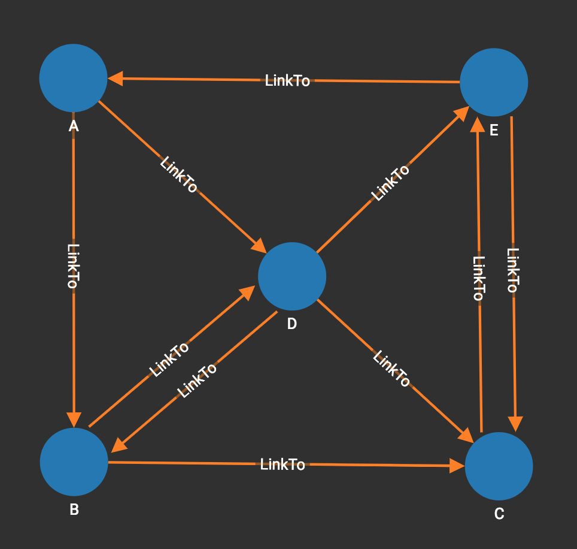

[,text]
----
[
  {
    "ResultSet": [
      {
        "v_id": "B",
        "v_type": "Node",
        "attributes": {
          "ResultSet.@dis": 1,
          "ResultSet.@path": [
            "A",
            "B"
          ]
        }
      },
      {
        "v_id": "A",
        "v_type": "Node",
        "attributes": {
          "ResultSet.@dis": 0,
          "ResultSet.@path": [
            "A"
          ]
        }
      },
      {
        "v_id": "C",
        "v_type": "Node",
        "attributes": {
          "ResultSet.@dis": 2,
          "ResultSet.@path": [
            "A",
            "D",
            "C"
          ]
        }
      },
      {
        "v_id": "E",
        "v_type": "Node",
        "attributes": {
          "ResultSet.@dis": 2,
          "ResultSet.@path": [
            "A",
            "D",
            "E"
          ]
        }
      },
      {
        "v_id": "D",
        "v_type": "Node",
        "attributes": {
          "ResultSet.@dis": 1,
          "ResultSet.@path": [
            "A",
            "D"
          ]
        }
      }
    ]
  }
]
----

=== Single-Source Shortest Path, Weighted

==== Description and Uses

Finding shortest paths in a graph with weighted edges is algorithmically harder than in an unweighted graph because even after you find a path to a vertex T, you cannot be certain that it is a shortest path. If edge weights are always positive, then you must keep trying until you have considered every in-edge to T. If edge weights can be negative, then it's even harder. You must consider all possible paths.

A classic application for weighted shortest path is finding the shortest travel route to get from A to B. (Think of route planning "GPS" apps.) In general, any application where you are looking for the cheapest route is a possible fit.

==== Specifications

The shortest path algorithm can be optimized if we know all the weights are nonnegative. If there can be negative weights, then sometimes a longer path will have a lower cumulative weight. Therefore, we have two versions of this algorithm

[,erlang]
----
shortest_ss_pos_wt (VERTEX source, SET<STRING> v_type, SET<STRING> e_type,
 STRING wt_attr, STRING wt_type, INT output_limit = -1, BOOL print_accum = TRUE,
 STRING result_attr = "", STRING file_path = "", BOOL display_edges = FALSE)
----

[,erlang]
----
shortest_ss_any_wt (VERTEX source, SET<STRING> v_type, SET<STRING> e_type,
 STRING wt_attr, STRING wt_type, INT output_limit = -1, BOOL print_accum = TRUE,
 STRING result_attr = "", STRING file_path = "", BOOL display_edges = FALSE)
----+++<table>++++++<thead>++++++<tr>++++++<th style="text-align:left">++++++<b>+++Characteristic+++</b>++++++</th>+++
      +++<th style="text-align:left">+++Value+++</th>++++++</tr>++++++</thead>+++
  +++<tbody>++++++<tr>++++++<td style="text-align:left">+++Result+++</td>+++
      +++<td style="text-align:left">+++Computes a shortest distance (INT) and shortest path (STRING) from vertex +++<em>+++source+++</em>+++ to
        each other vertex.+++</td>++++++</tr>+++
    +++<tr>++++++<td style="text-align:left">+++Input Parameters+++</td>+++
      +++<td style="text-align:left">++++++<ul>++++++<li>++++++<b>++++++<code>+++VERTEX source+++</code>+++:+++</b>+++ Id of the source vertex+++</li>+++
          +++<li>++++++<b>++++++<code>+++SET<STRING> v_type+++</code>++++++</b>+++: Names of vertex types to
            use+++</li>+++
          +++<li>++++++<b>++++++<code>+++SET<STRING> e_type+++</code>++++++</b>+++: Names of edge types to use+++</li>+++
          +++<li>++++++<b>++++++<code>+++STRING wt_attr+++</code>++++++</b>+++: Name of edge weight attribute+++</li>+++
          +++<li>++++++<b>++++++<code>+++STRING wt_type+++</code>++++++</b>+++: Data type of edge weight attribute:
            &quot;INT&quot;, &quot;FLOAT&quot;, or &quot;DOUBLE&quot;+++</li>+++
          +++<li>++++++<b>++++++<code>+++INT output_limit+++</code>++++++</b>+++: If >=0, max number of vertices
            to output to JSON.+++</li>+++
          +++<li>++++++<b>++++++<code>+++BOOL print_accum+++</code>++++++</b>+++: If True, output JSON to standard
            output+++</li>+++
          +++<li>++++++<b>++++++<code>+++STRING result_attr+++</code>++++++</b>+++: If not empty, store distance values
            (INT) to this attribute+++</li>+++
          +++<li>++++++<b>++++++<code>+++STRING file_path+++</code>+++:+++</b>+++ If not empty, write output to this
            file.+++</li>+++
          +++<li>++++++<b>++++++<code>+++BOOL display_edges+++</code>++++++</b>+++: If true, include the graph&apos;s
            edges in the JSON output, so that the full graph can be displayed.+++</li>++++++</ul>++++++</td>++++++</tr>+++
    +++<tr>++++++<td style="text-align:left">+++Result Size+++</td>+++
      +++<td style="text-align:left">+++V = number of vertices+++</td>++++++</tr>+++
    +++<tr>++++++<td style="text-align:left">+++Time Complexity+++</td>+++
      +++<td style="text-align:left">+++O(V*E), V = number of vertices, E = number of edges+++</td>++++++</tr>+++
    +++<tr>++++++<td style="text-align:left">+++Graph Types+++</td>+++
      +++<td style="text-align:left">+++Directed or Undirected edges, Weighted edges+++</td>++++++</tr>++++++</tbody>++++++</table>+++


The shortest_path_any_wt query is an implementation of the Bellman-Ford algorithm. If there is more than one path with the same total weight, the algorithm returns one of them.

Currently, shortest_path_pos_wt also uses Bellman-Ford. The well-known Dijsktra's algorithm is designed for serial computation and cannot work with GSQL's parallel processing.


==== Example

The graph below has only positive edge weights. Using vertex A as the source vertex, the algorithm discovers that the shortest weighted path from A to B is A-D-B, with distance 8. The shortest weighted path from A to C is A-D-B-C with distance 9.

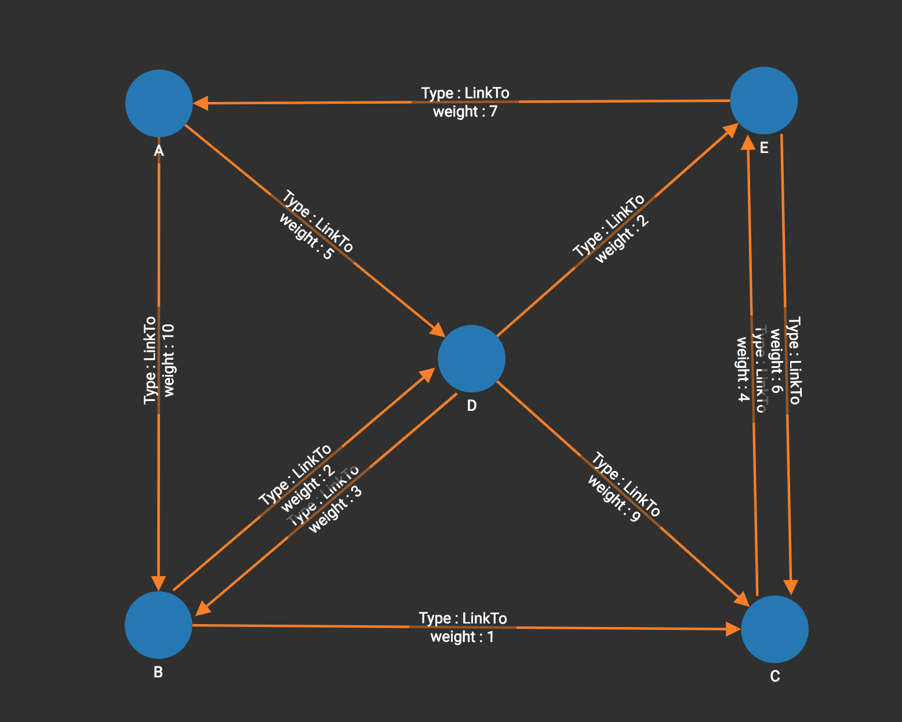

[,text]
----
[
  {
    "ResultSet": [
      {
        "v_id": "B",
        "v_type": "Node",
        "attributes": {
          "ResultSet.@dis": 8,
          "ResultSet.@path": [
            "D",
            "B"
          ]
        }
      },
      {
        "v_id": "A",
        "v_type": "Node",
        "attributes": {
          "ResultSet.@dis": 0,
          "ResultSet.@path": []
        }
      },
      {
        "v_id": "C",
        "v_type": "Node",
        "attributes": {
          "ResultSet.@dis": 9,
          "ResultSet.@path": [
            "D",
            "B",
            "C"
          ]
        }
      },
      {
        "v_id": "E",
        "v_type": "Node",
        "attributes": {
          "ResultSet.@dis": 7,
          "ResultSet.@path": [
            "D",
            "E"
          ]
        }
      },
      {
        "v_id": "D",
        "v_type": "Node",
        "attributes": {
          "ResultSet.@dis": 5,
          "ResultSet.@path": [
            "D"
          ]
        }
      }
    ]
  }
]
----

The graph below has both positive and negative edge weights. Using vertex A as the source vertex, the algorithm discovers that the shortest weighted path from A to E is A-D-C-B-E, with a cumulative score of 7 - 3 - 2 - 4 = -2.

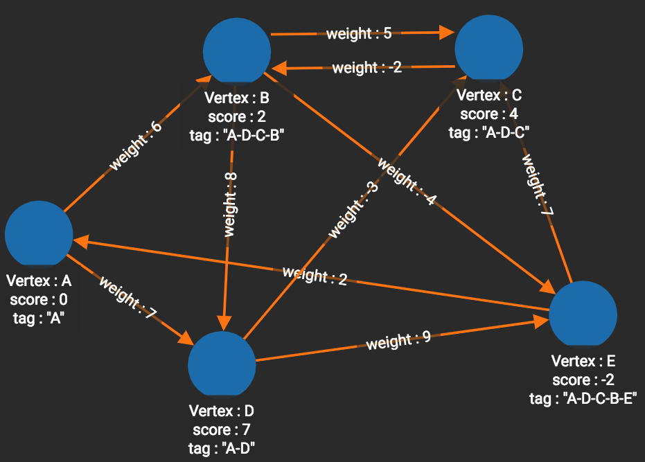

=== Single-Pair Shortest Path

The Single-Pair Shortest Path task seeks the shortest path between a source vertex S and a target vertex T. If the edges are unweighted, then use the query in our tutorial documentlink:../start/gsql-examples/classic-graph-algorithms.md#example-8-single-pair-shortest-path-unweighted[GSQL Demo Examples.]

If the edges are weighted, then use the link:graph-algorithm-library.md#single-source-shortest-path-weighted[Single-Source Shortest Path] algorithm. In the worst case, it takes the same computational effort to find the shortest path for one pair as to find the shortest paths for all pairs from the same source S. The reason is that you cannot know whether you have found the shortest (least weight) path until you have explored the full graph. If the weights are always positive, however, then a more efficient algorithm is possible. You can stop searching when you have found paths that use each of the in-edges to T.

=== All-Pairs Shortest Path


The All-Pairs Shortest Path algorithm is costly for large graphs because the computation time is O(V{caret}3) and the output size is O(V{caret}2). Be cautious about running this on very large graphs.


The All-Pairs Shortest Path (APSP) task seeks to find the shortest paths between every pair of vertices in the entire graph. In principle, this task can be handled by running the Single-Source Shortest Path (SSSP) algorithm for each input vertex, e.g.,

[,erlang]
----
CREATE QUERY all_pairs_shortest(SET<STRING> v_type, SET<STRING> e_type,
 STRING wt_attr, STRING wt_type, STRING result_attr = "", STRING file_path = "")
{
  Start = {v_type};
  Result = SELECT s FROM Start:s
        POST-ACCUM
          shortest_ss_any_wt(s, v_type, e_type, wt_attr, wt_type,
          result_attr, file_path+s);
}
----

This example highlights one of the strengths of GSQL: treating queries as stored procedures that can be called from within other queries. We only show the result_attr and file_path options, because subqueries cannot send their JSON output.

For large graphs (with millions of vertices or more), however, this is an enormous task. While the massively parallel processing of the TigerGraph platform can speed up the computation by 10x or 100x, consider what it takes just to store or report the results. If there are 1 million vertices, then there are nearly 1 trillion output values.

There are more efficient methods than calling the single-source shortest path algorithm n times, such as the Floyd-Warshall algorithm, which computes APSP in O(V{caret}3) time.

Our recommendation:

* If you have a smaller graph (perhaps thousands or tens of thousands of vertices), the APSP task may be tractable.
* If you have a large graph, avoid using APSP.

=== Minimum Spanning Tree (MST)

==== Description and Uses

Given an undirected and connected graph, a minimum spanning tree is a set of edges that can connect all the vertices in the graph with the minimal sum of edge weights. The library implements a parallel version of https://en.wikipedia.org/wiki/Prim%27s_algorithm[Prim's algorithm]:

. Start with a set A = { a single vertex _seed_ }
. For all vertices in A, select a vertex y such that
 .. y is not in A, and
 .. There is an edge from y to a vertex x in A, and
 .. The weight of the edge e(x,y) is the smallest among all eligible pairs (x,y).
. Add y to A, and add the edge (x,y) to MST.
. Repeat steps 2 and 3 until A has all vertices in the graph.

If the user specifies a source vertex, this will be used as the _seed_. Otherwise, the algorithm will select a random _seed_ vertex.


If the graph contains multiple components (i.e., some vertices are disconnected from the rest of the graph, then the algorithm will span only the component of the seed vertex.

If you do not have a preferred vertex, and the graph might have more than one component, then you should use the Minimum Spanning Forest (MDF) algorithm instead.


==== Specifications

[,erlang]
----
mst (VERTEX opt_source, SET<STRING> v_type, SET<STRING> e_type,
  STRIN wt_attr, STRING wt_type, INT max_iter = -1,
  BOOL print_accum = TRUE, STRING result_attr = "", STRING file_path = "")
----+++<table>++++++<thead>++++++<tr>++++++<th style="text-align:left">++++++<b>+++Characteristic+++</b>++++++</th>+++
      +++<th style="text-align:left">+++Value+++</th>++++++</tr>++++++</thead>+++
  +++<tbody>++++++<tr>++++++<td style="text-align:left">+++Result+++</td>+++
      +++<td style="text-align:left">+++Computes a minimum spanning tree. If the JSON or file output selected,
        the output is the set of edges that form the MST. If the result_attr option
        is selected, the edges which are part of the MST are tagged True; other
        edges are tagged False.+++</td>++++++</tr>+++
    +++<tr>++++++<td style="text-align:left">+++Input Parameters+++</td>+++
      +++<td style="text-align:left">++++++<ul>++++++<li>++++++<b>++++++<code>+++VERTEX opt_source+++</code>+++:+++</b>+++ ID of a source vertex (optional)+++</li>+++
          +++<li>++++++<b>++++++<code>+++SET<STRING> v_type+++</code>++++++</b>+++: Names of vertex types to
            use+++</li>+++
          +++<li>++++++<b>++++++<code>+++SET<STRING> e_type+++</code>++++++</b>+++: Names of edge types to use+++</li>+++
          +++<li>++++++<b>++++++<code>+++STRING wt_attr+++</code>++++++</b>+++: Name of edge weight attribute+++</li>+++
          +++<li>++++++<b>++++++<code>+++STRING wt_type+++</code>++++++</b>+++: Data type of edge weight attribute:
            &quot;INT&quot;, &quot;FLOAT&quot;, or &quot;DOUBLE&quot;+++</li>+++
          +++<li>++++++<b>++++++<code>+++INT max_iter+++</code>++++++</b>+++: Maximum of edges to include. If less
            than (V-1), then the result is not a true spanning tree.+++</li>+++
          +++<li>++++++<b>++++++<code>+++BOOL print_accum+++</code>++++++</b>+++: If True, output JSON to standard
            output+++</li>+++
          +++<li>++++++<b>++++++<code>+++STRING result_attr+++</code>++++++</b>+++: If not empty, store result values
            (BOOL) to this attribute+++</li>+++
          +++<li>++++++<b>++++++<code>+++STRING file_path+++</code>+++:+++</b>+++ If not empty, write output to this
            file.+++</li>++++++</ul>++++++</td>++++++</tr>+++
    +++<tr>++++++<td style="text-align:left">+++Result Size+++</td>+++
      +++<td style="text-align:left">+++V - 1 = number of vertices - 1+++</td>++++++</tr>+++
    +++<tr>++++++<td style="text-align:left">+++Time Complexity+++</td>+++
      +++<td style="text-align:left">+++O(V{caret}2)+++</td>++++++</tr>+++
    +++<tr>++++++<td style="text-align:left">+++Graph Types+++</td>+++
      +++<td style="text-align:left">+++Undirected edges and connected+++</td>++++++</tr>++++++</tbody>++++++</table>+++

*Example*

In the graph `social10`, we consider only the undirected Coworker edges.

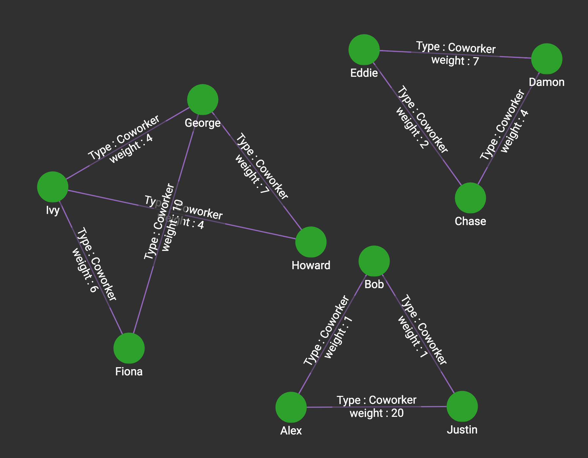

This graph has 3 components. Minimum Spanning Tree finds a tree for one component, so which component it will work on depends on what vertex we give as the starting point. If we select Fiona, George, Howard, or Ivy as the start vertex, then it works on the 4-vertex component on the left. You can start from any vertex in the component and get the same or an equivalent MST result.

The figure below shows the result of

[,sql]
----
# Use _ for default values
RUN QUERY mst(("Ivy", "Person"), ["Person"], ["Coworker"] "weight", "INT",
_, _, _, _)
----

Note that the value for the one vertex is `("Ivy", "Person")`. In GSQL, this 2-tuple format which explicitly gives the vertex type is used when the query is written to accept a vertex of any type.

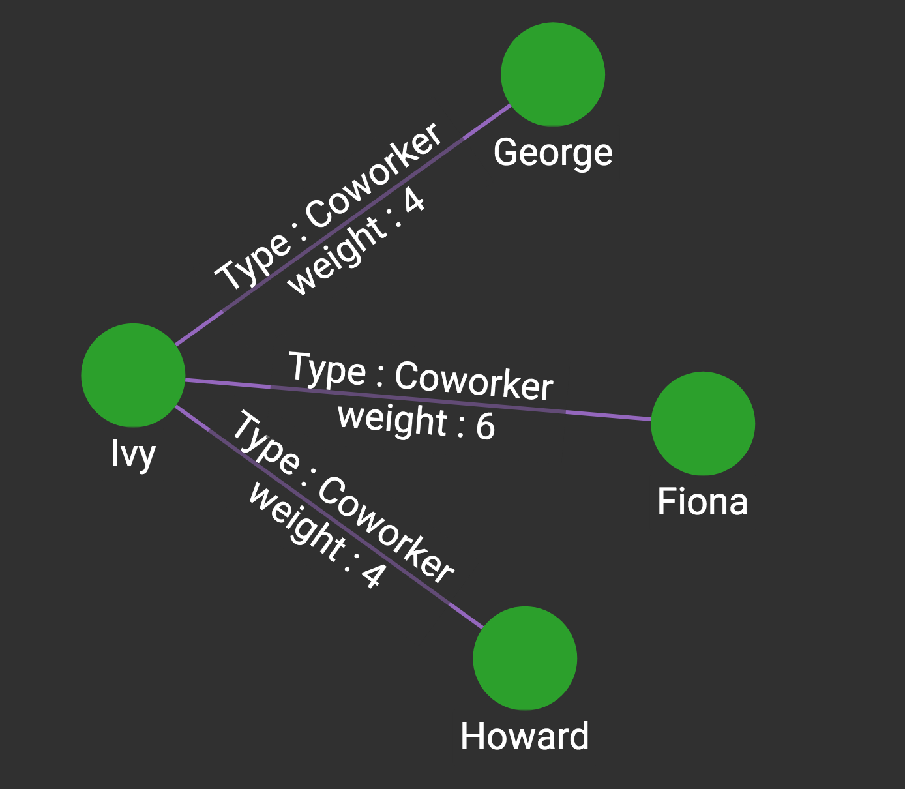

File output:

[,text]
----
From,To,Weight
Ivy,Fiona,6
Ivy,Howard,4
Ivy,George,4
----

The attribute version requires a boolean attribute on the edge, and it will assign the attribute to "true" if that edge is selected in the MST:

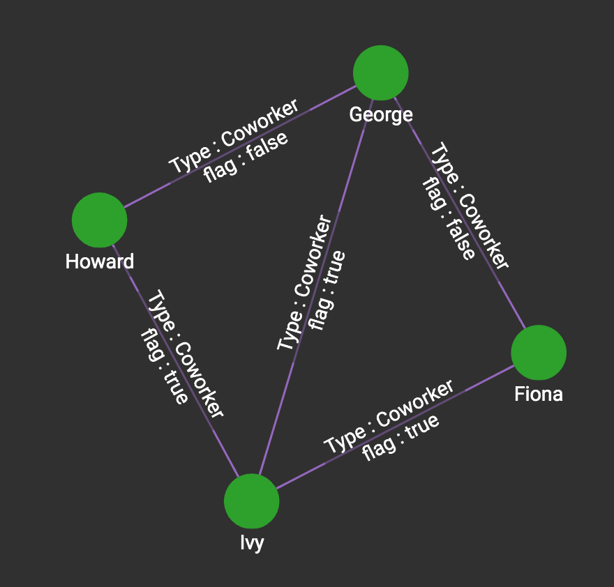

=== Minimum Spanning Forest (MS**F**)

==== Description and Uses

Given an undirected graph with one or more connected components, a minimum spanning forest is a set of minimum spanning trees, one for each component. The library implements the algorithm in section 6.2 of Qin et al. 2014: http://www-std1.se.cuhk.edu.hk/~hcheng/paper/SIGMOD2014qin.pdf.

==== Specifications

[,erlang]
----
msf (SET<STRING> v_type, SET<STRING> e_type, STRING wt_attr, STRING wt_type,
BOOL print_accum = TRUE, STRING result_attr = "", STRING file_path = "")
----+++<table>++++++<thead>++++++<tr>++++++<th style="text-align:left">++++++<b>+++Characteristic+++</b>++++++</th>+++
      +++<th style="text-align:left">+++Value+++</th>++++++</tr>++++++</thead>+++
  +++<tbody>++++++<tr>++++++<td style="text-align:left">+++Result+++</td>+++
      +++<td style="text-align:left">+++Computes a minimum spanning forest. If the JSON or file output selected,
        the output is the set of edges that form the MSF. If the result_attr option
        is selected, the edges which are part of the MSF are tagged True; other
        edges are tagged False.+++</td>++++++</tr>+++
    +++<tr>++++++<td style="text-align:left">+++Input Parameters+++</td>+++
      +++<td style="text-align:left">++++++<ul>++++++<li>++++++<b>++++++<code>+++SET<STRING> v_type+++</code>++++++</b>+++: Names of vertex types to
            use+++</li>+++
          +++<li>++++++<b>++++++<code>+++SET<STRING> e_type+++</code>++++++</b>+++: Names of edge types to use+++</li>+++
          +++<li>++++++<b>++++++<code>+++STRING wt_attr+++</code>++++++</b>+++: Name of edge weight attribute+++</li>+++
          +++<li>++++++<b>++++++<code>+++STRING wt_type+++</code>++++++</b>+++: Data type of edge weight attribute:
            &quot;INT&quot;, &quot;FLOAT&quot;, or &quot;DOUBLE&quot;+++</li>+++
          +++<li>++++++<b>++++++<code>+++BOOL print_accum+++</code>++++++</b>+++: If True, output JSON to standard
            output+++</li>+++
          +++<li>++++++<b>++++++<code>+++STRING result_attr+++</code>++++++</b>+++: If not empty, store result values
            (BOOL) to this attribute+++</li>+++
          +++<li>++++++<b>++++++<code>+++STRING file_path+++</code>+++:+++</b>+++ If not empty, write output to this
            file.+++</li>++++++</ul>++++++</td>++++++</tr>+++
    +++<tr>++++++<td style="text-align:left">+++Result Size+++</td>+++
      +++<td style="text-align:left">++++++
+++V - c,+++
+++
        +++
+++V = number of vertices, c = number of components+++
++++++</td>++++++</tr>+++
    +++<tr>++++++<td style="text-align:left">+++Time Complexity+++</td>+++
      +++<td style="text-align:left">+++O((V+E) * logV)+++</td>++++++</tr>+++
    +++<tr>++++++<td style="text-align:left">+++Graph Types+++</td>+++
      +++<td style="text-align:left">+++Undirected edges+++</td>++++++</tr>++++++</tbody>++++++</table>+++

*Example*

Refer to the example for the MST algorithm. This graph has 3 components. MSF will find an MST for each of the three components.

=== *Maximal Independent Set*

==== Description and Uses

An *independent set of vertices* does not contain any pair of vertices that are neighbors, i.e., ones which have an edge between them. A https://en.wikipedia.org/wiki/Maximal_independent_set[*maximal independent set*] is the largest independent set that contains those vertices; you cannot improve upon it unless you start over with a different independent set. However, the search for the largest possible independent set (the *maximum independent set*, as opposed to the maximal independent set) is an NP-hard problem: there is no known algorithm that can find that answer in polynomial time. So we settle for the maximal independent set.

This algorithm finds use in applications wanting to find the most efficient configuration which "covers" all the necessary cases. For example, it has been used to optimize delivery or transit routes, where each vertex is one transit segment and each edge connects two segments that can NOT be covered by the same vehicle.

==== Specifications

[,erlang]
----
maximal_indep_set(STRING v_type, STRING e_type,
INT max_iter = 100, BOOL print_accum = TRUE, STRING file_path = "")
----+++<table>++++++<thead>++++++<tr>++++++<th style="text-align:left">++++++<b>+++Characteristic+++</b>++++++</th>+++
      +++<th style="text-align:left">+++Value+++</th>++++++</tr>++++++</thead>+++
  +++<tbody>++++++<tr>++++++<td style="text-align:left">+++Result+++</td>+++
      +++<td style="text-align:left">+++A set of vertices that form a maximal independent set.+++</td>++++++</tr>+++
    +++<tr>++++++<td style="text-align:left">+++Input Parameters+++</td>+++
      +++<td style="text-align:left">++++++<ul>++++++<li>++++++<b>++++++<code>+++STRING v_type+++</code>++++++</b>+++: Name of vertex type to use+++</li>+++
          +++<li>++++++<b>++++++<code>+++STRING e_type+++</code>++++++</b>+++: Name of edge type to use+++</li>+++
          +++<li>++++++<b>++++++<code>+++INT max_iter+++</code>+++:+++</b>+++ maximum number of iterations for the
            search+++</li>+++
          +++<li>++++++<b>++++++<code>+++BOOL print_accum+++</code>++++++</b>+++: If True, output JSON to standard
            output+++</li>+++
          +++<li>++++++<b>++++++<code>+++STRING file_path+++</code>+++:+++</b>+++ If not empty, write output to this
            file.+++</li>++++++</ul>++++++</td>++++++</tr>+++
    +++<tr>++++++<td style="text-align:left">+++Result Size+++</td>+++
      +++<td style="text-align:left">+++Size of the MIS: unknown. Worst case: If the graph is a set of N unconnected
        vertices, then the MIS is all N vertices.+++</td>++++++</tr>+++
    +++<tr>++++++<td style="text-align:left">+++Time Complexity+++</td>+++
      +++<td style="text-align:left">+++O(E), E = number of edges+++</td>++++++</tr>+++
    +++<tr>++++++<td style="text-align:left">+++Graph Types+++</td>+++
      +++<td style="text-align:left">+++Undirected edges+++</td>++++++</tr>++++++</tbody>++++++</table>+++

*Example*

Consider our social10 graph, with three components.

image::../.gitbook/assets/image%20%2814%29.png[]

It is clear that for each of the two triangles -- (Alex, Bob, Justin) and (Chase, Damon, Eddie) -- we can select one vertex from each triangle to be part of the MIS. For the 4-vertex component (Fiona, George, Howard, Ivy), it is less clear what will happen. If the algorithm selects either George or Ivy, then no other independent vertices remain in the component. However, the algorithm could select both Fiona and Howard; they are independent of one another.

This demonstrates the uncertainty of the Maximal Independent Set algorithm and how it differs from Maximum Independent Set. A _maximum_ independent set algorithm would _always_ select Fiona and Howard, plus 2 others, for a total of 4 vertices. The _maximal_ independent set algorithm relies on chance. It could return either 3 or 4 vertices.

=== *Cycle Detection*

==== Description and Uses

The Cycle Detection problem seeks to find all the cycles (loops) in a graph. We apply the usual restriction that the cycles must be "simple cycles", that is, they are paths that start and end at the same vertex but otherwise never visit any vertex twice.

There are two versions of the task: for directed graphs and undirected graphs. The GSQL algorithm library currently supports only directed cycle detection. The https://en.wikipedia.org/wiki/Rocha%E2%80%93Thatte_cycle_detection_algorithm[Rocha--Thatte algorithm] is an efficient distributed algorithm, which detects all the cycles in a directed graph. The algorithm will self-terminate, but it is also possible to stop at k iterations, which finds all the cycles having lengths up to k edges.

The basic idea of the algorithm is to (potentially) traverse every edge in parallel, again and again, forming all possible paths. At each step, if a path forms a cycle, it records it and stops extending it. More specifically:

*Initialization:* +
For each vertex, record one path consisting of its own id. Mark the vertex as Active.

*Iteration steps:* +
For each Active vertex v:

. Send its list of paths to each of its out-neighbors.
. Inspect each path P in the list of the paths received:
 ** If the first id in P is also id(v), a cycle has been found:
  *** Remove P from its list.
  *** If id(v) is the least id of any id in P, then add P to the Cycle List. (The purpose is to count each cycle only once.)
 ** Else, if id(v) is somewhere else in the path, then remove P from the path list (because this cycle must have been counted already).
 ** Else, append id(v) to the end of each of the remaining paths in its list.

==== Specifications

[,erlang]
----
cycle_detection (SET<STRING> v_type, SET<STRING> e_type, INT depth,
  BOOL print_accum = TRUE, STRING file_path = "")
----+++<table>++++++<thead>++++++<tr>++++++<th style="text-align:left">++++++<b>+++Characteristic+++</b>++++++</th>+++
      +++<th style="text-align:left">+++Value+++</th>++++++</tr>++++++</thead>+++
  +++<tbody>++++++<tr>++++++<td style="text-align:left">+++Result+++</td>+++
      +++<td style="text-align:left">++++++
+++Computes a list of vertex id lists, each of which is a cycle. The result
          is available in 2 forms:+++
+++
        +++<ul>++++++<li>+++streamed out in JSON format+++</li>+++
          +++<li>+++written to a file in tabular format+++</li>++++++</ul>++++++</td>++++++</tr>+++
    +++<tr>++++++<td style="text-align:left">+++Input Parameters+++</td>+++
      +++<td style="text-align:left">++++++<ul>++++++<li>++++++<b>++++++<code>+++SET<STRING> v_type+++</code>++++++</b>+++: Names of vertex types to
            use+++</li>+++
          +++<li>++++++<b>++++++<code>+++SET<STRING> e_type+++</code>++++++</b>+++: Names of edge types to use+++</li>+++
          +++<li>++++++<b>++++++<code>+++INT depth+++</code>++++++</b>+++: Maximum cycle length to search for = maximum
            number of iterations+++</li>+++
          +++<li>++++++<b>++++++<code>+++BOOL print_accum+++</code>++++++</b>+++: If True, output JSON to standard
            output+++</li>+++
          +++<li>++++++<b>++++++<code>+++STRING file_path+++</code>+++:+++</b>+++ If not empty, write output to this
            file.+++</li>++++++</ul>++++++</td>++++++</tr>+++
    +++<tr>++++++<td style="text-align:left">+++Result Size+++</td>+++
      +++<td style="text-align:left">++++++
+++Number of cycles * average cycle length+++
+++
        +++
+++Both of these measures are not known in advance.+++
++++++</td>++++++</tr>+++
    +++<tr>++++++<td style="text-align:left">+++Time Complexity+++</td>+++
      +++<td style="text-align:left">++++++
+++O(E *k), E = number of edges.+++
+++
        +++
+++k = min(max. cycle length, depth parameter)+++
++++++</td>++++++</tr>+++
    +++<tr>++++++<td style="text-align:left">+++Graph Types+++</td>+++
      +++<td style="text-align:left">+++Directed+++</td>++++++</tr>++++++</tbody>++++++</table>+++

*Example*

In the social10 graph, there are 5 cycles, all with the Fiona-George-Howard-Ivy cluster.

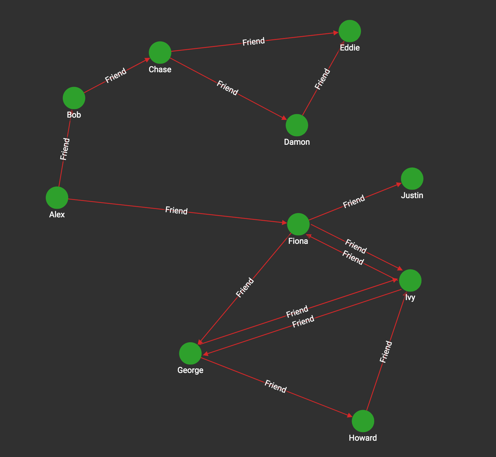

[,text]
----
[
  {
    "@@cycles": [
      [
        "Fiona",
        "Ivy"
      ],
      [
        "George",
        "Ivy"
      ],
      [
        "Fiona",
        "George",
        "Ivy"
      ],
      [
        "George",
        "Howard",
        "Ivy"
      ],
      [
        "Fiona",
        "George",
        "Howard",
        "Ivy"
      ]
    ]
  }
]
----

=== *Estimated Diameter*

==== Description and Uses

The diameter of a graph is the worst-case length of a shortest path between any pair of vertices in a graph. It is the farthest distance to travel, to get from one vertex to another, if you always take the shortest path. Finding the diameter requires calculating (the lengths of) all shortest paths, which can be quite slow.

This algorithm uses a simple heuristic to estimate the diameter. rather than calculating the distance from each vertex to every other vertex, it selects K vertices randomly, where K is a user-provided parameter. It calculates the distances from each of these K vertices to all other vertices. So, instead of calculating V*(V-1) distances, this algorithm only calculates K*(V-1) distances. The higher the value of K, the greater the likelihood of hitting the actual longest shortest path.

The current version only computes unweighted distances.


This algorithm query employs a subquery called *max_BFS_depth*. Both queries are needed to run the algorithm.


==== Specifications

[,erlang]
----
estimate_diameter (SET<STRING> v_type, SET<STRING> e_type, INT seed_set_length,
  BOOL print_accum = TRUE, STRING file_path = "", BOOL display = FALSE)
----+++<table>++++++<thead>++++++<tr>++++++<th style="text-align:left">++++++<b>+++Characteristic+++</b>++++++</th>+++
      +++<th style="text-align:left">+++Value+++</th>++++++</tr>++++++</thead>+++
  +++<tbody>++++++<tr>++++++<td style="text-align:left">+++Result+++</td>+++
      +++<td style="text-align:left">+++Returns the estimated value for the diameter of the graph+++</td>++++++</tr>+++
    +++<tr>++++++<td style="text-align:left">+++Input Parameters+++</td>+++
      +++<td style="text-align:left">++++++<ul>++++++<li>++++++<b>++++++<code>+++SET<STRING> v_type+++</code>++++++</b>+++: Names of vertex types to
            use+++</li>+++
          +++<li>++++++<b>++++++<code>+++SET<STRING> e_type+++</code>++++++</b>+++: Names of edge types to use+++</li>+++
          +++<li>++++++<b>++++++<code>+++INT seed_set_length+++</code>++++++</b>+++: The number (K) of random seed
            vertices to use+++</li>+++
          +++<li>++++++<b>++++++<code>+++BOOL print_accum+++</code>++++++</b>+++: If True, output JSON to standard
            output+++</li>+++
          +++<li>++++++<b>++++++<code>+++STRING file_path+++</code>+++:+++</b>+++ If not empty, write output to this
            file.+++</li>++++++</ul>++++++</td>++++++</tr>+++
    +++<tr>++++++<td style="text-align:left">+++Result Size+++</td>+++
      +++<td style="text-align:left">+++one integer+++</td>++++++</tr>+++
    +++<tr>++++++<td style="text-align:left">+++Time Complexity+++</td>+++
      +++<td style="text-align:left">+++O(k*E), E = number of edges, k = number of seed vertices+++</td>++++++</tr>+++
    +++<tr>++++++<td style="text-align:left">+++Graph Types+++</td>+++
      +++<td style="text-align:left">+++Directed+++</td>++++++</tr>++++++</tbody>++++++</table>+++

== Node embeddings

=== Node2Vec

==== Description

Node2Vec is a node embedding algorithm that uses random walks in the graph to create a vector representation of a node.

A random walk starts with a node, and the algorithm iteratively selects neighboring nodes to visit, and each neighboring node has an assigned probability. This transforms graph structure into a collection of linear sequences of nodes. For each node we will be left with a list of other nodes from their local or extended neighborhoods.

Once the above step is complete, the algorithm uses a variation of the word2vec model from the language modeling community to turn each node into a vector of probabilities. The probabilities represent the likelihood of visiting a given node in a random walk from each starting node.

==== Specification

[,text]
----
random_walk(INT step = 8, INT path_size = 4,
    STRING filepath = "/home/tigergraph/path.csv", SET<STRING> edge_types,
    INT sample_num)

node2vec_query(STRING filepath = "/home/tigergraph/path.csv",
    STRING output_file = "/home/tigergraph/embedding.csv",
    INT dimension)
----

Installing this query requires link:../dev/gsql-ref/querying/operators-and-expressions.md#query-user-defined-functions[installing a UDF], which can be found in the https://github.com/tigergraph/gsql-graph-algorithms/tree/master/algorithms/examples/Graph%2BML[Github repository of the query]. If you are running the query on a cluster, you need to manually install the UDF on every node of the cluster.

==== Parameters

|===
| Parameter | Description | Data type

| `step`
| Number of random walks per node
| `INT`

| `path_size`
| Number of hops per walk
| `INT`

| `filepath`
| File path to output results to
| `STRING`

| `edge_types`
| Edge types to traverse
| `SET<STRING>`

| `sample_num`
| Number of nodes to be used in the random sample
| `INT`
|===

== *Centrality Algorithms*

Centrality algorithms determine the importance of each vertex within a network. Typical applications:

PageRank is designed for directed edges. The classic interpretation is to find the most "important" web pages, based on hyperlink referrals, but it can be used for another network where entities make positive referrals of one another.

Closeness Centrality and Betweenness Centrality both deal with the idea of "centrally located."

=== PageRank

==== Description and Uses

The PageRank algorithm measures the influence of each vertex on every other vertex. PageRank influence is defined recursively: a vertex's influence is based on the influence of the vertices which refer to it. A vertex's influence tends to increase if (1) it has more referring vertices or if (2) its referring vertices have higher influence. The analogy to social influence is clear.

A common way of interpreting PageRank value is through the Random Network Surfer model. A vertex's PageRank score is *proportional to the probability that a random network surfer will be at that vertex at any given time.* *A vertex with a high PageRank score is a vertex that is frequently visited*, assuming that vertices are visited according to the following Random Surfer scheme:

* Assume a person travels or surfs across a network's structure, moving from vertex to vertex in a long series of rounds.
* The surfer can start anywhere. This start-anywhere property is part of the magic of PageRank, meaning the score is a truly fundamental property of the graph structure itself.
* Each round, the surfer randomly picks one of the outward connections from the surfer's current location. The surfer repeats this random walk for a long time.
* But wait. The surfer doesn't always follow the network's connection structure. There is a probability (_1-damping_, to be precise), that the surfer will ignore the structure and will magically teleport to a random vertex.

==== Specifications

[,erlang]
----
pageRank (STRING v_type, STRING e_type,
  FLOAT max_change=0.001, INT max_iter=25, FLOAT damping=0.85, INT top_k = 100,
   BOOL print_accum = TRUE, STRING result_attr =  "", STRING file_path = "",
   BOOL display_edges = FALSE)
----+++<table>++++++<thead>++++++<tr>++++++<th style="text-align:left">++++++<b>+++Characteristic+++</b>++++++</th>+++
      +++<th style="text-align:left">+++Value+++</th>++++++</tr>++++++</thead>+++
  +++<tbody>++++++<tr>++++++<td style="text-align:left">+++Result+++</td>+++
      +++<td style="text-align:left">+++Computes a PageRank value (FLOAT type) for each vertex.+++</td>++++++</tr>+++
    +++<tr>++++++<td style="text-align:left">+++Input Parameters+++</td>+++
      +++<td style="text-align:left">++++++<ul>++++++<li>++++++<b>++++++<code>+++STRING v_type+++</code>++++++</b>+++: Names of vertex type to use+++</li>+++
          +++<li>++++++<b>++++++<code>+++STRING e_type+++</code>++++++</b>+++: Names of edge type to use+++</li>+++
          +++<li>++++++<b>++++++<code>+++FLOAT max_change+++</code>++++++</b>+++: PageRank will stop iterating when
            the largest difference between any vertex&apos;s current score and its
            previous score &#x2264; +++<code>+++max_change.+++</code>+++ That is, the scores have
            become very stable and are changing by less than +++<code>+++max_change+++</code>+++ from
            one iteration to the next.+++</li>+++
          +++<li>++++++<b>++++++<code>+++INT max_iter+++</code>++++++</b>+++: Maximum number of iterations.+++</li>+++
          +++<li>++++++<b>++++++<code>+++FLOAT damping+++</code>++++++</b>+++: Fraction of score that is due to the
            score of neighbors. The balance (1 - damping) is a minimum baseline score
            that every vertex receives.+++</li>+++
          +++<li>++++++<b>++++++<code>+++INT top_k+++</code>++++++</b>+++: Sort the scores highest first and output
            only this many scores+++</li>+++
          +++<li>++++++<b>++++++<code>+++BOOL print_accum+++</code>++++++</b>+++: If True, output JSON to standard
            output+++</li>+++
          +++<li>++++++<b>++++++<code>+++STRING result_attr+++</code>++++++</b>+++: If not empty, store PageRank values
            (FLOAT) to this attribute+++</li>+++
          +++<li>++++++<b>++++++<code>+++STRING file_path+++</code>+++:+++</b>+++ If not empty, write output to this
            file.+++</li>+++
          +++<li>++++++<b>++++++<code>+++BOOL display_edges+++</code>++++++</b>+++: If true, include the graph&apos;s
            edges in the JSON output, so that the full graph can be displayed.+++</li>++++++</ul>++++++</td>++++++</tr>+++
    +++<tr>++++++<td style="text-align:left">+++Result Size+++</td>+++
      +++<td style="text-align:left">+++V = number of vertices+++</td>++++++</tr>+++
    +++<tr>++++++<td style="text-align:left">+++Time Complexity+++</td>+++
      +++<td style="text-align:left">++++++
+++O(E*k), E = number of edges, k = number of iterations.+++
+++
        +++
+++The number of iterations is data-dependent, but the user can set a maximum.
          Parallel processing reduces the time needed for computation.+++
++++++</td>++++++</tr>+++
    +++<tr>++++++<td style="text-align:left">+++Graph Types+++</td>+++
      +++<td style="text-align:left">+++Directed edges+++</td>++++++</tr>++++++</tbody>++++++</table>+++

==== Example

[,sql]
----
 # Use _ for default values
 RUN QUERY pageRank("Person", "Friend", 0.001, 25, 0.85, 100
 _, _, _, _)
----

We ran pageRank on our test10 graph (using Friend edges) with the following parameter values: damping=0.85, max_change=0.001, and max_iter=25. We see that Ivy (center bottom) has the highest pageRank score (1.12). This makes sense since there are 3 neighboring persons who point to Ivy, more than for any other person. Eddie and Justin have scores of exactly 1 because they do not have any out-edges. This is an artifact of our particular version pageRank. Likewise, Alex has a score of 0.15, which is (1-damping), because Alex has no in-edges.

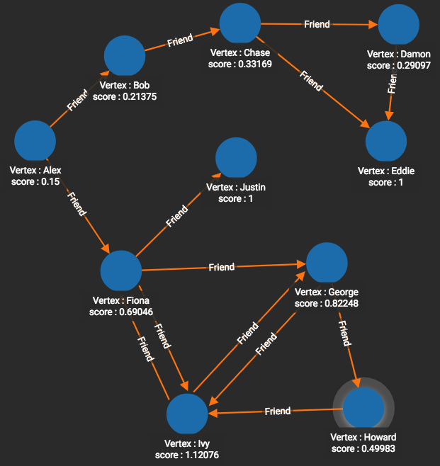

=== Weighted PageRank

==== Description and Uses

The only difference between weighted PageRank and standard PageRank is that edges have weights, and the influence that a vertex receives from an in-neighbor is multiplied by the weight of the in-edge.

==== Specifications

[,erlang]
----
pageRank_wt (SET<STRING> v_type, SET<STRING> e_type, STRING wt_attr,
  FLOAT max_change=0.001, INT max_iter=25, FLOAT damping=0.85, INT top_k=100,
   BOOL print_accum = TRUE, STRING result_attr =  "", STRING file_path = "",
   BOOL display_edges = FALSE)
----+++<table>++++++<thead>++++++<tr>++++++<th style="text-align:left">++++++<b>+++Characteristic+++</b>++++++</th>+++
      +++<th style="text-align:left">+++Value+++</th>++++++</tr>++++++</thead>+++
  +++<tbody>++++++<tr>++++++<td style="text-align:left">+++Result+++</td>+++
      +++<td style="text-align:left">+++Computes a weighted PageRank value (FLOAT type) for each vertex.+++</td>++++++</tr>+++
    +++<tr>++++++<td style="text-align:left">+++Input Parameters+++</td>+++
      +++<td style="text-align:left">++++++
+++<b></b>+++
+++
        +++<ul>++++++<li>++++++<b>++++++<code>+++STRING v_type+++</code>++++++</b>+++: Names of vertex type to use+++</li>+++
          +++<li>++++++<b>++++++<code>+++STRING e_type+++</code>++++++</b>+++: Names of edge type to use+++</li>+++
          +++<li>++++++<b>++++++<code>+++STRING wt_attr+++</code>++++++</b>+++: Name of edge weight attribute+++</li>+++
          +++<li>++++++<b>++++++<code>+++FLOAT max_change+++</code>++++++</b>+++: PageRank will stop iterating when
            the largest difference between any vertex&apos;s current score and its
            previous score &#x2264; +++<code>+++max_change+++</code>+++. That is, the scores have
            become very stable and are changing by less than +++<code>+++max_change+++</code>+++ from
            one iteration to the next.+++</li>+++
          +++<li>++++++<b>++++++<code>+++INT max_iter+++</code>++++++</b>+++: Maximum number of iterations.+++</li>+++
          +++<li>++++++<b>++++++<code>+++FLOAT damping+++</code>++++++</b>+++: Fraction of score that is due to the
            score of neighbors. The balance (1 - damping) is a minimum baseline score
            that every vertex receives.+++</li>+++
          +++<li>++++++<b>++++++<code>+++INT top_k+++</code>++++++</b>+++: Sort the scores highest first and output
            only this many scores+++</li>+++
          +++<li>++++++<b>++++++<code>+++BOOL print_accum+++</code>++++++</b>+++: If True, output JSON to standard
            output+++</li>+++
          +++<li>++++++<b>++++++<code>+++STRING result_attr+++</code>++++++</b>+++: If not empty, store PageRank values
            (FLOAT) to this attribute+++</li>+++
          +++<li>++++++<b>++++++<code>+++STRING file_path+++</code>+++:+++</b>+++ If not empty, write output to this
            file.+++</li>+++
          +++<li>++++++<b>++++++<code>+++BOOL display_edges+++</code>++++++</b>+++: If true, include the graph&apos;s
            edges in the JSON output, so that the full graph can be displayed.+++</li>++++++</ul>++++++</td>++++++</tr>+++
    +++<tr>++++++<td style="text-align:left">+++Result Size+++</td>+++
      +++<td style="text-align:left">+++V = number of vertices+++</td>++++++</tr>+++
    +++<tr>++++++<td style="text-align:left">+++Time Complexity+++</td>+++
      +++<td style="text-align:left">++++++
+++O(E*k), E = number of edges, k = number of iterations.+++
+++
        +++
+++The number of iterations is data-dependent, but the user can set a maximum.
          Parallel processing reduces the time needed for computation.+++
++++++</td>++++++</tr>+++
    +++<tr>++++++<td style="text-align:left">+++Graph Types+++</td>+++
      +++<td style="text-align:left">+++Directed edges+++</td>++++++</tr>++++++</tbody>++++++</table>+++

=== Personalized PageRank

==== Description and Uses

In the original PageRank, the damping factor is the probability of the surfer continues browsing at each step. The surfer may also stop browsing and start again from a random vertex. In personalized PageRank, the surfer can only start browsing from a given set of source vertices both at the beginning and after stopping.

==== Specifications

[,erlang]
----
pageRank_pers(SET<VERTEX> source, STRING e_type,
FLOAT max_change=0.001, INT max_iter=25, FLOAT damping = 0.85, INT top_k = 100
BOOL print_accum = TRUE, STRING result_attr = "", STRING file_path = "")
----+++<table>++++++<thead>++++++<tr>++++++<th style="text-align:left">++++++<b>+++Characteristic+++</b>++++++</th>+++
      +++<th style="text-align:left">+++Value+++</th>++++++</tr>++++++</thead>+++
  +++<tbody>++++++<tr>++++++<td style="text-align:left">+++Result+++</td>+++
      +++<td style="text-align:left">+++Computes a personalized PageRank value (FLOAT type) for each vertex.+++</td>++++++</tr>+++
    +++<tr>++++++<td style="text-align:left">+++Input Parameters+++</td>+++
      +++<td style="text-align:left">++++++<ul>++++++<li>++++++<b>++++++<code>+++SET<VERTEX> source+++</code>++++++</b>+++: Set of seed vertices+++</li>+++
          +++<li>++++++<b>++++++<code>+++STRING e_type+++</code>++++++</b>+++: Names of edge type to use+++</li>+++
          +++<li>++++++<b>++++++<code>+++FLOAT max_change+++</code>++++++</b>+++: PageRank will stop iterating when
            the largest difference between any vertex&apos;s current score and its
            previous score &#x2264; +++<code>+++max_change+++</code>+++. That is, the scores have
            become very stable and are changing by less than +++<code>+++max_change+++</code>+++ from
            one iteration to the next.+++</li>+++
          +++<li>++++++<b>++++++<code>+++INT max_iter+++</code>++++++</b>+++: Maximum number of iterations.+++</li>+++
          +++<li>++++++<b>++++++<code>+++FLOAT damping+++</code>++++++</b>+++: Fraction of score that is due to the
            score of neighbors. The balance (1 - damping) is a minimum baseline score
            that every vertex receives.+++</li>+++
          +++<li>++++++<b>++++++<code>+++INT top_k+++</code>++++++</b>+++: Sort the scores highest first and output
            only this many scores+++</li>+++
          +++<li>++++++<b>++++++<code>+++BOOL print_accum+++</code>++++++</b>+++: If True, output JSON to standard
            output+++</li>+++
          +++<li>++++++<b>++++++<code>+++STRING result_attr+++</code>++++++</b>+++: If not empty, store PageRank values
            (FLOAT) to this attribute+++</li>+++
          +++<li>++++++<b>++++++<code>+++STRING file_path+++</code>+++:+++</b>+++ If not empty, write output to this
            file.+++</li>++++++</ul>++++++</td>++++++</tr>+++
    +++<tr>++++++<td style="text-align:left">+++Result Size+++</td>+++
      +++<td style="text-align:left">+++V = number of vertices+++</td>++++++</tr>+++
    +++<tr>++++++<td style="text-align:left">+++Time Complexity+++</td>+++
      +++<td style="text-align:left">++++++
+++O(E*k), E = number of edges, k = number of iterations.+++
+++
        +++
+++The number of iterations is data-dependent, but the user can set a maximum.
          Parallel processing reduces the time needed for computation.+++
++++++</td>++++++</tr>+++
    +++<tr>++++++<td style="text-align:left">+++Graph Types+++</td>+++
      +++<td style="text-align:left">+++Directed edges+++</td>++++++</tr>++++++</tbody>++++++</table>+++

==== Example

We ran Personalized PageRank on the graph `social10` using Friend edges with the following parameter values:

[,sql]
----
# Using "_" to use default values
RUN QUERY pageRank_pers([("Fiona","Person")], "Friend", _, _, _, _, _, _,
_)
----

In this case, the random walker can only start or restart walking from Fiona. In the figure below, we see that Fiona has the highest PageRank score in the result. Ivy and George have the next highest scores because they are direct out-neighbors of Ivy and there are looping paths that lead back to them again. Half of the vertices have a score of 0 since they can not be reached from Fiona.

image::../.gitbook/assets/screen-shot-2019-04-25-at-4.09.01-pm%20%281%29.png[ Visualized results of example query on social10 graph, with Friend edges]

=== Closeness Centrality

We all have an intuitive understanding when we say a home, an office, or a store is "centrally located." Closeness Centrality provides a precise measure of how "centrally located" a vertex is. The steps below show the steps for one vertex `v`:

|===
| Step | Mathematical Formula

| 1. Compute the average distance from vertex v to every other vertex:
| stem:[d_{avg}(v) = \sum_{u \ne v} dist(v,u)/(n-1)]

| 2. Invert the average distance, so we have average closeness of v:
| stem:[CC(v) = 1/d_{avg}(v)]
|===

TigerGraph's closeness centrality algorithm uses multi-source breadth-first search (MS-BFS) to traverse the graph and calculate the sum of a vertex's distance to every other vertex in the graph, which vastly improves the performance of the algorithm. The algorithm's implementation of MS-BFS is based on the paper https://db.in.tum.de/~kaufmann/papers/msbfs.pdf[The More the Merrier: Efficient Multi-source Graph Traversal by Then et al].


This algorithm query employs a subquery called `cc_subquery`. Both queries are needed to run the algorithm.


==== Specifications

[,erlang]
----
closeness_cent (SET<STRING> v_type, SET<STRING> e_type, INT max_hops=10,
  INT top_k=100, BOOL wf = TRUE, BOOL print_accum = True, STRING result_attr = "",
  STRING file_path = "", BOOL display_edges = FALSE)
----

*Parameters*+++<table>++++++<thead>++++++<tr>++++++<th style="text-align:left">++++++<b>+++Characteristic+++</b>++++++</th>+++
      +++<th style="text-align:left">+++Value+++</th>++++++</tr>++++++</thead>+++
  +++<tbody>++++++<tr>++++++<td style="text-align:left">+++Result+++</td>+++
      +++<td style="text-align:left">+++Computes a Closeness Centrality value (FLOAT type) for each vertex.+++</td>++++++</tr>+++
    +++<tr>++++++<td style="text-align:left">+++Required Input Parameters+++</td>+++
      +++<td style="text-align:left">++++++<ul>++++++<li>++++++<code>+++SET<STRING> v_type+++</code>+++: Names of vertex types to use+++</li>+++
          +++<li>++++++<code>+++SET<STRING> e_type+++</code>+++: Names of edge types to use+++</li>+++
          +++<li>++++++<code>+++INT max_hops+++</code>+++: If >=0, look only this far from each vertex+++</li>+++
          +++<li>++++++<code>+++INT top_k+++</code>++++++<b>+++:+++</b>+++ Sort the scores highest first and output
            only this many scores+++</li>+++
          +++<li>++++++<code>+++BOOL wf+++</code>+++: If True, use Wasserman-Faust normalization for multi-component
            graphs+++</li>+++
          +++<li>++++++<code>+++BOOL print_accum+++</code>+++: If true, output JSON to standard output+++</li>+++
          +++<li>++++++<code>+++STRING result_attr+++</code>+++: If not empty, store centrality values
            (FLOAT) to this attribute+++</li>+++
          +++<li>++++++<code>+++STRING file_path+++</code>++++++<b>+++:+++</b>+++ If not empty, write output to this
            file in CSV.+++</li>+++
          +++<li>++++++<code>+++BOOL display_edges+++</code>+++: If true, include the graph&apos;s edges
            in the JSON output, so that the full graph can be displayed.+++</li>++++++</ul>++++++</td>++++++</tr>+++
    +++<tr>++++++<td style="text-align:left">+++Result Size+++</td>+++
      +++<td style="text-align:left">+++V = number of vertices+++</td>++++++</tr>+++
    +++<tr>++++++<td style="text-align:left">+++Time Complexity+++</td>+++
      +++<td style="text-align:left">++++++
+++O(E), E = number of edges.+++
+++
        +++
+++Parallel processing reduces the time needed for computation.+++
++++++</td>++++++</tr>+++
    +++<tr>++++++<td style="text-align:left">+++Graph Types+++</td>+++
      +++<td style="text-align:left">+++Directed or Undirected edges, Unweighted edges+++</td>++++++</tr>++++++</tbody>++++++</table>+++

==== Example

Closeness centrality can be measured for either directed edges (from `v` to others) or for undirected edges. Directed graphs may seem less intuitive, however, because if the distance from Alex to Bob is 1, it does not mean the distance from Bob to Alex is also 1.

For our example, we wanted to use the topology of the Likes graph, but to have undirected edges. We emulated an undirected graph by using both `Friend` and `Also_Friend` (reverse-direction) edges.

[,sql]
----
# Use _ for default values
RUN QUERY closeness_cent(["Person"], ["Friend", "Also_Friend"], _, _,
_, _, _, _, _)
----

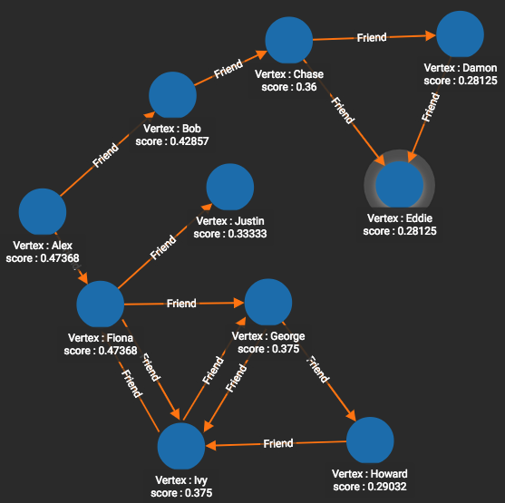

=== Approximate Closeness Centrality

In the link:graph-algorithm-library.md#closeness-centrality[Closeness Centrality algorithm], to obtain the closeness centrality score for a vertex, we measure the distance from the source vertex to every single vertex in the graph. In large graphs, running this calculation for every vertex can be highly time-consuming.

The Approximate Closeness Centrality algorithm (based on https://arxiv.org/pdf/1409.0035.pdf[Cohen et al. 2014]) calculates the approximate closeness centrality score for each vertex by combining two estimation approaches - sampling and pivoting. This hybrid estimation approach offers near-linear time processing and linear space overhead within a small relative error. It runs on graphs with unweighted edges (directed or undirected).


This query uses another subqueryhttps://github.com/tigergraph/gsql-graph-algorithms/blob/master/algorithms/schema-free/closeness_cent_approx_sub.gsql[`closeness_cent_approx_sub`], which needs to be installed before `closeness_approx` can be installed.


==== Specifications

[,sql]
----
closeness_approx (
    SET<STRING> v_type,
    SET<STRING> e_type,
        INT k = 100,  # sample num
        INT max_hops = 10,  # max BFS explore steps
        DOUBLE epsilon = 0.1,  # error parameter
    BOOL print_accum = true, # output to console
        STRING file_path = "",  # output file
        INT debug = 0,  # debug flag -- 0: No LOG;1: LOG without the sample-node bfs loop;2: ALL LOG.
        INT sample_index = 0,  # random sample group
        INT maxsize = 1000,  # max size of connected components using exact closeness algorithm
        BOOL wf = True # Wasserman and Faust formula
)
----

==== Parameters:

|===
| Name | Description

| `v_type`
| Vertex types to calculate approximate closeness centrality for.

| `e_type`
| Edge types to traverse.

| `k`
| Size of the sample.

| `max_hops`
| Upper limit of how many jumps the algorithm will perform from each vertex.

| `epsilon`
| The maximum relative error, between 0 and 1. Setting a lower value produces a more accurate estimate but increases run time.

| `print_accum`
| Boolean value that indicates whether or not to output to console in JSON format.

| `file_path`
| If provided, the algorithm will output to this file path in CSV format

| `debug`
| There are many conditional logging statements inside the query. If the input is 0, nothing will be logged. If the input is 1, everything else but the breadth-first-search process from the sample-node. If the input is 2, everything will be logged.

| `sample_index`
| The algorithm will partition the graph based on the sample size. This index indicates which partition to use when estimating closeness centrality.

| `maxsize`
| If the number of vertices in the graph is lower than `maxsize`, the exact closeness centrality is calculated instead and nothing will be approximated.

| `wf`
| Boolean value that indicates whether to use the https://books.google.com/books/about/Social_Network_Analysis.html?id=CAm2DpIqRUIC[Wasserman and Faust]formula to calculate closeness centrality rather than the classic formula.
|===

==== Result

The result is a list of all vertices in the graph with their approximate closeness centrality score. It is available both in JSON and CSV format.

==== Example

Below is an example of running the algorithm on the social10 test graph and an excerpt of the response.

[,javascript]
----
RUN QUERY closeness_aprox(["Person"], ["Friend", "Coworker"], 6, 3   \
0.1, true, "", 0, 0, 100, false)

[
  {
    "Start": [
      {
        "attributes": {
          "Start.@closeness": 0.58333
        },
        "v_id": "Fiona",
        "v_type": "Person"
      },
      {
        "attributes": {
          "Start.@closeness": 0.44444
        },
        "v_id": "Justin",
        "v_type": "Person"
      },
      {
        "attributes": {
          "Start.@closeness": 0.53333
        },
        "v_id": "Bob",
        "v_type": "Person"
      }
]
----

=== *Betweenness* Centrality

The Betweenness Centrality of a vertex is defined as the number of shortest paths that pass through this vertex, divided by the total number of shortest paths. That is

[stem]
++++
BC(v) =\sum_{s \ne v \ne t}PD_{st}(v)= \sum_{s \ne v \ne t} SP_{st}(v)/SP_{st} ,
++++

where stem:[PD]is called the pair dependency, stem:[SP_{st}]is the total number of shortest paths from node `s` to node `t` and stem:[SP_{st}(v)]is the number of those paths that pass through `v`.

The TigerGraph implementation is based on A Faster Algorithm for Betweenness Centrality by Ulrik Brandes, Journal of Mathematical Sociology 25(2):163-177, (2001). For every vertex `s` in the graph, the pair dependency starting from vertex `s` to all other vertices `t` via all other vertices `v` is computed first,

stem:[PD_{s*}(v) = \sum_{t:s \in V} PD_{st}(v)].

Then betweenness centrality is computed as

stem:[BC(v) =\sum_{s:s \in V}PD_{s*}(v)/2].

According to Brandes, the accumulated pair dependency can be calculated as

[stem]
++++
PD_{s*}(v) =\sum_{w:v \in P_s(w)} SP_{sv}(v)/SP_{sw} \cdot (1+PD_{s*}(w)) ,
++++

wherestem:[P_s(w)], the set of predecessors of vertex `w` on shortest paths from `s`, is defined as

[stem]
++++
P_s(w) = \{u \in V: \{u, w\} \in E, dist(s,w) = dist(s,u)+dist(u,w) \} .
++++

For every vertex, the algorithm works in two phases. The first phase calculates the number of shortest paths passing through each vertex. Then starting from the vertex on the most outside layer in a non-incremental order with pair dependency initial value of 0, traverse back to the starting vertex


This algorithm query employs a subquery called *bc_subquery*. Both queries are needed to run the algorithm.


*Specifications*

[,erlang]
----
betweenness_cent(SET<STRING> v_type, SET<STRING> e_type, INT max_hops = 10,
  INT top_k=100, BOOL print_accum=TRUE, STRING result_attr="", STRING file_path="",
  BOOL display_edges = FALSE)
----

*Parameters*+++<table>++++++<thead>++++++<tr>++++++<th style="text-align:left">++++++<b>+++Characteristic+++</b>++++++</th>+++
      +++<th style="text-align:left">+++Value+++</th>++++++</tr>++++++</thead>+++
  +++<tbody>++++++<tr>++++++<td style="text-align:left">+++Result+++</td>+++
      +++<td style="text-align:left">+++Computes a Betweenness Centrality value (FLOAT type) for each vertex.+++</td>++++++</tr>+++
    +++<tr>++++++<td style="text-align:left">+++Required Input Parameters+++</td>+++
      +++<td style="text-align:left">++++++<ul>++++++<li>++++++<b>++++++<code>+++SET<STRING> v_type+++</code>++++++</b>+++: Names of vertex types to
            use+++</li>+++
          +++<li>++++++<b>++++++<code>+++SET<STRING> e_type+++</code>++++++</b>+++: Names of edge types to use+++</li>+++
          +++<li>++++++<b>++++++<code>+++INT max_hops+++</code>++++++</b>+++: If >=0, look only this far from each
            vertex+++</li>+++
          +++<li>++++++<b>++++++<code>+++INT top_k+++</code>+++:+++</b>+++ Sort the scores highest first and output
            only this many scores+++</li>+++
          +++<li>++++++<b>++++++<code>+++BOOL print_accum+++</code>++++++</b>+++: If True, output JSON to standard
            output+++</li>+++
          +++<li>++++++<b>++++++<code>+++STRING result_attr+++</code>++++++</b>+++: If not empty, store centrality
            values (FLOAT) to this attribute+++</li>+++
          +++<li>++++++<b>++++++<code>+++STRING file_path+++</code>+++:+++</b>+++ If not empty, write output to this
            file.+++</li>+++
          +++<li>++++++<b>++++++<code>+++BOOL display_edges+++</code>++++++</b>+++: If true, include the graph&apos;s
            edges in the JSON output, so that the full graph can be displayed.+++</li>++++++</ul>++++++</td>++++++</tr>+++
    +++<tr>++++++<td style="text-align:left">+++Result Size+++</td>+++
      +++<td style="text-align:left">+++V = number of vertices+++</td>++++++</tr>+++
    +++<tr>++++++<td style="text-align:left">+++Time Complexity+++</td>+++
      +++<td style="text-align:left">++++++
+++O(E*V), E = number of edges, V = number of vertices.+++
+++
        +++
+++Considering the high time cost of running this algorithm on a big graph,
          the users can set a maximum number of iterations. Parallel processing reduces
          the time needed for computation.+++
++++++</td>++++++</tr>+++
    +++<tr>++++++<td style="text-align:left">+++Graph Types+++</td>+++
      +++<td style="text-align:left">+++Undirected edges, Unweighted edges+++</td>++++++</tr>++++++</tbody>++++++</table>+++

==== Example

In the example below, Claire is in the very center of the graph and has the highest betweenness centrality. Six shortest paths pass through Sam (i.e. paths from Victor to all other 6 people except for Sam and Victor), so the score of Sam is 6. David also has a score of 6, since Brian has 6 paths to other people that pass through David.

[,sql]
----
# Use _ for default values
RUN QUERY (["Person"], ["Friend"], _, _, _, _, _, _)
----

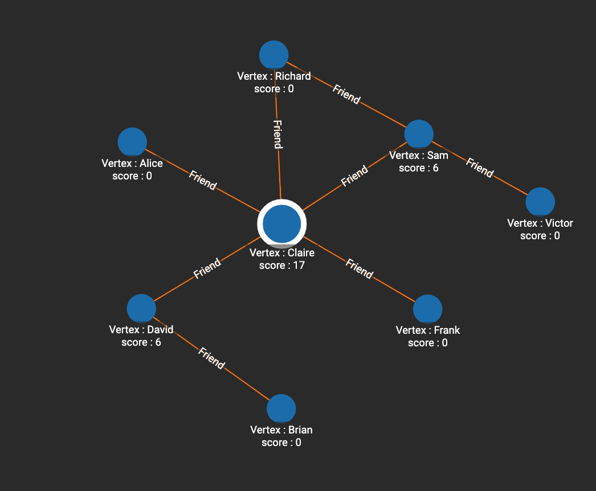

[,text]
----
[
  {
    "@@BC": {
      "Alice": 0,
      "Frank": 0,
      "Claire": 17,
      "Sam": 6,
      "Brian": 0,
      "David": 6,
      "Richard": 0,
      "Victor": 0
    }
  }
]
----

In the following example, both Charles and David have 9 shortest paths passing through them. Ellen is in a similar position as Charles, but her centrality is weakened due to the path between Frank and Jack.

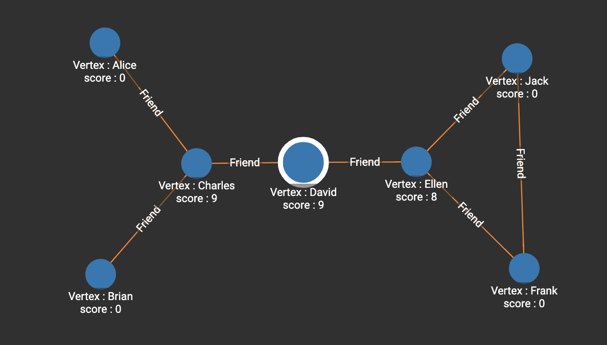

[,text]
----
[
  {
    "@@BC": {
      "Alice": 0,
      "Frank": 0,
      "Charles": 9,
      "Ellen": 8,
      "Brian": 0,
      "David": 9,
      "Jack": 0
    }
  }
]
----

== *Community Algorithms*

These algorithms evaluate how a group is clustered or partitioned, as well as its tendency to strengthen or break apart.

=== Connected Components

==== Description and Uses +++<a id="description-and-uses-1">++++++</a>+++

A component is the maximal set of vertices, plus their connecting edges, which are interconnected. That is, you can reach each vertex from each other vertex. In the example figure below, there are three components.

This particular algorithm deals with undirected edges. If the same definition (each vertex can reach each other vertex) is applied to directed edges, then the components are called Strongly Connected Components. If you have directed edges but ignore the direction (permitting traversal in either direction), then the algorithm finds Weakly Connected Components.

==== Specifications +++<a id="specifications-1">++++++</a>+++

[,erlang]
----
conn_comp (SET<STRING> v_type, SET<STRING> e_type, INT output_limit = 100,
  BOOL print_accum = TRUE, STRING result_attr = "", STRING file_path = "")
----+++<table>++++++<thead>++++++<tr>++++++<th style="text-align:left">++++++<b>+++Characteristic+++</b>++++++</th>+++
      +++<th style="text-align:left">+++Value+++</th>++++++</tr>++++++</thead>+++
  +++<tbody>++++++<tr>++++++<td style="text-align:left">+++Result+++</td>+++
      +++<td style="text-align:left">+++Assigns a component id (INT) to each vertex, such that members of the
        same component have the same id value.+++</td>++++++</tr>+++
    +++<tr>++++++<td style="text-align:left">+++Input Parameters+++</td>+++
      +++<td style="text-align:left">++++++<ul>++++++<li>++++++<b>++++++<code>+++SET<STRING> v_type+++</code>++++++</b>+++: Names of vertex types to
            use+++</li>+++
          +++<li>++++++<b>++++++<code>+++SET<STRING> e_type+++</code>++++++</b>+++: Names of edge types to use+++</li>+++
          +++<li>++++++<b>++++++<code>+++INT output_limit+++</code>++++++</b>+++: If >=0, max number of vertices
            to output to JSON.+++</li>+++
          +++<li>++++++<b>++++++<code>+++BOOL print_accum+++</code>++++++</b>+++: If True, output JSON to standard
            output+++</li>+++
          +++<li>++++++<b>++++++<code>+++STRING result_attr+++</code>++++++</b>+++: If not empty, store community
            ID values (INT) to this attribute+++</li>+++
          +++<li>++++++<b>++++++<code>+++STRING file_path+++</code>+++:+++</b>+++ If not empty, write output to this
            file.+++</li>++++++</ul>++++++</td>++++++</tr>+++
    +++<tr>++++++<td style="text-align:left">+++Result Size+++</td>+++
      +++<td style="text-align:left">+++V = number of vertices+++</td>++++++</tr>+++
    +++<tr>++++++<td style="text-align:left">+++Time Complexity+++</td>+++
      +++<td style="text-align:left">+++O(E*d), E = number of edges, d = max(diameter of components)+++</td>++++++</tr>+++
    +++<tr>++++++<td style="text-align:left">+++Graph Types+++</td>+++
      +++<td style="text-align:left">+++Undirected edges+++</td>++++++</tr>++++++</tbody>++++++</table>+++

==== Example +++<a id="example-1">++++++</a>+++

It is easy to see in this small graph that the algorithm correctly groups the vertices:

* Alex, Bob, and Justin all have Community ID = 2097152
* Chase, Damon, and Eddie all have Community ID = 5242880
* Fiona, George, Howard, and Ivy all have Community ID = 0

Our algorithm uses the TigerGraph engine's internal vertex ID numbers; they cannot be predicted.

[,erlang]
----
RUN QUERY conn_comp(["Person"], ["Coworker"], _, _, _, _)
----

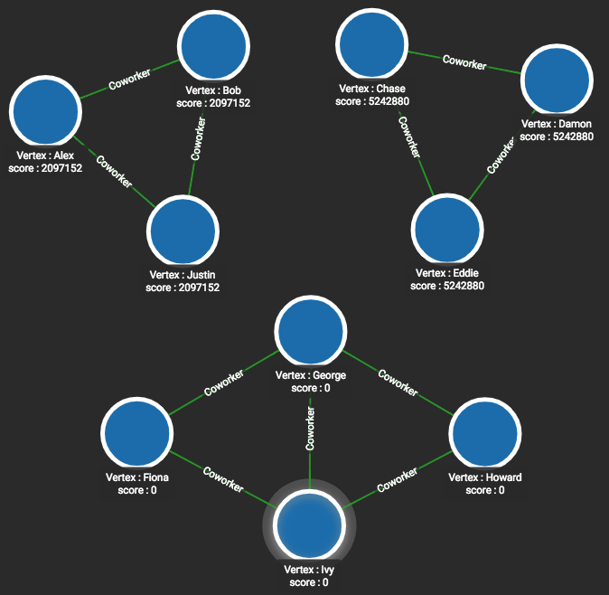

=== K-core Decomposition

A *k-core* of a graph is a maximal connected subgraph in which every vertex is connected to at least k vertices in the subgraph. To obtain the k-core of a graph, the algorithm first deletes the vertices whose outdegree is less than _k_. It then updates the outdegree of the neighbors of the deleted vertices, and if that causes a vertex's outdegree to fall below _k_, it will also delete that vertex. The algorithm repeats this operation until every vertex left in the subgraph has an outdegree of at least _k_.

Our algorithm takes a range of values for _k_ and returns the set of the vertices that constitute the k-core with the highest possible value of _k_ within the range. It is an implementation of Algorithm 2 in https://ieeexplore.ieee.org/document/8622056[Scalable K-Core Decomposition for Static Graphs Using a Dynamic Graph Data Structure, Tripathy et al., IEEE Big Data 2018].

==== Time complexity

O(E), where E is the number of edges in the graph.

==== Specifications

[,text]
----
kcore(STRING v_type, STRING e_type, INT k_min = 0, INT k_max = -1,
BOOL print_accum = TRUE, STRING attr = "", STRING file_path = "",
BOOL show_membership = FALSE, BOOL show_shells=FALSE)
----

==== Parameters

|===
| Parameter | Description

| `v_type`
| Vertex type to include in the k-core

| `e_type`
| Edge type to count for k-core connections

| `k_min`
| Minimum value of k. If the actual maximum core is below `k_min`, the algorithm will return an empty set.

| `k_max`
| Maximum value of k. If `k_max` is smaller than `k_min`, the algorithm will ignore this parameter and keep looking for k-cores until it reaches a value of k where a k-core cannot be found.

| `show_membership`
| If `show_membership` is `true`, the algorithm will return the k-cores found for every value of k within the range provided. For each k-core, the results will include its member vertices.

| `show_shells`
| The _*k*_*-shell* is the set of vertices that are part of the _k_-core but not part of the (_k_+1)-core. If `show_shells` is `true`, the algorithm will return the k-shells found for every value of k. within the range provided. For each k-shell, the results will include its member vertices.

| `print_accum`
| Boolean value that decides whether the algorithm will return output in JSON

| `attr`
| Optional. An attribute of the vertex to save the core level of the vertex to. If `attr` is provided, the core level of the vertex will be saved to this attribute of the vertex.

| `file_path`
| Optional. If `file_path` is provided, the algorithm will output results to a file specified by the file path in CSV format.
|===

==== Example

In the example below based on the https://docs.tigergraph.com/start/gsql-101/get-set#GSQL101-DataSet[`social`] graph from GSQL 101, we can see that Dan, Tom, and Jenny make up a 2-core, which is the max-core of the graph:

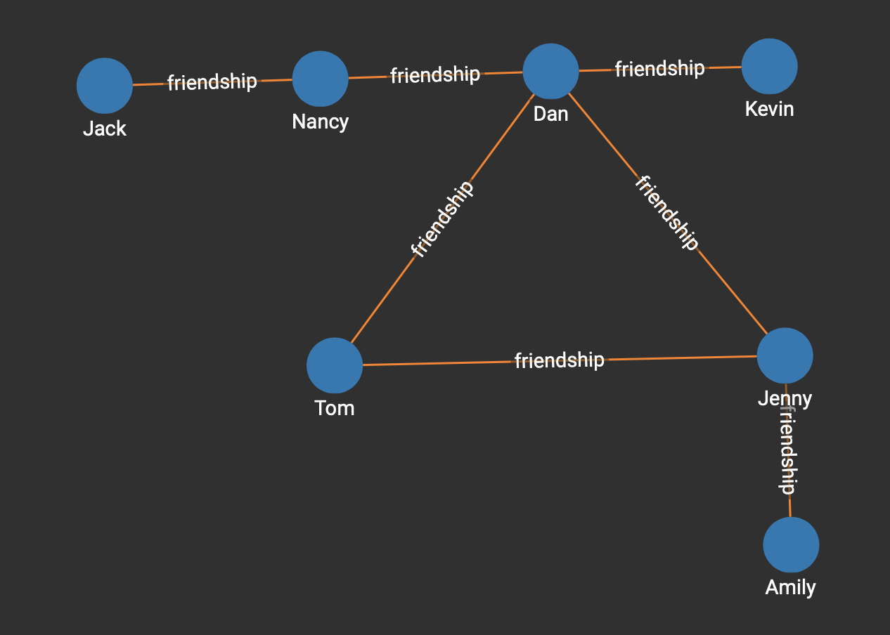

If we run the `kcore` algorithm on this small graph like so:

[,text]
----
RUN QUERY kcore("person", "friendship", 0, -1, TRUE, "", "", FALSE, FALSE)
----

Here is the returned JSON response, which includes a 2-core that is comprised of Dan, Jenny, and Tom:

[,javascript]
----
[
  {
    "core_size": 3,
    "k": 2,             // the k-core with the highest possible k is returned
    "max_core": [
      {
        "attributes": {
          "@core": 2,
          "@deg": 0,
          "age": 40,
          "gender": "male",
          "name": "Tom",
          "state": "ca"
        },
        "v_id": "Tom",
        "v_type": "person"
      },
      {
        "attributes": {
          "@core": 2,
          "@deg": 0,
          "age": 34,
          "gender": "male",
          "name": "Dan",
          "state": "ny"
        },
        "v_id": "Dan",
        "v_type": "person"
      },
      {
        "attributes": {
          "@core": 2,
          "@deg": 0,
          "age": 25,
          "gender": "female",
          "name": "Jenny",
          "state": "tx"
        },
        "v_id": "Jenny",
        "v_type": "person"
      }
    ]
  }
]
----

=== Strongly Connected Components

==== Description and Uses +++<a id="description-and-uses-1">++++++</a>+++

A strongly connected component (SCC) is a subgraph such that there is a path from any vertex to every other vertex. A graph can contain more than one separate SCC. An SCC algorithm finds the maximal SCCs within a graph. Our implementation is based on the Divide-and-Conquer Strong Components (DCSC) algorithm[1]. In each iteration, pick a pivot vertex `v` randomly, and find its descendant and predecessor sets, where descendant set `D_v` is the vertex reachable from `v`, and predecessor set `P_v` is the vertices which can reach `v` (stated another way, reachable from `v` through reverse edges). The intersection of these two sets is a strongly connected component `SCC_v`. The graph can be partitioned into 4 sets: `SCC_v`, descendants `D_v` excluding `SCC_v`, predecessors `P_v` excluding `SCC`, and the remainders `R_v`. It is proved that _any SCC_ is a subset of one of the 4 sets [1]. Thus, we can divide the graph into different subsets and detect the SCCs independently and iteratively.

The problem of this algorithm is unbalanced load and slow convergence when there are a lot of small SCCs, which is often the case in real-world use cases [3]. We added two trimming stages to improve the performance: size-1 SCC trimming[2] and weakly connected components[3].

The implementation of this algorithm requires reverse edges for all directed edges considered in the graph.

[1] Fleischer, Lisa K., Bruce Hendrickson, and Ali Pınar. "On identifying strongly connected components in parallel." International Parallel and Distributed Processing Symposium. Springer, Berlin, Heidelberg, 2000.

[2] Mclendon Iii, William, et al. "Finding strongly connected components in distributed graphs." Journal of Parallel and Distributed Computing 65.8 (2005): 901-910.

[3] Hong, Sungpack, Nicole C. Rodia, and Kunle Olukotun. "On fast parallel detection of strongly connected components (SCC) in small-world graphs." Proceedings of the International Conference on High Performance Computing, Networking, Storage and Analysis. ACM, 2013.

==== Specifications +++<a id="specifications-1">++++++</a>+++

[,erlang]
----
scc (SET<STRING> v_type, SET<STRING> e_type, SET<STRING> rev_e_type,
  INT top_k_dist, INT output_limit, INT max_iter = 500, INT iter_wcc = 5,
  BOOL print_accum = TRUE, STRING attr= "", STRING file_path="")
----+++<table>++++++<thead>++++++<tr>++++++<th style="text-align:left">++++++<b>+++Characteristic+++</b>++++++</th>+++
      +++<th style="text-align:left">+++Value+++</th>++++++</tr>++++++</thead>+++
  +++<tbody>++++++<tr>++++++<td style="text-align:left">+++Result+++</td>+++
      +++<td style="text-align:left">+++Assigns a component id (INT) to each vertex, such that members of the
        same component have the same id value.+++</td>++++++</tr>+++
    +++<tr>++++++<td style="text-align:left">+++Input Parameters+++</td>+++
      +++<td style="text-align:left">++++++<ul>++++++<li>++++++<b>++++++<code>+++SET<STRING> v_type+++</code>++++++</b>+++: Names of vertex types to
            use+++</li>+++
          +++<li>++++++<b>++++++<code>+++SET<STRING> e_type+++</code>++++++</b>+++: Names of edge types to use+++</li>+++
          +++<li>++++++<b>++++++<code>+++SET<STRING> rev_e_type+++</code>++++++</b>+++: Names of reverse direction
            edge types to use+++</li>+++
          +++<li>++++++<b>++++++<code>+++INT top_k_dist+++</code>++++++</b>+++: top k result in SCC distribution+++</li>+++
          +++<li>++++++<b>++++++<code>+++INT output_limit+++</code>++++++</b>+++: If >=0, max number of vertices
            to output to JSON.+++</li>+++
          +++<li>++++++<b>++++++<code>+++INT max_iter+++</code>++++++</b>+++: number of maximum iteration of the algorithm+++</li>+++
          +++<li>++++++<b>++++++<code>+++INT iter_wcc+++</code>++++++</b>+++: find weakly connected components for
            the active vertices in this iteration, since the largest SCCs are already
            found after several iterations; usually a small number(3 to 10)+++</li>+++
          +++<li>++++++<b>++++++<code>+++BOOL print_accum+++</code>++++++</b>+++: If True, output JSON to standard
            output+++</li>+++
          +++<li>++++++<b>++++++<code>+++STRING result_attr+++</code>++++++</b>+++: If not empty, store community
            ID values (INT) to this attribute+++</li>+++
          +++<li>++++++<b>++++++<code>+++STRING file_path+++</code>+++:+++</b>+++ If not empty, write output to this
            file.+++</li>++++++</ul>++++++</td>++++++</tr>+++
    +++<tr>++++++<td style="text-align:left">+++Result Size+++</td>+++
      +++<td style="text-align:left">+++V = number of vertices+++</td>++++++</tr>+++
    +++<tr>++++++<td style="text-align:left">+++Time Complexity+++</td>+++
      +++<td style="text-align:left">+++O(iter*d), d = max(diameter of components)+++</td>++++++</tr>+++
    +++<tr>++++++<td style="text-align:left">+++Graph Types+++</td>+++
      +++<td style="text-align:left">+++Directed edges with reverse direction edges as well+++</td>++++++</tr>++++++</tbody>++++++</table>+++

==== Example +++<a id="example-1">++++++</a>+++

We ran `scc` on the social26 graph. A portion of the JSON result is shown below.

[,text]
----
[
  {
    "i": 1
  },
  {
    "trim_set.size()": 8
  },
  {
    "trim_set.size()": 5
  },
  {
    "trim_set.size()": 2
  },
  {
    "trim_set.size()": 2
  },
  {
    "trim_set.size()": 0
  },
  {
    "@@cluster_dist_heap": [
      {
        "csize": 9,
        "num": 1
      },
      {
        "csize": 1,
        "num": 17
      }
    ]
  },
----

The first element `"i"=1` means the whole graph is processed in just one iteration. The 5 `"trim_set.size()"` elements mean there were 5 rounds of size-1 SCC trimming. The final `"@@.cluster_dist_heap" object"` reports on the size distribution of SCCs.There is one SCC with 9 vertices, and 17 SCCs with only 1 vertex in the graph.

=== Label Propagation

==== Description and Uses +++<a id="description-and-uses-1-1">++++++</a>+++

Label Propagation is a heuristic method for determining communities. The idea is simple: If the plurality of your neighbors all bear the label X, then you should label yourself as also a member of X. The algorithm begins with each vertex having its own unique label. Then we iteratively update labels based on the neighbor influence described above. It is important that the order for updating the vertices be random. The algorithm is favored for its efficiency and simplicity, but it is not guaranteed to produce the same results every time.

In a variant version, some vertices could initially be known to belong to the same community. If they are well-connected to one another, they are likely to preserve their common membership and influence their neighbors,

==== Specifications +++<a id="specifications-1-1">++++++</a>+++

[,erlang]
----
label_prop (SET<STRING> v_type, SET<STRING> e_type, INT max_iter, INT output_limit,
BOOL print_accum = TRUE, STRING file_path = "", STRING attr = "")
----+++<table>++++++<thead>++++++<tr>++++++<th style="text-align:left">++++++<b>+++Characteristic+++</b>++++++</th>+++
      +++<th style="text-align:left">+++Value+++</th>++++++</tr>++++++</thead>+++
  +++<tbody>++++++<tr>++++++<td style="text-align:left">+++Result+++</td>+++
      +++<td style="text-align:left">+++Assigns a component id (INT) to each vertex, such that members of the
        same component have the same id value.+++</td>++++++</tr>+++
    +++<tr>++++++<td style="text-align:left">+++Input Parameters+++</td>+++
      +++<td style="text-align:left">++++++<ul>++++++<li>++++++<b>++++++<code>+++SET<STRING> v_type+++</code>++++++</b>+++: Names of vertex types to
            use+++</li>+++
          +++<li>++++++<b>++++++<code>+++SET<STRING> e_type+++</code>++++++</b>+++: Names of edge types to use+++</li>+++
          +++<li>++++++<b>++++++<code>+++INT max_iter+++</code>++++++</b>+++: Number of maximum iteration of the algorithm+++</li>+++
          +++<li>++++++<b>++++++<code>+++INT output_limit+++</code>++++++</b>+++: If >=0, max number of vertices
            to output to JSON.+++</li>+++
          +++<li>++++++<b>++++++<code>+++BOOL print_accum+++</code>++++++</b>+++: If True, output JSON to standard
            output+++</li>+++
          +++<li>++++++<b>++++++<code>+++STRING attr+++</code>++++++</b>+++: If not empty, store community id values
            (INT) to this attribute+++</li>+++
          +++<li>++++++<b>++++++<code>+++STRING file_path+++</code>+++:+++</b>+++ If not empty, write output to this
            file.+++</li>++++++</ul>++++++</td>++++++</tr>+++
    +++<tr>++++++<td style="text-align:left">+++Result Size+++</td>+++
      +++<td style="text-align:left">+++V = number of vertices+++</td>++++++</tr>+++
    +++<tr>++++++<td style="text-align:left">+++Time Complexity+++</td>+++
      +++<td style="text-align:left">+++O(E*k), E = number of edges, k = number of iterations.+++</td>++++++</tr>+++
    +++<tr>++++++<td style="text-align:left">+++Graph Types+++</td>+++
      +++<td style="text-align:left">+++Undirected edges+++</td>++++++</tr>++++++</tbody>++++++</table>+++

==== Example +++<a id="example-1-1">++++++</a>+++

This is the same graph that was used in the Connected Component example. The results are different, though. The quartet of Fiona, George, Howard, and Ivy have been split into 2 groups:

* (George & Ivy) each connect to (Fiona & Howard) and to one another.
* (Fiona & Howard) each connect to (George & Ivy) but not to one another.

Label Propagation tries to find natural clusters and separations within connected components. That is, it looks at the quality and pattern of connections. The Component Component algorithm simply asks the Yes or No question: Are these two vertices connected?

We set `max_iter` to 10, but the algorithm reaches a steady state after 3 iterations:

[,sql]
----
# Use _ for default/empty values
RUN QUERY(["Person"], ["Coworker"], 10, -1, _, _, _)
----

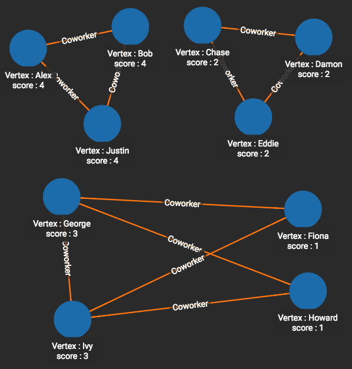

=== Local Clustering Coefficient

==== Description

The Local Clustering Coefficient algorithm computes the local clustering coefficient of every vertex in a graph. The _local clustering coefficient_ of a vertex (node) in a graph quantifies how close its neighbors are to being a complete graph, where every two distinct vertices are connected by an edge. It is obtained by dividing the number edges between a vertex's neighbors by the number of edges that could possibly exist.

The algorithm does not report the local clustering coefficient for vertices that have only one neighbor.

==== Time complexity

`O(n)`, where `n` is the number of vertices in the graph.

==== Specifications

[,erlang]
----
Local_clustering_coefficient(STRING v_type, STRING e_type,INT top_k=100,
  BOOL print_accum = True, STRING result_attr = "",
  STRING file_path = "", BOOL display_edges = FALSE)
----

==== Parameters

|===
| Parameter | Description | Data type

| `v_type`
| Vertex type to calculate local clustering coefficient for
| `STRING`

| `e_type`
| Edge type to traverse. Only vertices that are connected by edges of this type are treated as connected in this algorithm.
| `STRING`

| `top_k`
| Number of the highest local clustering coefficients to report.
| `INT`

| `print_accum`
| If `true`, output JSON to standard output.
| `BOOL`

| `result_attr`
| If provided, the local clustering coefficient of a vertex will be saved to this attribute.
| `STRING`

| `file_path`
| If provided, write output to this file in CSV.
| `STRING`

| `display_edges`
| If `display_edges` is set to true, the algorithm will also return edges, which help produce better visualized results in GraphStudio.
| `BOOL`
|===

==== Example

Using the `social` graph below as an example, Jenny has three neighbors - Tom, Dan and Amily, but only Tom and Dan are connected. Between the three neighbors, the maximum number of edges that could exist is 3. Therefore, the local clustering coefficient for Jenny is 1/3.

On the other hand, Tom has two neighbors that are connected by one edge. Since the maximum number of edges that could exist between two vertices is 1, Tom has a local clustering coefficient of 1/1 = 1.

image::../.gitbook/assets/image%20%2878%29.png[]

By running the algorithm in GSQL, we can confirm that Tom has the highest local clustering coefficient with a score of 1 and Jenny has a score of 1/3.

[,bash]
----
RUN QUERY Local_clustering_coefficient("person", "friendship", _, _, _, _, _)

{
  "error": false,
  "message": "",
  "version": {
    "schema": 0,
    "edition": "enterprise",
    "api": "v2"
  },
  "results": [{"top_scores": [
    {
      "score": 1,
      "Vertex_ID": "Tom"
    },
    {
      "score": 0.33333,
      "Vertex_ID": "Jenny"
    },
    {
      "score": 0.16667,
      "Vertex_ID": "Dan"
    },
    {
      "score": 0,
      "Vertex_ID": "Nancy"
    }
  ]}]
}
----

=== Louvain Method with Parallelism and Refinement

==== Description and Uses +++<a id="description-and-uses-1-1">++++++</a>+++

The Louvain Method for community detection [1] partitions the vertices in a graph by approximately maximizing the graph's modularity score. The modularity score for a partitioned graph assesses the difference in density of links within a partition vs. the density of links crossing from one partition to another. The assumption is that if a partitioning is good (that is, dividing up the graph into communities or clusters), then the within-density should be high and the inter-density should be low.

The most efficient and empirically effective method for calculating modularity was published by a team of researchers at the University of Louvain. The Louvain method uses agglomeration and hierarchical optimization:

. Optimize modularity for small local communities.
. Treat each optimized local group as one unit, and repeat the modularity operation for groups of these condensed units.

The original Louvain Method contains two phases. The first phase incrementally calculates the modularity change of moving a vertex into every other community and moves the vertex to the community with the highest modularity change. The second phase coarsens the graph by aggregating the vertices which are assigned in the same community into one vertex. The first phase and second phase make up a pass. The Louvain Method performs the passes iteratively. In other words, the algorithm assigns an initial community label to every vertex, then performs the first phase, during which the community labels are changed until there is no modularity gain. Then it aggregates the vertices with the same labels into one vertex and calculates the aggregated edge weights between new vertices. For the coarsened graph, the algorithm conducts the first phase again to move the vertices into new communities. The algorithm continues until the modularity is not increasing, or runs to the preset iteration limits.

However, phase one is sequential, and thus slow for large graphs. An improved Parallel Louvain Method Louvain Method (PLM) calculates the best community to move to for each vertex in parallel [2]. In Parallel Louvain Method(PLM), the positive modularity gain is not guaranteed, and it may also swap two vertices to each other's community. After finishing the passes, there is an additional refinement phase, which is running the first phase again on each vertex to do some small adjustments for the resulting communities. [3].

[1] Blondel, Vincent D., et al. "Fast unfolding of communities in large networks." Journal of statistical mechanics: theory and experiment 2008.10 (2008): P10008.

[2] Staudt, Christian L., and Henning Meyerhenke. "Engineering parallel algorithms for community detection in massive networks." IEEE Transactions on Parallel and Distributed Systems 27.1 (2016): 171-184.

[3] Lu, Hao, Mahantesh Halappanavar, and Ananth Kalyanaraman. "Parallel heuristics for scalable community detection." Parallel Computing 47 (2015): 19-37.

==== Specifications +++<a id="specifications-1-1">++++++</a>+++

[,erlang]
----
louvain_parallel (SET<STRING> v_type, SET<STRING> e_type, STRING wt_attr,
  INT iter1=10, INT iter2=10, INT iter3=10, INT split=10, BOOL print_accum = TRUE,
  STRING result_attr = "", STRING file_path = "", BOOL comm_by_size = TRUE)
----+++<table>++++++<thead>++++++<tr>++++++<th style="text-align:left">++++++<b>+++Characteristic+++</b>++++++</th>+++
      +++<th style="text-align:left">+++Value+++</th>++++++</tr>++++++</thead>+++
  +++<tbody>++++++<tr>++++++<td style="text-align:left">+++Result+++</td>+++
      +++<td style="text-align:left">+++Assigns a component id (INT) to each vertex, such that members of the
        same component have the same id value. The JSON output lists every vertex
        with its community ID value. It also lists community id values, sorted
        by community size.+++</td>++++++</tr>+++
    +++<tr>++++++<td style="text-align:left">+++Input Parameters+++</td>+++
      +++<td style="text-align:left">++++++<ul>++++++<li>++++++<b>++++++<code>+++SET<STRING> v_type+++</code>++++++</b>+++: Names of vertex types to
            use+++</li>+++
          +++<li>++++++<b>++++++<code>+++SET<STRING> e_type+++</code>++++++</b>+++: Names of edge types to use+++</li>+++
          +++<li>++++++<b>++++++<code>+++STRING wt_attr+++</code>++++++</b>+++: Name of edge weight attribute (must
            be FLOAT)+++</li>+++
          +++<li>++++++<b>++++++<code>+++INT iter1+++</code>++++++</b>+++: Max number of iterations for the first
            phase. Default value is 10+++</li>+++
          +++<li>++++++<b>++++++<code>+++INT iter2+++</code>++++++</b>+++: Max number of iterations for the second
            phase. Default value is 10+++</li>+++
          +++<li>++++++<b>++++++<code>+++INT iter3+++</code>++++++</b>+++: Max number of iterations for the refinement
            phase. Default value is 10+++</li>+++
          +++<li>++++++<b>++++++<code>+++INT split+++</code>++++++</b>+++: Number of splits in phase 1. Increase the
            number to save memory, at the expense of having a longer running time.
            Default value is 10.+++</li>+++
          +++<li>++++++<b>++++++<code>+++BOOL print_accum+++</code>++++++</b>+++: If True, output JSON to standard
            output+++</li>+++
          +++<li>++++++<b>++++++<code>+++STRING result_attr+++</code>++++++</b>+++: If not empty, store community
            id values (INT) to this attribute+++</li>+++
          +++<li>++++++<b>++++++<code>+++STRING file_path+++</code>+++:+++</b>+++ If not empty, write output to this
            file.+++</li>+++
          +++<li>++++++<b>++++++<code>+++BOOL comm_by_size+++</code>++++++</b>+++: If True, and if +++<code>+++print_accum+++</code>+++ is
            True, output the membership of each community, with communities arranged
            by size.+++</li>++++++</ul>++++++</td>++++++</tr>+++
    +++<tr>++++++<td style="text-align:left">+++Result Size+++</td>+++
      +++<td style="text-align:left">+++V = number of vertices+++</td>++++++</tr>+++
    +++<tr>++++++<td style="text-align:left">+++Time Complexity+++</td>+++
      +++<td style="text-align:left">+++O(V{caret}2*L), V = number of vertices, L = (iter1 * iter2 + iter3) = total
        number of iterations+++</td>++++++</tr>+++
    +++<tr>++++++<td style="text-align:left">+++Graph Types+++</td>+++
      +++<td style="text-align:left">++++++
+++Undirected, weighted edges+++
+++
        +++
+++An edge weight attribute is required.+++
++++++</td>++++++</tr>++++++</tbody>++++++</table>+++

==== Example

If we use `louvain_parallel` for social10 graph, it will give the same result as the connected components algorithm. The social26 graph is a densely connected graph. The connected components algorithm groups all the vertices into the same community and label propagation does not consider the edge weight. On the contrary, `louvain_parallel` detects 7 communities in total, and the cluster distribution is shown below (`csize` is cluster size):

[,text]
----
{
    "@@clusterDist": [
      {
        "csize": 2,
        "number": 1
      },
      {
        "csize": 3,
        "number": 2
      },
      {
        "csize": 4,
        "number": 2
      },
      {
        "csize": 5,
        "number": 2
      }
    ]
----

=== Triangle Counting

==== Description and Uses +++<a id="description-and-uses-1-1">++++++</a>+++

Why triangles? Think of it in terms of a social network:

* If A knows B, and A also knows C, then we complete the triangle if B knows C. If this situation is common, it indicates a community with a lot of interaction.
* The triangle is in fact the smallest multi-edge "complete subgraph," where every vertex connects to every other vertex.

Triangle count (or density) is a measure of community and connectedness. In particular, it addresses the question of transitive relationships: If A--> B and B-->C, then what is the likelihood of A--> C?

Note that it is computing a single number: How many triangles are in this graph? It is not finding communities within a graph.

It is not common to count triangles in directed graphs, though it is certainly possible. If you choose to do so, you need to be very specific about the direction of interest: In a directed graph, If A--> B and B--> C, then

* if A-->C, we have a "shortcut".
* if C-->A, then we have a feedback loop.

==== Specifications +++<a id="specifications-1-1">++++++</a>+++


The `tri_count` algorithm is in template format. It is not yet in schema-free format.


We present two different algorithms for counting triangles. The first, tri_count(), is the classic edge-iterator algorithm. For each edge and its two endpoint vertices S and T, count the overlap between S's neighbors and T's neighbors.

[,text]
----
tri_count()
tri_count_file(FILE filepath)
tri_count_attr()
----

One side effect of the simple edge-iterator algorithm is that it ends up considering each of the three sides of a triangle. The count needs to be divided by 3, meaning we did 3 times more work than a smaller algorithm would have.

tri_count_fast() is a smarter algorithm which does two passes over the edges. In the first pass we mark which of the two endpoint vertices has fewer neighbors. In the second pass, we count the overlap only between marked vertices. The result is that we eliminate 1/3 of the neighborhood matching, the slowest 1/3, but at the cost of some additional memory.

[,text]
----
tri_count_fast()
tri_count_fast_file(FILE filepath)
tri_count_fast_attr()
----

|===
| *Characteristic* | Value

| Result
| Returns the number of triangles in the graph.

| Input Parameters
| None

| Result Size
| 1 integer

| Time Complexity
| O(V * E), V = number of vertices, E = number of edges

| Graph Types
| Undirected edges
|===

==== Example +++<a id="example-1-1">++++++</a>+++

In the social10 graph with Coworker edges, there are clearly 4 triangles.

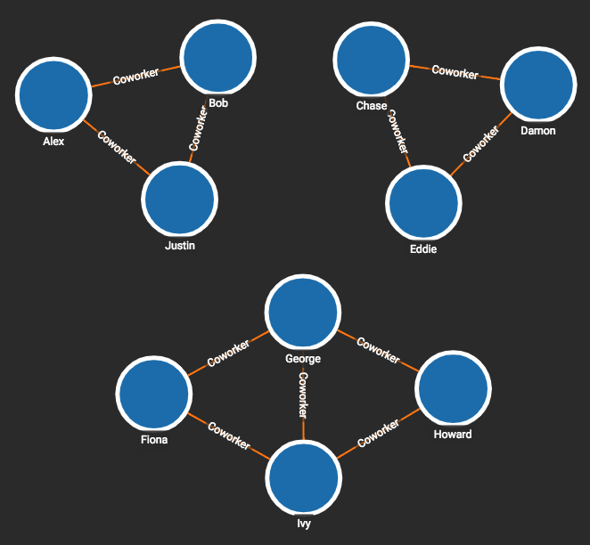

[,text]
----
{
  "error": false,
  "message": "",
  "version": {
    "edition": "developer",
    "schema": 0,
    "api": "v2"
  },
  "results": [
    {"num_triangles": 4}
  ]
}
----

== Similarity Algorithms

There are many ways to measure the similarity between two vertices in a graph, but all of them compare either (1) the features of the vertices themselves, (2) the relationships of each of the two vertices, or (3) both. We use a graph called movie to demonstrate our similarity algorithms.

=== Cosine Similarity of Neighborhoods, Single Source

==== Description and Uses

To compare two vertices by https://en.wikipedia.org/wiki/Cosine_similarity[cosine similarity], the selected properties of each vertex are first represented as a vector. For example, a property vector for a Person vertex could have the elements age, height, and weight. Then the cosine function is applied to the two vectors.

The cosine similarity of two vectors A and B is defined as follows:

[stem]
++++
cos(A,B)=\frac{A\cdot B}{||A||\cdot ||B||} = \frac{\sum_iA_i B_i}{\sqrt{\sum_iA^2_i}\sqrt{\sum_iB^2_i}}
++++

If A and B are identical, then cos(A, B) = 1. As expected for a cosine function, the value can also be negative or zero. In fact, cosine similarity is closely related to the Pearson correlation coefficient.

For this library function, the feature vector is the set of edge weights between the two vertices and their neighbors.

In the movie graph shown in the figure below, there are Person vertices and Movie vertices. Every person may give a rating to some of the movies. The rating score is stored on the Likes edge using the weight attribute. For example, in the graph below, Alex gives a rating of 10 to the movie "Free Solo".

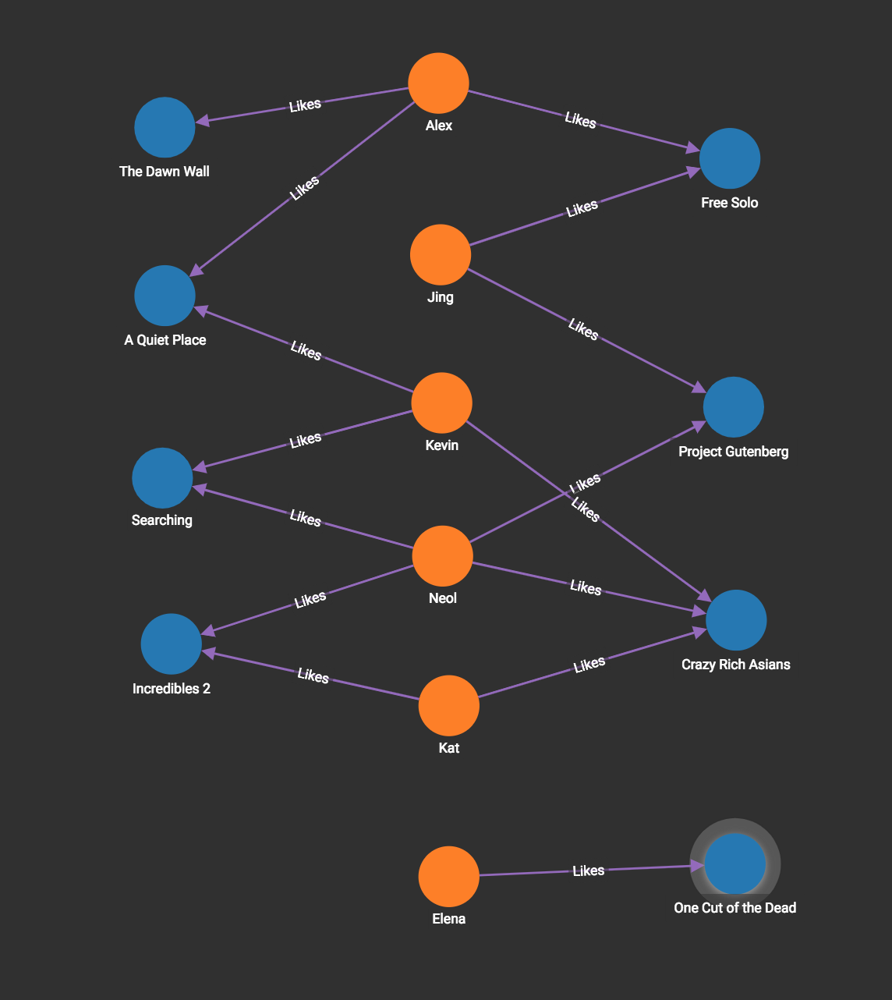

==== Specifications

[,erlang]
----
cosine_nbor_ss (VERTEX source, SET<STRING> e_type, SET<STRING> re_type,
  STRING weight, INT top_k, INT output_limit, BOOL print_accum = TRUE,
  STRING file_path = "", STRING similarity_edge = "")
RETURNS (MapAccum<VERTEX, FLOAT>)
----+++<table>++++++<thead>++++++<tr>++++++<th style="text-align:left">++++++<b>+++Characteristic+++</b>++++++</th>+++
      +++<th style="text-align:left">+++Value+++</th>++++++</tr>++++++</thead>+++
  +++<tbody>++++++<tr>++++++<td style="text-align:left">+++Result+++</td>+++
      +++<td style="text-align:left">++++++
+++The top K vertices in the graph that have the highest similarity scores,
          along with their scores.+++
+++
        +++
+++The result is available in three forms:+++
+++
        +++<ul>++++++<li>+++streamed out in JSON format+++</li>+++
          +++<li>+++written to a file in tabular format+++</li>+++
          +++<li>+++stored as a vertex attribute value+++</li>++++++</ul>++++++</td>++++++</tr>+++
    +++<tr>++++++<td style="text-align:left">+++Input Parameters+++</td>+++
      +++<td style="text-align:left">++++++<ul>++++++<li>++++++<code>+++VERTEX source+++</code>++++++<b>+++:+++</b>+++ Source vertex+++</li>+++
          +++<li>++++++<code>+++SET<STRING> e_type+++</code>+++: Edge type to traverse+++</li>+++
          +++<li>++++++<code>+++SET<STRING> re_type+++</code>+++: Reverse edge type to traverse+++</li>+++
          +++<li>++++++<code>+++STRING weight:+++</code>+++The edge attribute to use as the weight of
            the edge+++</li>+++
          +++<li>++++++<code>+++INT top_k+++</code>+++: Number of vertices+++</li>+++
          +++<li>++++++<code>+++INT output_limit:+++</code>++++++</li>+++
          +++<li>++++++<code>+++BOOL print_accum+++</code>+++: If +++<code>+++true+++</code>+++, output JSON to standard
            output.+++</li>+++
          +++<li>++++++<code>+++STRING filepath+++</code>+++: If provided, the output will be written
            to this file path in CSV format.+++</li>+++
          +++<li>++++++<code>+++STRING similarity_edge+++</code>+++: If provided, the similarity score
            will be saved to this edge.+++</li>++++++</ul>++++++</td>++++++</tr>+++
    +++<tr>++++++<td style="text-align:left">+++Result Size+++</td>+++
      +++<td style="text-align:left">++++++<code>+++top_k+++</code>++++++</td>++++++</tr>+++
    +++<tr>++++++<td style="text-align:left">+++Time Complexity+++</td>+++
      +++<td style="text-align:left">+++O(D{caret}2), D = outdegree of vertex v+++</td>++++++</tr>+++
    +++<tr>++++++<td style="text-align:left">+++Graph Types+++</td>+++
      +++<td style="text-align:left">+++Undirected or directed edges, weighted edges+++</td>++++++</tr>++++++</tbody>++++++</table>+++

The output size is always K (if K <= N), so the algorithm may arbitrarily choose to output one vertex over another if there are tied similarity scores.

==== Example +++<a id="example-1-1">++++++</a>+++

Given one person's name, this algorithm calculates the cosine similarity between this person and each other person where there is at one movie they have both rated.

In the previous example, if the source vertex is Alex, and `top_k` is set to 5, then we calculate the cosine similarity between him and two other persons, Jing and Kevin. The JSON output shows the top 5 similar vertices and their similarity score in descending order. The output limit is 5 persons, but we have only 2 qualified persons:

[,text]
----
[
  {
    "@@result_topk": [
      {
        "vertex1": "Alex",
        "vertex2": "Jing",
        "score": 0.42173
      },
      {
        "vertex1": "Alex",
        "vertex2": "Kevin",
        "score": 0.14248
      }
    ]
  }
]
----

The FILE version output is not necessarily in descending order. It looks like the following:

[,text]
----
Vertex1,Vertex2,Similarity
Alex,Kevin,0.142484
Alex,Jing,0.421731
----

The ATTR version inserts an edge into the graph with the similarity score as an edge attribute whenever the score is larger than zero. The result looks like this:

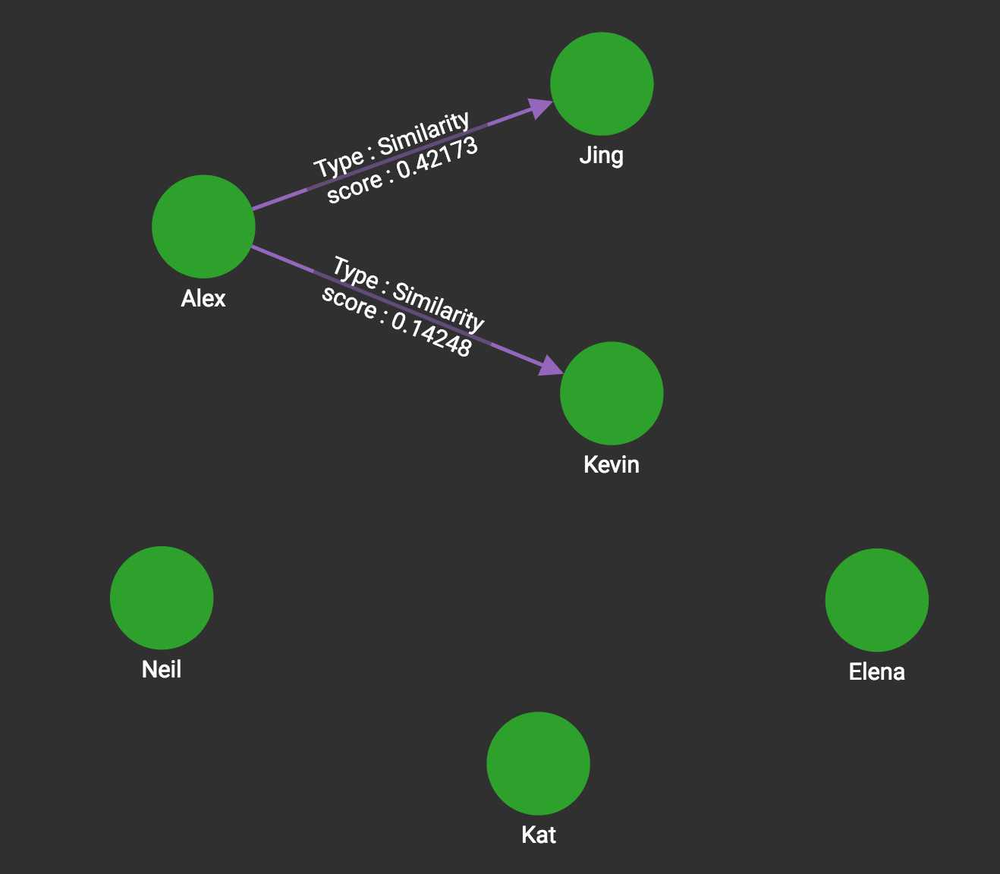

=== Cosine Similarity of Neighborhoods, Batch

This algorithm computes the same similarity scores as the link:graph-algorithm-library.md#cosine-similarity-of-neighborhoods-all-pairs[Cosine similarity of neighborhoods, all pairs algorithm]link:graph-algorithm-library.md#cosine-similarity-of-neighborhoods-single-source[,] except that it starts from all of the vertices as the source vertex and computes its similarity scores with its neighbors for all the vertices in parallel. Since this is a memory-intensive operation, it is split into batches to reduce peak memory usage. The user can specify how many batches it is to be split into. Compared with the link:graph-algorithm-library.md#cosine-similarity-of-neighborhoods-all-pairs[Cosine similarity of neighborhoods, all pairs algorithm], this algorithm allows you to split the workload into multiple batches and reduces the burden on memory.

This algorithm has a time complexity of _O(E)_, where E is the number of edges, and runs on graphs with weighted edges (directed or undirected).

==== Specifications

[,sql]
----
cosine_batch(STRING vertex_type, STRING edge_type, STRING edge_attribute,
INT topK, BOOL print_accum = true, STRING file_path,
STRING similarity_edge, INT num_of_batches=1)
----

==== Parameters

|===
| Name | Description

| `v_type`
| Vertex type to calculate similarity for

| `e_type`
| Directed edge type to traverse

| `edge_attribute`
| Name of the attribute on the edge type to use as the weight

| `topK`
| Number of top scores to report for each vertex

| `print_accum`
| If `true`, output JSON to standard output.

| `similarity_edge`
| If provided, the similarity score will be saved to this edge.

| `file_path`
| If not empty, write output to this file in CSV.

| `num_of_batches`
| Number of batches to divide the query into
|===

==== Result

The result of this algorithm is the top _k_ cosine similarity scores and their corresponding pair for each vertex. The score is only included if it is greater than 0.

The result can be output in JSON format, in CSV to a file, or saved as a similarity edge in the graph itself.

==== Example

Using the `social10` graph, we can calculate the cosine similarity of every person to every other person connected by the `Friend` edge, and print out the top _k_ most similar pairs for each vertex.

[,sql]
----
GSQL > cosine_batch("Person", "Friend", "weight", 5, true, "", "", 1)

// Every vertex and their most similar pairs ranked by their Cosine
// Similarity score.
[
  {
    "start": [
      {
        "attributes": {
          "start.@heap": [
            {
              "val": 0.49903,
              "ver": "Howard"
            },
            {
              "val": 0.43938,
              "ver": "George"
            },
            {
              "val": 0.05918,
              "ver": "Alex"
            },
            {
              "val": 0.05579,
              "ver": "Ivy"
            }
          ]
        },
        "v_id": "Fiona",
        "v_type": "Person"
      },
      {
        "attributes": {
          "start.@heap": []
        },
        "v_id": "Justin",
        "v_type": "Person"
      },
      {
        "attributes": {
          "start.@heap": []
        },
        "v_id": "Bob",
        "v_type": "Person"
      },
      {
        "attributes": {
          "start.@heap": [
            {
              "val": 0.22361,
              "ver": "Bob"
            },
            {
              "val": 0.21213,
              "ver": "Alex"
            }
          ]
        },
        "v_id": "Chase",
        "v_type": "Person"
      },
      {
        "attributes": {
          "start.@heap": [
            {
              "val": 0.57143,
              "ver": "Bob"
            },
            {
              "val": 0.12778,
              "ver": "Chase"
            }
          ]
        },
        "v_id": "Damon",
        "v_type": "Person"
      },
      {
        "attributes": {
          "start.@heap": []
        },
        "v_id": "Alex",
        "v_type": "Person"
      },
      {
        "attributes": {
          "start.@heap": [
            {
              "val": 0.64253,
              "ver": "Alex"
            },
            {
              "val": 0.63607,
              "ver": "Ivy"
            },
            {
              "val": 0.27091,
              "ver": "Howard"
            },
            {
              "val": 0.14364,
              "ver": "Fiona"
            }
          ]
        },
        "v_id": "George",
        "v_type": "Person"
      },
      {
        "attributes": {
          "start.@heap": []
        },
        "v_id": "Eddie",
        "v_type": "Person"
      },
      {
        "attributes": {
          "start.@heap": [
            {
              "val": 0.94848,
              "ver": "Fiona"
            },
            {
              "val": 0.6364,
              "ver": "Alex"
            },
            {
              "val": 0.31046,
              "ver": "George"
            },
            {
              "val": 0.1118,
              "ver": "Howard"
            }
          ]
        },
        "v_id": "Ivy",
        "v_type": "Person"
      },
      {
        "attributes": {
          "start.@heap": [
            {
              "val": 1.09162,
              "ver": "Fiona"
            },
            {
              "val": 0.78262,
              "ver": "Ivy"
            },
            {
              "val": 0.11852,
              "ver": "George"
            }
          ]
        },
        "v_id": "Howard",
        "v_type": "Person"
      }
    ]
  }
]
----

=== Cosine Similarity of Neighborhoods, All Pairs

==== Description and Uses

This algorithm computes the same similarity scores as the cosine similarity of neighborhoods, single-source algorithm (`cosine_nbor_ss`), except that it considers ALL pairs of vertices in the graph (for the vertex and edge types selected by the user). Naturally, this algorithm will take longer to run. For very large and very dense graphs, this may not be a practical choice.

==== Specifications

[,erlang]
----
cosine_nbor_ap (SET<STRING> v_type, SET<STRING> e_type, SET<STRING> re_type,
  STRING weight, INT top_k, INT output_limit, BOOL print_accum = TRUE,
  STRING similarity_edge = "", STRING file_path = "")
----+++<table>++++++<thead>++++++<tr>++++++<th style="text-align:left">++++++<b>+++Characteristic+++</b>++++++</th>+++
      +++<th style="text-align:left">+++Value+++</th>++++++</tr>++++++</thead>+++
  +++<tbody>++++++<tr>++++++<td style="text-align:left">+++Result+++</td>+++
      +++<td style="text-align:left">++++++
+++The top +++<em>+++k+++</em>+++ vertex pairs in the graph which have the highest similarity
          scores, along with their scores.+++
+++
        +++
+++The result is available in three forms:+++
+++
        +++<ul>++++++<li>+++streamed out in JSON format+++</li>+++
          +++<li>+++written to a file in tabular format, or+++</li>+++
          +++<li>+++stored as a vertex attribute value.+++</li>++++++</ul>++++++</td>++++++</tr>+++
    +++<tr>++++++<td style="text-align:left">+++Input Parameters+++</td>+++
      +++<td style="text-align:left">++++++<ul>++++++<li>++++++<code>+++SET<STRING> v_type+++</code>+++: Vertex types to calculate cosine
            similarity score for+++</li>+++
          +++<li>++++++<code>+++SET<STRING> e_type+++</code>+++: Edge types to traverse+++</li>+++
          +++<li>++++++<code>+++SET<STRING> re_type+++</code>+++: Reverse edge types to traverse+++</li>+++
          +++<li>++++++<code>+++STRING weight+++</code>+++: Edge attribute to use as weight+++</li>+++
          +++<li>++++++<code>+++INT top_k+++</code>+++: the number of vertex pairs with the highest similarity
            scores to return+++</li>+++
          +++<li>++++++<code>+++INT output_limit+++</code>+++: If >=0, max number of vertices to output
            to JSON.+++</li>+++
          +++<li>++++++<code>+++BOOL print_accum+++</code>+++: If +++<code>+++true, output JSON to standard output.+++</code>++++++</li>+++
          +++<li>++++++<code>+++STRING similarity_edge+++</code>+++: If provided, the similarity score
            will be saved to this edge+++</li>+++
          +++<li>++++++<code>+++filepath+++</code>+++(for file output only): the path to the output file+++</li>++++++</ul>++++++</td>++++++</tr>+++
    +++<tr>++++++<td style="text-align:left">+++Result Size+++</td>+++
      +++<td style="text-align:left">++++++<code>+++top_k+++</code>++++++</td>++++++</tr>+++
    +++<tr>++++++<td style="text-align:left">+++Time Complexity+++</td>+++
      +++<td style="text-align:left">+++O(E), E = number of edges+++</td>++++++</tr>+++
    +++<tr>++++++<td style="text-align:left">+++Graph Types+++</td>+++
      +++<td style="text-align:left">+++Undirected or directed edges, weighted edges+++</td>++++++</tr>++++++</tbody>++++++</table>+++

==== Example +++<a id="example-1-1">++++++</a>+++

Using the movie graph, calculate the cosine similarity between all pairs and show the top 5 pairs. This is the JSON result:

[,text]
----
[
  {
    "@@total_result": [
      {
        "vertex1": "Kat",
        "vertex2": "Neil",
        "score": 0.67509
      },
      {
        "vertex1": "Jing",
        "vertex2": "Neil",
        "score": 0.46377
      },
      {
        "vertex1": "Kevin",
        "vertex2": "Neil",
        "score": 0.42436
      },
      {
        "vertex1": "Jing",
        "vertex2": "Alex",
        "score": 0.42173
      },
      {
        "vertex1": "Kat",
        "vertex2": "Kevin",
        "score": 0.3526
      }
    ]
  }
]
----

The FILE output is similar to the output of cosine_nbor_file.

The ATTR version will create _k_ edges:

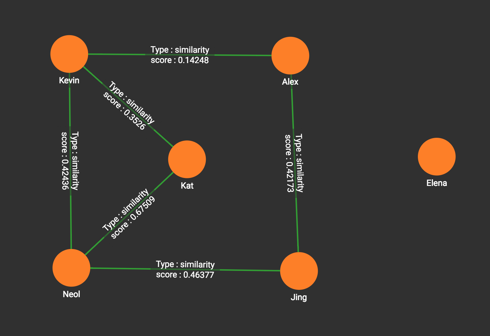

=== Jaccard Similarity of Neighborhoods, Single Source +++<a id="jaccard-similarity-of-neighborhoods-single-source">++++++</a>+++

==== Description and Uses +++<a id="description-and-uses-5">++++++</a>+++

The Jaccard index measures the relative overlap between two sets. To compare two vertices by Jaccard similarity, first select a set of values for each vertex. For example, a set of values for a Person could be the cities the Person has lived in. Then the Jaccard index is computed for the two vectors.

The Jaccard index of two sets A and B is defined as follows:

[stem]
++++
Jaccard(A,B)=\frac{|A \cap B|}{|A \cup B|}
++++

The value ranges from 0 to 1. If A and B are identical, then Jaccard(A, B) = 1. If both A and B are empty, we define the value to be 0.

==== Specifications +++<a id="specifications-6">++++++</a>+++

In the current

[,erlang]
----
jaccard_nbor_ss (VERTEX source, STRING e_type, STRING rev_e_type,  INT top_k = 100,
  BOOL print_accum = TRUE, STRING similarity_edge_type = "",STRING file_path = "")
----+++<table>++++++<thead>++++++<tr>++++++<th style="text-align:left">++++++<b>+++Characteristic+++</b>++++++</th>+++
      +++<th style="text-align:left">+++Value+++</th>++++++</tr>++++++</thead>+++
  +++<tbody>++++++<tr>++++++<td style="text-align:left">+++Result+++</td>+++
      +++<td style="text-align:left">++++++
+++The top +++<em>+++k+++</em>+++ vertices in the graph that have the highest similarity
          scores, along with their scores.+++
+++
        +++
+++The result is available in three forms:+++
+++
        +++<ul>++++++<li>+++streamed out in JSON format+++</li>+++
          +++<li>+++written to a file in tabular format, or+++</li>+++
          +++<li>+++stored as a vertex attribute value.+++</li>++++++</ul>++++++</td>++++++</tr>+++
    +++<tr>++++++<td style="text-align:left">+++Input Parameters+++</td>+++
      +++<td style="text-align:left">++++++<ul>++++++<li>++++++<code>+++SET<STRING> v_type+++</code>+++: Vertex type to calculate similarity
            score for+++</li>+++
          +++<li>++++++<code>+++SET<STRING> e_type+++</code>+++: Edge type to traverse+++</li>+++
          +++<li>++++++<code>+++SET<STRING> re_type+++</code>+++: Reverse edge type to traverse+++</li>+++
          +++<li>++++++<code>+++INT top_k+++</code>+++: the number of vertex pairs with the highest similarity
            scores to return+++</li>+++
          +++<li>++++++<code>+++BOOL print_accum+++</code>+++: Boolean value that decides whether to output
            to console+++</li>+++
          +++<li>++++++<code>+++STRING similarity_edge+++</code>+++: If provided, the similarity score
            will be saved to this edge+++</li>+++
          +++<li>++++++<code>+++STRING filepath:+++</code>+++If provided, the algorithm will output to
            the file path in CSV format+++</li>++++++</ul>++++++</td>++++++</tr>+++
    +++<tr>++++++<td style="text-align:left">+++Result Size+++</td>+++
      +++<td style="text-align:left">++++++<code>+++top_k+++</code>++++++</td>++++++</tr>+++
    +++<tr>++++++<td style="text-align:left">+++Time Complexity+++</td>+++
      +++<td style="text-align:left">+++O(D{caret}2), D = outdegree of vertex v+++</td>++++++</tr>+++
    +++<tr>++++++<td style="text-align:left">+++Graph Types+++</td>+++
      +++<td style="text-align:left">+++Undirected or directed edges, unweighted edges+++</td>++++++</tr>++++++</tbody>++++++</table>+++

The algorithm will not output more than K vertices, so the algorithm may arbitrarily choose to output one vertex over another if there are tied similarity scores.

==== Example +++<a id="example-1-1">++++++</a>+++

Using the movie graph, we run `jaccard_nbor_ss("Neil", 5)`:

[,text]
----
[
  {
    "@@result_topK": [
      {
        "vertex1": "Neil",
        "vertex2": "Kat",
        "score": 0.5
      },
      {
        "vertex1": "Neil",
        "vertex2": "Kevin",
        "score": 0.4
      },
      {
        "vertex1": "Neil",
        "vertex2": "Jing",
        "score": 0.2
      }
    ]
  }
]
----

If the source vertex (person) doesn't have any common neighbors (movies) with any other vertex (person), such as Elena in our example, the result will be an empty list:

[,text]
----
[
  {
    "@@result_topK": []
  }
]
----

=== Jaccard Similarity of Neighborhoods, Batch

This algorithm computes the same similarity scores as the link:graph-algorithm-library.md#jaccard-similarity-of-neighborhoods-all-pairs[Jaccard similarity of neighborhoods, all pairs]link:graph-algorithm-library.md#jaccard-similarity-of-neighborhoods-single-source[,] except that it starts from all of the vertices as the source vertex and computes its similarity scores with its neighbors for all the vertices in parallel. Since this is a memory-intensive operation, it is split into batches to reduce peak memory usage. The user can specify how many batches it is to be split into. Compared with the link:graph-algorithm-library.md#jaccard-similarity-of-neighborhoods-all-pairs[Jaccard similarity of neighborhoods, all pairs], this algorithm allows you to split the workload into multiple batches and reduces the burden on memory.

This algorithm has a time complexity of _O(E)_, where E is the number of edges, and runs on graphs with unweighted edges (directed or undirected).

==== Specifications

[,sql]
----
jaccard_batch (STRING v_type, STRING e_type, STRING re_type, INT topK,
BOOL print_accum = true, STRING similarity_edge, STRING file_path,
INT num_of_batches = 1)
----

==== Parameters

|===
| Name | Description

| `v_type`
| Vertex type to calculate similarity for

| `e_type`
| Directed edge type to traverse

| `re_type`
| Reverse edge type to traverse

| `topK`
| Number of top scores to report for each vertex

| `print_accum`
| If `true`, output JSON to standard output.

| `similarity_edge`
| If provided, the similarity scores will be saved to this edge type.

| `file_path`
| If a file path is provided, the algorithm will output to a file specified by the file path in CSV format

| `num_of_batches`
| Number of batches to divide the query into
|===

==== Result

The result contains the top _k_ Jaccard *similarity* scores for each vertex and its corresponding pair. A pair is only included if its similarity is greater than 0, meaning there is at least one common neighbor between the pair. The result is available in JSON format, or can be output to a file in CSV, or it can be saved as an edge on the graph itself. A JSON formatted result could look like this:

[,javascript]
----
// Run jaccard_batch on social10 graph traversing through Friend edges
[
  {
    "Start": [
      {
        "attributes": {
          "Start.@heap": [
            {
              "val": 0.33333,
              "ver": "Howard"
            },
            {
              "val": 0.25,
              "ver": "Ivy"
            },
            {
              "val": 0.25,
              "ver": "George"
            }
          ]
        },
        "v_id": "Fiona",
        "v_type": "Person"
      },
      {
        "attributes": {
          "Start.@heap": []
        },
        "v_id": "Justin",
        "v_type": "Person"
      },
      {
        "attributes": {
          "Start.@heap": []
        },
        "v_id": "Bob",
        "v_type": "Person"
      },
      {
        "attributes": {
          "Start.@heap": [
            {
              "val": 0.5,
              "ver": "Damon"
            }
          ]
        },
        "v_id": "Chase",
        "v_type": "Person"
      },
      {
        "attributes": {
          "Start.@heap": [
            {
              "val": 0.5,
              "ver": "Chase"
            }
          ]
        },
        "v_id": "Damon",
        "v_type": "Person"
      },
      {
        "attributes": {
          "Start.@heap": [
            {
              "val": 0.33333,
              "ver": "Ivy"
            }
          ]
        },
        "v_id": "Alex",
        "v_type": "Person"
      },
      {
        "attributes": {
          "Start.@heap": [
            {
              "val": 0.5,
              "ver": "Howard"
            },
            {
              "val": 0.25,
              "ver": "Fiona"
            }
          ]
        },
        "v_id": "George",
        "v_type": "Person"
      },
      {
        "attributes": {
          "Start.@heap": []
        },
        "v_id": "Eddie",
        "v_type": "Person"
      },
      {
        "attributes": {
          "Start.@heap": [
            {
              "val": 0.33333,
              "ver": "Alex"
            },
            {
              "val": 0.25,
              "ver": "Fiona"
            }
          ]
        },
        "v_id": "Ivy",
        "v_type": "Person"
      },
      {
        "attributes": {
          "Start.@heap": [
            {
              "val": 0.5,
              "ver": "George"
            },
            {
              "val": 0.33333,
              "ver": "Fiona"
            }
          ]
        },
        "v_id": "Howard",
        "v_type": "Person"
      }
    ]
  }
]
----

=== Jaccard Similarity of Neighborhoods, All Pairs

==== Description and Uses +++<a id="description-and-uses-6">++++++</a>+++

This algorithm computes the same similarity scores as the link:graph-algorithm-library.md#jaccard-similarity-of-neighborhoods-single-source-1[Jaccard similarity of neighborhoods, single-source algorithm], except that it considers ALL pairs of vertices in the graph (for the vertex and edge types selected by the user). Naturally, this algorithm will take longer to run. For very large and very dense graphs, this algorithm may not be a practical choice.

==== Specifications +++<a id="specifications-7">++++++</a>+++

[,erlang]
----
jaccard_nbor_ap(STRING v_type, STRING e_type, STRING re_type, INT top_k,
  BOOL print_accum = TRUE, STRING similarity_edge = "", STRING file_path = "")
----+++<table>++++++<thead>++++++<tr>++++++<th style="text-align:left">++++++<b>+++Characteristic+++</b>++++++</th>+++
      +++<th style="text-align:left">+++Value+++</th>++++++</tr>++++++</thead>+++
  +++<tbody>++++++<tr>++++++<td style="text-align:left">+++Result+++</td>+++
      +++<td style="text-align:left">++++++
+++The top +++<em>+++k+++</em>+++ vertex pairs in the graph that have the highest similarity
          scores, along with their scores.+++
+++
        +++
+++The result is available in three forms:+++
+++
        +++<ul>++++++<li>+++streamed out in JSON format+++</li>+++
          +++<li>+++written to a file in tabular format, or+++</li>+++
          +++<li>+++stored as a vertex attribute value.+++</li>++++++</ul>++++++</td>++++++</tr>+++
    +++<tr>++++++<td style="text-align:left">+++Input Parameters+++</td>+++
      +++<td style="text-align:left">++++++<ul>++++++<li>++++++<code>+++SET<STRING> v_type+++</code>+++: Vertex types to calculate similarity
            score for+++</li>+++
          +++<li>++++++<code>+++SET<STRING> e_type+++</code>+++: Edge types to traverse+++</li>+++
          +++<li>++++++<code>+++SET<STRING> re_type+++</code>+++: Reverse edge types to traverse+++</li>+++
          +++<li>++++++<code>+++INT top_k+++</code>+++: the number of vertex pairs with the highest similarity
            scores to return+++</li>+++
          +++<li>++++++<code>+++BOOL print_accum+++</code>+++: Boolean value that decides whether to output
            to console+++</li>+++
          +++<li>++++++<code>+++STRING similarity_edge+++</code>+++: If provided, the similarity score
            will be saved to this edge+++</li>+++
          +++<li>++++++<code>+++STRING file_path+++</code>+++: If provided, the algorithm will output
            to the file path in CSV format+++</li>++++++</ul>++++++</td>++++++</tr>+++
    +++<tr>++++++<td style="text-align:left">+++Result Size+++</td>+++
      +++<td style="text-align:left">++++++<code>+++top_k+++</code>++++++</td>++++++</tr>+++
    +++<tr>++++++<td style="text-align:left">+++Time Complexity+++</td>+++
      +++<td style="text-align:left">+++O(E{caret}2 / V), V = number of vertices, E = number of edges+++</td>++++++</tr>+++
    +++<tr>++++++<td style="text-align:left">+++Graph Types+++</td>+++
      +++<td style="text-align:left">+++Undirected or directed edges, unweighted edges+++</td>++++++</tr>++++++</tbody>++++++</table>+++

The algorithm will not output more than K vertex pairs, so the algorithm may arbitrarily chose to output one vertex pair over another, if there are tied similarity scores.

==== Example +++<a id="example-1-1">++++++</a>+++

For the movie graph, calculate the Jaccard similarity between all pairs and show the 5 most similar pairs: jaccard_nbor_ap(5). This is the JSON output :

[,text]
----
[
  {
    "@@total_result": [
      {
        "vertex1": "Kat",
        "vertex2": "Neil",
        "score": 0.5
      },
      {
        "vertex1": "Kevin",
        "vertex2": "Neil",
        "score": 0.4
      },
      {
        "vertex1": "Jing",
        "vertex2": "Alex",
        "score": 0.25
      },
      {
        "vertex1": "Kat",
        "vertex2": "Kevin",
        "score": 0.25
      },
      {
        "vertex1": "Jing",
        "vertex2": "Neil",
        "score": 0.2
      }
    ]
  }
]
----

== Classification Algorithms

Classification algorithms, or classifiers, are one of the simplest forms of machine learning. They seek to predict the classification of a given entity, based on the evidence of previously classified entities. Classification is closely related to similarity and clustering; all of them deal with finding and using the commonalities among entities.

=== Greedy Graph Coloring

==== Description

This algorithm assigns a unique integer value known as its color to the vertices of a graph such that no neighboring vertices share the same color. The reason why this is called color is that this task is equivalent to assigning a color to each nation on a map so that no neighboring nations share the same color.

Given a set of _k_ vertices, the algorithm first colors all vertices with the same color - the first color. It then starts from all the vertices and has each vertex send its own colors to its neighbors. If there are two neighboring vertices with the same color, the algorithm will reassign colors where there is a conflict. The same process is repeated until all conflicts are resolved.

The algorithm has a worst-case time complexity of _O(V{caret}2 + E),_ where _V_ is the number of vertices and _E_ is the number of edges.

==== Specifications

[,sql]
----
CREATE QUERY greedy_graph_coloring(SET<STRING> v_type,SET<STRING> e_type,
UINT max_colors = 999999,BOOL print_color_count = TRUE,
BOOL display = TRUE, STRING file_path = "")
----

==== Parameters

|===
| Name | Description

| `v_type`
| A set of all vertex types to color.

| `e_type`
| A set of all edge types to traverse.

| `max_colors`
| The Maximum number of colors that can be used. Use a large number like 999999 unless there is a strict limit.

| `print_color_count`
| If set to true, the total number of colors used will be displayed

| `display`
| If set to true, the output will display all vertices and their associated color

| `file_path`
| If a file path is provided, the output will be saved to the file indicated by the file path in CSV format.
|===

==== Example

On the https://github.com/tigergraph/gsql-graph-algorithms/blob/master/tests/social/data/social10.csv[social10] graph, say we want to color the `Person` vertices in such a way that any two vertices that are either connected by a `Friend` edge or a `Coworker` edge do not have the same color. By running the `greedy_graph_color` algorithm, we get the following result:

[,sql]
----
GSQL > RUN QUERY greedy_graph_coloring(["Person"], ["Friend", "Coworker"],
 999999, true, true, "")

 [
  {
    // Total number of colors used
    "color_count": 4
  },
  {
    "start": [
      {
        "attributes": {
          "start.@colorvertex": 4
        },
        "v_id": "Fiona",
        "v_type": "Person"
      },
      {
        "attributes": {
          "start.@colorvertex": 3
        },
        "v_id": "Justin",
        "v_type": "Person"
      },
      {
        "attributes": {
          "start.@colorvertex": 2
        },
        "v_id": "Bob",
        "v_type": "Person"
      },
      {
        "attributes": {
          "start.@colorvertex": 3
        },
        "v_id": "Chase",
        "v_type": "Person"
      },
      {
        "attributes": {
          "start.@colorvertex": 2
        },
        "v_id": "Damon",
        "v_type": "Person"
      },
      {
        "attributes": {
          "start.@colorvertex": 1
        },
        "v_id": "Alex",
        "v_type": "Person"
      },
      {
        "attributes": {
          "start.@colorvertex": 3
        },
        "v_id": "George",
        "v_type": "Person"
      },
      {
        "attributes": {
          "start.@colorvertex": 1
        },
        "v_id": "Eddie",
        "v_type": "Person"
      },
      {
        "attributes": {
          "start.@colorvertex": 2
        },
        "v_id": "Ivy",
        "v_type": "Person"
      },
      {
        "attributes": {
          "start.@colorvertex": 1
        },
        "v_id": "Howard",
        "v_type": "Person"
      }
    ]
  }
]
----

image::../.gitbook/assets/image%20%2817%29.png[Visualized result - no neighboring vertices share the same color]

=== k-Nearest Neighbors, Cosine Neighbor Similarity, single vertex

==== Description and Uses +++<a id="description-and-uses-6">++++++</a>+++

The k-Nearest Neighbors (kNN) algorithm is one of the simplest classification algorithms. It assumes that some or all the vertices in the graph have already been classified. The classification is stored as an attribute called the label. The goal is to predict the label of a given vertex, by seeing what are the labels of the nearest vertices.

Given a source vertex in the dataset and a positive integer _k_, the algorithm calculates the distance between this vertex and all other vertices and selects the _k_ vertices that are nearest. The prediction of the label of this node is the majority label among its k-nearest neighbors.

The distance can be physical distance as well as the reciprocal of similarity score, in which case "nearest" means "most similar". In our algorithm, the distance is the reciprocal of cosine neighbor similarity. The similarity calculation used here is the same as the calculation in https://app.gitbook.com/@tigergraph/s/document/~/edit/drafts/-LhrD9J_UpLvgqsxbKx9/v/2.4/graph-algorithm-library#cosine-similarity-of-neighborhoods-single-source[Cosine Similarity of Neighborhoods, Single Source]. Note that in this algorithm, vertices with zero similarity to the source node are not considered in prediction. For example, if there are 5 vertices with non-zero similarity to the source vertex, and 5 vertices with zero similarity, when we pick the top 7 neighbors, only the label of the 5 vertices with non-zero similarity score will be used in prediction.

==== Specifications +++<a id="specifications-7">++++++</a>+++

[,erlang]
----
knn_cosine_ss (VERTEX source, SET<STRING> v_type, SET<STRING> e_type, SET<STRING>
  re_type, STRING weight, STRING label, INT top_k,
  BOOL print_accum = TRUE, STRING file_path = "", STRING attr = "")
  RETURNS (STRING)
----+++<table>++++++<thead>++++++<tr>++++++<th style="text-align:left">++++++<b>+++Characteristic+++</b>++++++</th>+++
      +++<th style="text-align:left">+++Value+++</th>++++++</tr>++++++</thead>+++
  +++<tbody>++++++<tr>++++++<td style="text-align:left">+++Result+++</td>+++
      +++<td style="text-align:left">++++++
+++The predicted label for the source vertex.+++
+++
        +++
+++The result is available in three forms:+++
+++
        +++<ul>++++++<li>+++streamed out in JSON format+++</li>+++
          +++<li>+++written to a file in tabular format, or+++</li>+++
          +++<li>+++stored as a vertex attribute value.+++</li>++++++</ul>++++++</td>++++++</tr>+++
    +++<tr>++++++<td style="text-align:left">+++Input Parameters+++</td>+++
      +++<td style="text-align:left">++++++<ul>++++++<li>++++++<code>+++VERTEX source+++</code>+++: The vertex which you want to predict the label+++</li>+++
          +++<li>++++++<code>+++SET<STRING> v_type+++</code>+++: Vertex types to calculate distance
            to source vertex for+++</li>+++
          +++<li>++++++<code>+++SET<STRING> e_type+++</code>+++: Edge types to traverse+++</li>+++
          +++<li>++++++<code>+++SET<STRING> re_type+++</code>+++: Reverse edge types to traverse+++</li>+++
          +++<li>++++++<code>+++STRING weight+++</code>+++: Edge attribute to use as the weight of the
            edge+++</li>+++
          +++<li>++++++<code>+++STRING label+++</code>+++: Vertex attribute to recognize as the label
            of the vertex+++</li>+++
          +++<li>++++++<code>+++INT top_k+++</code>+++: number of nearest neighbors to consider+++</li>+++
          +++<li>++++++<code>+++BOOL print_accum+++</code>+++: If true, the algorithm will output the
            result to the console in JSON format.+++</li>+++
          +++<li>++++++<code>+++STRING filepath+++</code>+++: If provided, the algorithm will output to
            this file path in CSV format+++</li>+++
          +++<li>++++++<code>+++STRING attr+++</code>+++: Vertex attribute to save the predicted label
            as.+++</li>++++++</ul>++++++</td>++++++</tr>+++
    +++<tr>++++++<td style="text-align:left">+++Result Size+++</td>+++
      +++<td style="text-align:left">+++V = number of vertices+++</td>++++++</tr>+++
    +++<tr>++++++<td style="text-align:left">+++Time Complexity+++</td>+++
      +++<td style="text-align:left">+++O(D{caret}2), D = outdegree of vertex v+++</td>++++++</tr>+++
    +++<tr>++++++<td style="text-align:left">+++Graph Types+++</td>+++
      +++<td style="text-align:left">+++Undirected or directed edges, weighted edges+++</td>++++++</tr>++++++</tbody>++++++</table>+++

The algorithm will not output more than K vertex pairs, so the algorithm may arbitrarily choose to output one vertex pair over another if there are tied similarity scores.

==== Example +++<a id="example-1-1">++++++</a>+++

For the movie graph, we add the following labels to the Person vertices.

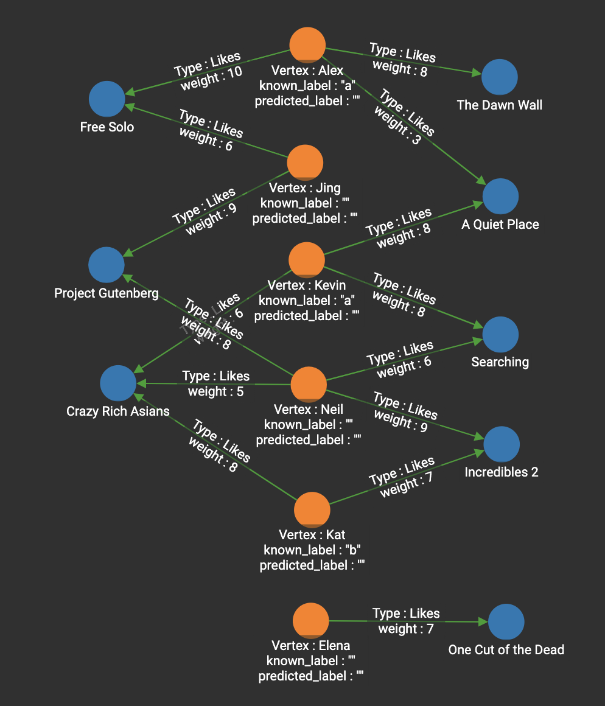

When we install the algorithm, answer the questions like:

[,text]
----
Vertex types: Person
Edge types: Likes
Second Hop Edge type: Reverse_Likes
Edge attribute that stores FLOAT weight, leave blank if no such attribute:weight
Vertex attribute that stores STRING label:known_label
----

We then run kNN, using Neil as the source person and k=3. This is the JSON output :

[,text]
----
[
  {
    "predicted_label": "a"
  }
]
----

If we run cosine_nbor_ss, using Neil as the source person and k=3, we can see the persons with the top 3 similarity score:

[,text]
----
[
  {
    "neighbours": [
      {
        "v_id": "Kat",
        "v_type": "Person",
        "attributes": {
          "neighbours.@similarity": 0.67509
        }
      },
      {
        "v_id": "Jing",
        "v_type": "Person",
        "attributes": {
          "neighbours.@similarity": 0.46377
        }
      },
      {
        "v_id": "Kevin",
        "v_type": "Person",
        "attributes": {
          "neighbours.@similarity": 0.42436
        }
      }
    ]
  }
]
----

Kat has a label "b", Kevin has a label "a", and Jing does not have a label. Since "a" and "b" are tied, the prediction for Neil is just one of the labels.

If Jing had label "b", then there would be 2 "b"s, so "b" would be the prediction.

If Jing had label "a", then there would be 2 "a"s, so "a" would be the prediction.

=== k-Nearest Neighbors, Cosine Neighbor Similarity, All Vertices Batch

==== Description and Uses +++<a id="description-and-uses-6">++++++</a>+++

This algorithm is a batch version of the https://app.gitbook.com/@tigergraph/s/document/~/edit/drafts/-Ll49vrTnAN15ff3rsHW/v/2.5/graph-algorithm-library#k-nearest-neighbors-cosine-neighbor-similarity-single-vertex[k-Nearest Neighbors, Cosine Neighbor Similarity, single vertex]. It makes a prediction for every vertex whose label is not known (i.e., the attribute for the known label is empty), based on its k nearest neighbors' labels.

==== Specifications +++<a id="specifications-7">++++++</a>+++

[,erlang]
----
knn_cosine_all(SET<STRING> v_type, SET<STRING> e_type, SET<STRING> re_type,
  STRING weight, STRING label, INT top_k, BOOL print_accum = TRUE,
  STRING file_path = "", STRING attr = "")
----+++<table>++++++<thead>++++++<tr>++++++<th style="text-align:left">++++++<b>+++Characteristic+++</b>++++++</th>+++
      +++<th style="text-align:left">+++Value+++</th>++++++</tr>++++++</thead>+++
  +++<tbody>++++++<tr>++++++<td style="text-align:left">+++Result+++</td>+++
      +++<td style="text-align:left">++++++
+++The predicted label for the vertices whose label attribute is empty.+++
+++
        +++
+++The result is available in three forms:+++
+++
        +++<ul>++++++<li>+++streamed out in JSON format+++</li>+++
          +++<li>+++written to a file in tabular format, or+++</li>+++
          +++<li>+++stored as a vertex attribute value.+++</li>++++++</ul>++++++</td>++++++</tr>+++
    +++<tr>++++++<td style="text-align:left">+++Input Parameters+++</td>+++
      +++<td style="text-align:left">++++++<ul>++++++<li>++++++<code>+++SET<STRING> v_type+++</code>+++: Vertex types to calculate distance
            to source vertex for+++</li>+++
          +++<li>++++++<code>+++SET<STRING> e_type+++</code>+++: Edge types to traverse+++</li>+++
          +++<li>++++++<code>+++SET<STRING> re_type+++</code>+++: Reverse edge types to traverse+++</li>+++
          +++<li>++++++<code>+++STRING weight+++</code>+++: Edge attribute to use as the weight of the
            edge+++</li>+++
          +++<li>++++++<code>+++STRING label+++</code>+++: Vertex attribute to recognize as the label
            of the vertex+++</li>+++
          +++<li>++++++<code>+++INT top_k+++</code>+++: number of nearest neighbors to consider+++</li>+++
          +++<li>++++++<code>+++BOOL print_accum+++</code>+++: Boolean value that indicates whether to
            output to console in JSON+++</li>+++
          +++<li>++++++<code>+++STRING filepath+++</code>+++: If provided, the algorithm will output to
            this file path in CSV format+++</li>+++
          +++<li>++++++<code>+++STRING attr+++</code>+++: Vertex attribute to save the predicted label
            as.+++</li>++++++</ul>++++++</td>++++++</tr>+++
    +++<tr>++++++<td style="text-align:left">+++Result Size+++</td>+++
      +++<td style="text-align:left">+++V = number of vertices+++</td>++++++</tr>+++
    +++<tr>++++++<td style="text-align:left">+++Time Complexity+++</td>+++
      +++<td style="text-align:left">+++O(E{caret}2 / V), V = number of vertices, E = number of edges+++</td>++++++</tr>+++
    +++<tr>++++++<td style="text-align:left">+++Graph Types+++</td>+++
      +++<td style="text-align:left">+++Undirected or directed edges, weighted edges+++</td>++++++</tr>++++++</tbody>++++++</table>+++

==== Example +++<a id="example-1-1">++++++</a>+++

For the movie graph shown in the single vertex version, run knn_cosine_all, using topK=3. Then you get the following result:

[,text]
----
  {
    "Source": [
      {
        "v_id": "Jing",
        "v_type": "Person",
        "attributes": {
          "name": "Jing",
          "known_label": "",
          "predicted_label": "",
          "@predicted_label": "a"
        }
      },
      {
        "v_id": "Neil",
        "v_type": "Person",
        "attributes": {
          "name": "Neil",
          "known_label": "",
          "predicted_label": "",
          "@predicted_label": "b"
        }
      },
      {
        "v_id": "Elena",
        "v_type": "Person",
        "attributes": {
          "name": "Elena",
          "known_label": "",
          "predicted_label": "",
          "@predicted_label": ""
        }
      }
    ]
  }
]
----

=== k-Nearest Neighbors, Cosine Neighbor Similarity, cross-validation

==== Description and Uses +++<a id="description-and-uses-6">++++++</a>+++

k-Nearest Neighbors (kNN) is often used for machine learning. You can choose the value for `topK` based on your experience, or using cross-validation to optimize the hyperparameters. In our library, Leave-one-out cross-validation for selecting optimal _k_ is provided. Given a _k_ value, we run the algorithm repeatedly using every vertex with a known label as the source vertex and predict its label. We assess the accuracy of the predictions for each value of _k_, and then repeat for different values of k in the given range. The goal is to find the value of k with highest predicting accuracy in the given range, for that dataset.

==== Specifications +++<a id="specifications-7">++++++</a>+++

[,erlang]
----
knn_cosine_cv(SET<STRING> v_type, SET<STRING> e_type, SET<STRING> re_type,
STRING weight, STRING label, INT min_k, INT max_k) RETURNS (INT)
----+++<table>++++++<thead>++++++<tr>++++++<th style="text-align:left">++++++<b>+++Characteristic+++</b>++++++</th>+++
      +++<th style="text-align:left">+++Value+++</th>++++++</tr>++++++</thead>+++
  +++<tbody>++++++<tr>++++++<td style="text-align:left">+++Result+++</td>+++
      +++<td style="text-align:left">++++++
+++A list of prediction accuracy for every k value in the given range, and+++
+++
        +++
+++the value of k with the highest predicting accuracy in the given range.+++
+++
        +++
+++The result is available in JSON format+++
++++++</td>++++++</tr>+++
    +++<tr>++++++<td style="text-align:left">+++Input Parameters+++</td>+++
      +++<td style="text-align:left">++++++<ul>++++++<li>++++++<code>+++SET<STRING> v_type+++</code>+++: Vertex types to calculate distance
            to source vertex for+++</li>+++
          +++<li>++++++<code>+++SET<STRING> e_type+++</code>+++: Edge types to traverse+++</li>+++
          +++<li>++++++<code>+++SET<STRING> re_type+++</code>+++: Reverse edge types to traverse+++</li>+++
          +++<li>++++++<code>+++STRING weight+++</code>+++: Edge attribute to use as the weight of the
            edge+++</li>+++
          +++<li>++++++<code>+++STRING label+++</code>+++: Vertex attribute to recognize as the label
            of the vertex+++</li>+++
          +++<li>++++++<code>+++INT min_k+++</code>+++: lower bound of k (inclusive)+++</li>+++
          +++<li>++++++<code>+++INT max_k+++</code>+++: upper bound of k (inclusive)+++</li>++++++</ul>++++++</td>++++++</tr>+++
    +++<tr>++++++<td style="text-align:left">+++Result Size+++</td>+++
      +++<td style="text-align:left">+++max_k-min_k+1+++</td>++++++</tr>+++
    +++<tr>++++++<td style="text-align:left">+++Time Complexity+++</td>+++
      +++<td style="text-align:left">+++O(max_k*E{caret}2 / V), V = number of vertices, E = number of edges+++</td>++++++</tr>+++
    +++<tr>++++++<td style="text-align:left">+++Graph Types+++</td>+++
      +++<td style="text-align:left">+++Undirected or directed edges, weighted edges+++</td>++++++</tr>++++++</tbody>++++++</table>+++

==== Example +++<a id="example-1-1">++++++</a>+++

Run knn_cosine_cv with min_k=2, max_k = 5. The JOSN result:

[,text]
----
[
  {
    "@@correct_rate_list": [
      0.33333,
      0.33333,
      0.33333,
      0.33333
    ]
  },
  {
    "best_k": 2
  }
]
----
